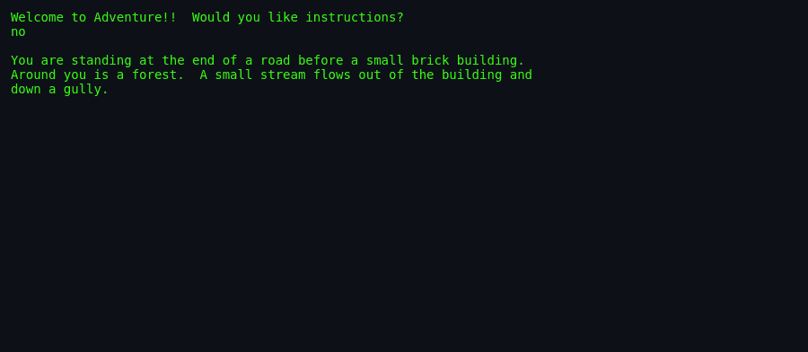
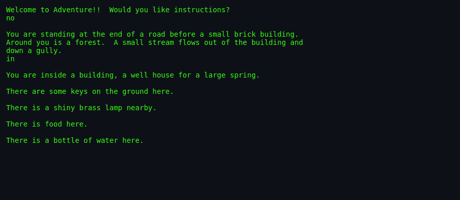
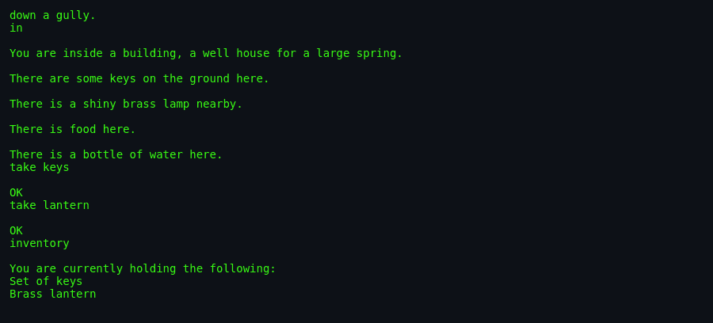
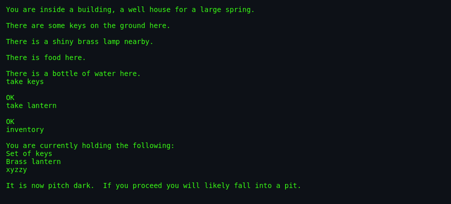

# About `adventure`

> **Brochure**. The definitive history, creation story, caving origins, and cultural legacy
> of *Colossal Cave Adventure* — the genesis of computer interactive fiction.

---

## What Is `adventure`?

*"You are standing at the end of a road before a small brick building. Around you is a forest. A small stream flows out of the building and down a gully..."*

With these unassuming sentences, computer gaming changed forever.

`adventure` (originally known as *ADVENT* or *Colossal Cave Adventure*) is the foundational ancestor of the interactive fiction, text adventure, and narrative video game genres. In it, you plunge into an immense underground cavern system, navigating subterranean rivers, crawling through tight fissures, confronting Tolkien-esque dwarves, and retrieving 15 fabled treasures.

---

## Screenshots

*The game opens with the traditional welcome: `Welcome to
Adventure!! Would you like instructions?` — the same prompt that
has greeted players since 1976.*

*The most famous opening line in all of interactive fiction: **"You
are standing at the end of a road before a small brick building.
Around you is a forest. A small stream flows out of the building
and down a gully."***

*The Well House at the start of the cave. Keys, lamp, food, and a
bottle of water — the standard starting inventory of a would-be
Grandmaster.*

*After taking the keys and brass lantern, the `inventory` command
confirms what you're carrying — the classic list-of-nouns format
that every text adventure inherited from `adventure`.*

*The iconic magic word: `xyzzy`. Typing it transports the player
between the building and the Debris Room — the legendary easter
egg that entered hacker culture and lives on in countless later
programs (including Microsoft Minesweeper's cheat code).*

---

## Authors & Publisher

- **Original Creator (1975–1976):** **William (Will) Crowther**, a programmer at Bolt, Beranek and Newman (BBN) who helped build the original ARPANET routers (Interface Message Processors).
- **Major Expansion & Scoring System (1976–1977):** **Don Woods**, a computer scientist at the Stanford Artificial Intelligence Laboratory (SAIL).
- **C Language Unix Translation (1977/1993):** **Jim Gillogly**, computer scientist at The Rand Corporation, who ported Crowther & Woods's PDP-10 Fortran code to C and contributed it to Berkeley Unix.
- **Publisher:** Shipped across the ARPANET, DECUS tapes, and formally incorporated into 4.3BSD-Reno and 4.4BSD-Lite.

---

## The Era

In the mid-1970s, computers were room-sized mainframes (such as the DEC PDP-10) accessed via hardcopy teletypes or early glass video terminals. Games were almost exclusively mathematical simulations (*Hamurabi*, *Star Trek*, *Lunar Lander*).

Crowther, going through a difficult divorce and wanting an activity to connect with his young daughters Sandy and Laura, combined his two personal passions: **caving** and **Dungeons & Dragons**. He wrote a computer program that simulated the real Bedquilt Cave section of Mammoth Cave National Park in Kentucky, which he and his ex-wife Pat Crowther had surveyed for the Cave Research Foundation.

When Don Woods discovered Crowther's unfinished program on a Stanford server in 1976, he contacted Crowther via ARPANET email (`crowther@bbn.com`) and gained permission to expand it. Woods added fantasy puzzles, mythical beasts (a dragon, a troll, giant clams), magic words, and a structured 350-point objective.

---

## Why It's Historically Monumental

- **The Birth of Interactive Fiction:** Prior to *Adventure*, computer programs processed numbers. *Adventure* proved that computers could process **natural language, spatial geography, and interactive narrative**.
- **Real-World Geography:** The upper sections of Colossal Cave—including the Cobble Crawl, the Debris Room, the Hall of Mists, and the Complex Junction—are an **accurate topographical map** of the real Kentucky cave surveyed by Crowther.
- **`XYZZY` and Hacker Lexicon:** The magic words `xyzzy` and `plugh` became legendary across hacker culture, immortalized as easter eggs in operating systems, games (*Minesweeper* cheat codes), and literature.
- **Productivity Crisis:** In 1977, *Adventure* spread virally across the nascent ARPANET. Entire universities and corporate research divisions (including MIT, Stanford, Xerox PARC, and BBN) suffered massive productivity collapses as engineers spent weeks mapping the dark maze.

---

## Difficulty & Progression

Unlike level-based games, `adventure`'s progression is **intellectual and exploratory**, measured against a strict 350-point rating scale:

1. **The Battery Lifespan Clock:**
   The brass lantern contains exactly **330 turns** of battery life. Players must explore, locate, and transport treasures under constant pressure of the darkness clock.
2. **Dynamic Dwarf Aggression:**
   The cavern starts peaceful. Entering the Hall of Mists activates the first dwarf. Soon, up to 5 axe-throwing dwarves and a stealthy pirate patrol the corridors, their combat lethality scaling with turn count.
3. **The Closing Sequence & Endgame:**
   Depositing the 15th treasure triggers the cavern closing. Magic words fail, passageways collapse, and the adventurer is teleported into the Repository for a high-stakes bomb-defusal puzzle that determines whether they reach Grandmaster rank.
4. **Scoring Ranks:**
   Points are earned for finding treasures ($30$), depositing them in the building ($170$), avoiding deaths ($30$), triggering the closing ($25$), and escaping the endgame ($45$). Ranks range from *Beginner* (0–34) up to *Grandmaster* (350+).

---

## Known Historical Quirks & Bugs

1. **William the Conqueror Millennial Overflow (2066 AD):**
   In `wizard.c`, the day calculation overflows on 16-bit integers in the year 2066 AD. Gillogly's original source comment notes: *"it will be attributed to Wm the C's millenial celebration"*.
2. **The 351st Point Easter Egg:**
   While the maximum listed score is 350, reading the issue of *"Spelunker Today"* magazine and dropping it in Witt's End awards a secret extra point, producing a score of **351 out of 350** ("You just went off my scale!!!").
3. **The 5-Letter Parser Truncation:**
   Because the Fortran original stored words in 5-character PDP-10 words, typing `NORTHEAST` checks only `NORTH`, often walking players in the wrong direction!

---

## See Also

- [`how-to-play.md`](./how-to-play.md) — Vocabulary and navigation manual.
- [`walkthrough.md`](./walkthrough.md) — 350-Point Grandmaster walkthrough.
- [`world-map.md`](./world-map.md) — Full topological Mermaid maps.
- [`architecture.md`](./architecture.md) — Memory virtualization and C engine analysis.
- [`lineage.md`](./lineage.md) — From Adventure to Zork and modern RPGs.
- [`references.md`](./references.md) — Historical sources and interviews.
