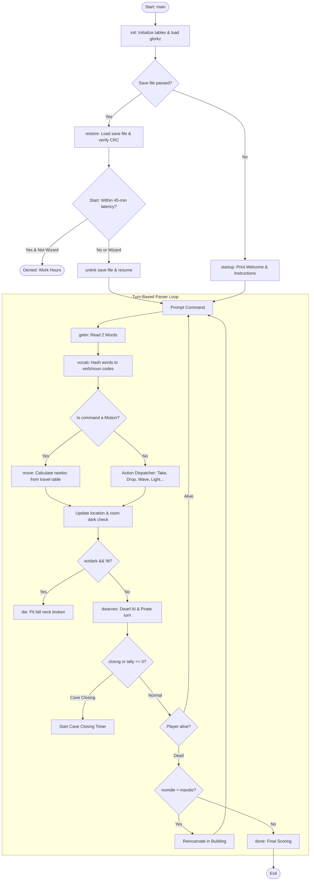
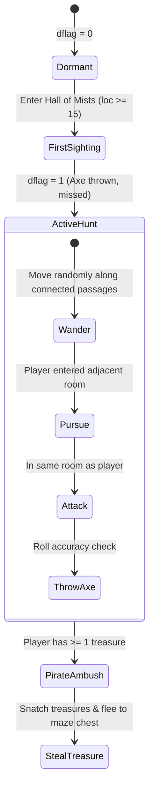

# `adventure` — Original Architecture

> Deep technical and architectural analysis of the C translation of *Colossal Cave Adventure* (`adventure`)
> written by Jim Gillogly and preserved in the BSD source distribution.
>
> Upstream repository tree: <https://github.com/vattam/BSDGames/tree/master/adventure>

---

## Files & Roles

| File | Purpose / Subsystem | Approx. LoC |
|---|---|---:|
| `main.c` | Entry point, CLI argument parsing, turn engine, two-word command dispatch, motion logic | 766 |
| `subr.c` | Core mechanics: dwarf AI, pirate logic, item manipulation, container logic, combat | 845 |
| `done.c` | Termination handler, death/reincarnation logic, scoring formulas, rank classifications | 172 |
| `init.c` | Environment setup, variable initialization, data table loading from `glorkz` | 385 |
| `io.c` | Virtualized text file reader, line buffering, input normalization | 612 |
| `save.c` | Game serialization/deserialization, single-use save enforcement | 225 |
| `wizard.c` | Anti-play hours enforcement (`latncy = 45`), time math, wizard authentication | 161 |
| `vocab.c` | Hash table vocabulary lookup and 5-letter word hashing | 240 |
| `crc.c` | Checksum verification for save-file tampering protection | 210 |
| `setup.c` | Pre-build tool to compile raw text into binary/indexed structures | 160 |
| `hdr.h` / `extern.h` | Global definitions, macros, array capacities, extern declarations | 260 |
| `glorkz` | Massive textual database: descriptions, travel tables, hints, messages | ~2,500 lines |

---

## High-Level Flow & Control Loop



---

## Memory Virtualization: The `glorkz` Database

One of Jim Gillogly's most brilliant achievements when porting Crowther & Woods's massive Fortran mainframe codebase to 16-bit Unix minis (PDP-11 with 64KB address spaces) was **text virtualization** (`hdr.h:86-91`, `io.c`):

```c
struct text {
    char *seekadr;  /* Msg start in virtual disk/file */
    int txtlen;     /* length of message */
};
struct text rtext[RTXSIZ];  /* random text messages */
struct text ptext[100];     /* room descriptions */
```

Instead of keeping hundreds of kilobytes of room descriptions, hints, and item text resident in RAM, the program indexes the byte offsets of messages inside `glorkz`. When a room description is spoken (`speak(&ptext[loc])`), the string is paged into a small temporary buffer on demand and printed. This allowed the full 350-point epic to run within tiny memory constraints.

---

## AI Logic: Dwarves and The Pirate

*Adventure* features one of the earliest dynamic autonomous NPC systems in video game history (`subr.c:dwarves()`):



### 1. Dwarf Combat Mechanics
- **Spawning:** 5 hostile dwarves patrol subterranean rooms $\ge 15$.
- **Aggression:** They follow the player through graph connections.
- **Lethality Scaling:** On the first turn a dwarf encounters the player, the axe throw is hardcoded to miss ($95\%$ safety). On subsequent encounters, axe accuracy increases, creating immediate urgency.
- **Combat:** The player can kill a dwarf by throwing an axe back at it (`THROW AXE`).

### 2. The Pirate Mechanic
The 6th entity in the dwarf array is the **Pirate**. The pirate never attacks directly; instead, he stalks players carrying valuable treasures through deep corridors. When triggered, he snatches all carried treasures and deposits them inside the hidden chest in the Maze of Twisty Little Passages, forcing the player to map the maze to reclaim them.

---

## Difficulty Progression & Runtime Setup Logic

*Colossal Cave Adventure* manages difficulty through three interrelated progression systems:

### 1. The Lantern Battery Clock (`limit`)
- Initialized to **330 ticks** in `init.c`.
- Every turn inside the dark cave decrements `limit`.
- Progression alerts:
  - Turn 300: Lamp begins flickering ("Your lamp is growing dim").
  - Turn 330: Lamp dies completely.
- Replenishment: The player can buy fresh batteries at the underground vending machine by dropping the rare coins, resetting the clock.

### 2. Dwarf Alertness Ramp (`dflag`)
- `dflag = 0`: Safe surface exploration.
- `dflag = 1`: Enters Hall of Mists; first lone dwarf appears and throws an axe.
- `dflag = 2`: Cave-wide activation; all 5 dwarves and pirate actively hunt the player.

### 3. Save / Restore Anti-Cheat Architecture (`save.c`, `wizard.c`, `crc.c`)
- **Single-Use Saves:** When a save file is restored (`main.c:86`), the file is immediately deleted (`unlink(argv[1])`). This prevented players from reloading previous saves after dying (anti-save-scumming).
- **Working Hours Lock (`wizard.c:Start()`):**
  The function `datime(&d, &t)` calculates minutes elapsed since suspension. If `delay < 45` minutes, resume is blocked with:
  `"This adventure was suspended a mere X minutes ago. Come back later."`
- **Wizard Override:** Entering the magic wizard password (`dwarf`) bypasses the work-hours latency lock.
- **Tamper Protection:** `crc.c` calculates a cyclic redundancy checksum over the serialized binary state struct. If an adventurer edited their save file with a hex editor to gain 350 points, the CRC check fails with: `"Oops -- file was altered... You dissolve into thin air!"`

---

## Clever Era Techniques

1. **Two-Word Command Hashing:** The vocabulary parser uses a 512-entry hash table (`vocab.c`) where 5-letter ASCII words are hashed into prime buckets, yielding $O(1)$ keyword dispatch on ancient processors.
2. **Bitmask State Properties (`prop[]`):** Each object has an integer property state (`prop[i]`). For instance, `prop[lamp] = 0` (unlit), `1` (lit), `-1` (destroyed). Puzzles check single integer bits to determine multi-room physical states.
3. **Reincarnation Score Penalty:** Rather than hard permadeath, the game grants 3 reincarnations via the "benevolent spirit", but docks 10 points per resurrection, preserving player momentum while penalizing sloppy play.
