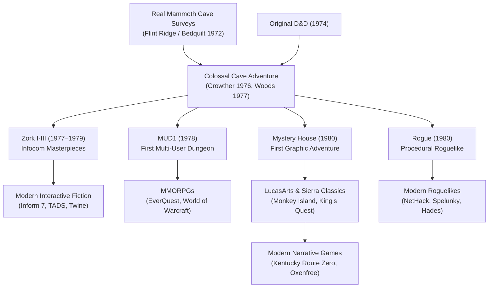

# `adventure` — Lineage & Genre Family

> The ancestry, descendants, and evolutionary impact of *Colossal Cave Adventure* —
> the spark that ignited interactive fiction, text adventures, and computer role-playing.

---

## Direct Ancestors

- **Mammoth Cave System Surveys (1960s–1972):** Will Crowther and Pat Crowther spent years mapping Kentucky's Flint Ridge and Mammoth Cave systems for the Cave Research Foundation (CRF). The cave layout in *Adventure* is a direct topological recreation of the real Bedquilt section.
- **Original Dungeons & Dragons (1974, Gary Gygax & Dave Arneson):** Will Crowther participated in early tabletop D&D campaigns in Boston. The concepts of hit dice, fantasy creatures (dwarves, dragons, trolls), magical items, and dungeon looting were lifted directly from tabletop RPGs.
- **DEC PDP-10 / TENEX Operating System:** The computing platform that made multi-user mainframe hacking and large text arrays feasible.

---

## Direct Descendants

- **Zork / Dungeon (1977–1979, Tim Anderson, Marc Blank, Bruce Daniels, Dave Lebling at MIT):** Inspired directly by playing *Adventure*, the MIT Dynamic Modelling group built MDL Zork to create a much more sophisticated full-sentence natural language parser and complex world simulations.
- **MUD1 (1978, Roy Trubshaw & Richard Bartle):** The world's first Multi-User Dungeon at the University of Essex, marrying Crowther's room-based text traversal with multi-user packet networking.
- **Mystery House (1980, Roberta & Ken Williams):** Added vector graphic illustrations to Crowther's text format, launching Sierra On-Line and the graphic adventure genre.
- **Rogue (1980, Michael Toy & Glenn Wichman):** Translated *Adventure*'s dungeon exploration into an ASCII-rendered procedural turn-based game, spawning the *roguelike* genre.

---

## Genre Family Tree

---

## If You Like `adventure`, Try…

- **Zork I: The Great Underground Empire (Infocom):** The natural next step: a brilliant, sarcastic parser adventure with superior prose and legendary puzzles.
- **Anchorhead (Michael Gentry):** A modern Lovecraftian interactive fiction masterpiece written in Inform.
- **Colossal Cave (2023, Roberta & Ken Williams):** A full 3D first-person reimagining of Crowther & Woods's original cave created by the founders of Sierra On-Line.
- **Kentucky Route Zero (Cardboard Computer):** A magical realist narrative adventure deeply inspired by the real Mammoth Cave history and Crowther's legacy.

---

## Communities & Historical Archives

- **The Interactive Fiction Database (IFDB):** <https://ifdb.org/> — The central archive of text adventure games and reviews.
- **IntFiction Forum:** <https://intfiction.org/> — The premier community for parser game designers and IF historians.
- **The Digital Antiquarian (Jimmy Maher):** In-depth historical essays detailing Crowther and Woods's development history.
