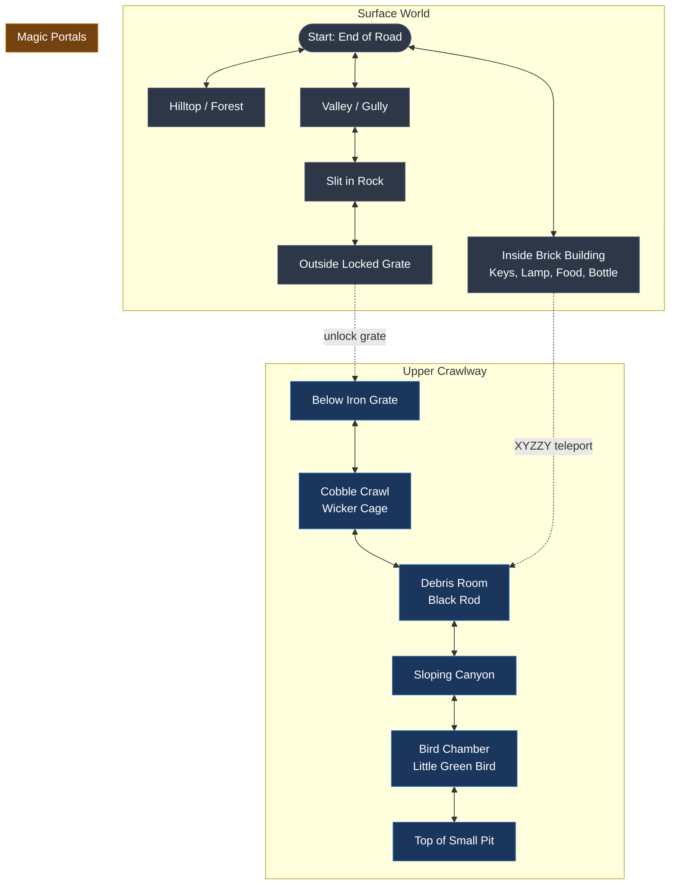
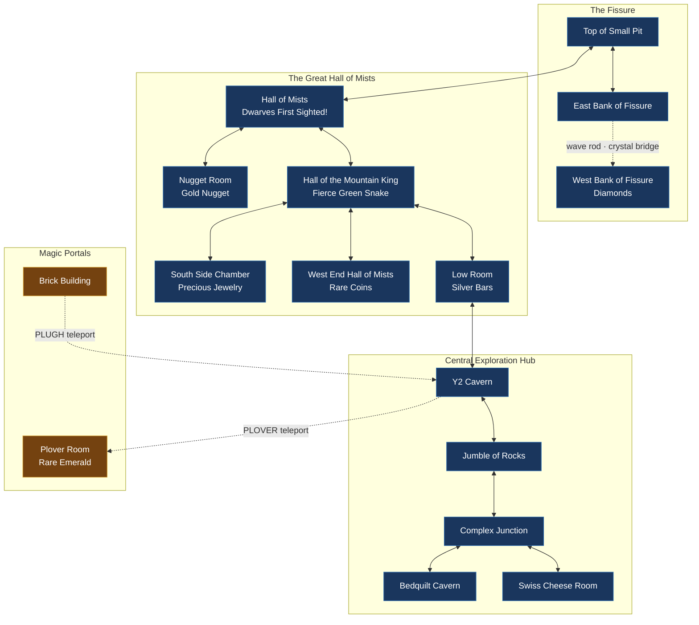
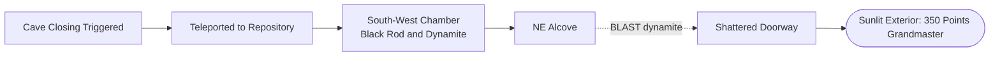

# `adventure` — World Map

> Complete topological map of Colossal Cave in Mermaid, detailing the surface,
> upper crawlways, the Hall of Mists, the fantasy depths, and the notorious mazes.

---

## Sector 1: The Surface & Upper Crawlway

---

## Sector 2: The Hall of Mists & The Y2 Hub

---

## Sector 3: The Deep Fantasy Caverns

```mermaid
flowchart TD
    subgraph GiantSector [The Giant and Beanstalk]
        Bedquilt_Ref["Bedquilt Cavern"] <--> GiantRoom["Giant Room<br/>Golden Eggs<br/>Fee Fie Foe Foo"]
        GiantRoom <--> PloverRoom2["Plover Room<br/>Emerald"]
    end

    subgraph OrientalSector [The Dragon and Ming Vase]
        ComplexJunction_Ref["Complex Junction"] <--> MirrorCanyon["Mirror Canyon"]
        MirrorCanyon <--> SecretCanyon["Secret Canyon"]
        SecretCanyon <--> OrientalRoom["Oriental Room<br/>Ming Vase"]
        OrientalRoom <--> SoftRoom["Soft Room<br/>Velvet Pillow<br/>Vending Machine"]
        SecretCanyon <--> DragonLair["Large Cavern<br/>Green Dragon on Persian Rug"]
    end

    subgraph OceanSector [Subterranean Waterfall]
        Y2_Ref["Y2 Cavern"] <--> Anteroom["Anteroom"]
        Anteroom <--> ShellRoom["Shell Room<br/>Giant Clam and Pearl"]
        ShellRoom <--> Waterfall["Waterfall Cavern<br/>Jeweled Trident"]
    end

    subgraph ChasmSector [The Troll and Chained Bear]
        SwissCheese_Ref["Swiss Cheese Room"] <--> BarrenRoom["Barren Room<br/>Chained Cave Bear<br/>Golden Chain"]
        BarrenRoom <--> ChasmEdge["Chasm Edge<br/>Greedy Troll"]
        ChasmEdge -.throw tame bear.-> FarChasm["Far Side of Chasm"]
    end

    classDef deep fill:#234e52,stroke:#319795,color:#fff;
    class GiantRoom,PloverRoom2,MirrorCanyon,SecretCanyon,OrientalRoom,SoftRoom,DragonLair,Anteroom,ShellRoom,Waterfall,BarrenRoom,ChasmEdge,FarChasm deep;
```

---

## Sector 4: The Mazes

### 1. Maze of Twisty Little Passages, All Alike
Contains 14 interconnected rooms with identical text descriptions:
`"You are in a maze of twisty little passages, all alike."`
- **Navigation Rule:** Must drop different inventory items (keys, bottle, cage, food) in each room to serve as breadcrumbs and map exits.
- **Notable Contents:** Dead End containing the **Pirate's Treasure Chest**.

### 2. Maze of Twisty Little Passages, All Different
Contains rooms with permuted phrasing:
- *"Little twisty passages, all different."*
- *"Twisty little passages, all different."*
- *"Passages, all different, twisty little."*
- **Notable Contents:** Connected to the **Brink of Pit** and the **Vending Machine**.

---

## Sector 5: The Endgame Repository

---

---

## Master Room & Object Directory

Below is the definitive catalog of all key locations in Colossal Cave and the objects, tools, treasures, and creatures found within them:

### 1. Surface & Upper Caverns (Rooms 1–14)

| Room ID | Room Name | Objects Present | Category | Mechanical Purpose & Puzzle Notes |
|:---:|---|---|---|---|
| **1** | End of Road | — | Surface Hub | Starting point of the adventure. |
| **3** | Inside Brick Building | **Brass Keys**, **Brass Lantern**, **Food Rations**, **Bottle of Water** | Tools / Vault | Starting tools; treasure vault where all 15 treasures must be deposited; `XYZZY` and `PLUGH` magic terminus. |
| **8** | Outside Iron Grate | **Steel Grate & Padlock** | Barrier | Entrance to cave; must be unlocked with brass keys. |
| **9** | Below Iron Grate | — | Upper Crawl | First underground room; ladder leads back up to grate. |
| **10** | Cobble Crawl | **Wicker Cage** | Tool | Essential container used to capture the little green bird. |
| **11** | Debris Room | **Black Iron Rod with Rusty Star** | Tool / Portal | Waving rod creates/destroys crystal bridge across fissure; `XYZZY` portal endpoint. |
| **13** | Bird Chamber | **Little Green Bird** | Creature / Tool | Bird flees if rod is held; captured in wicker cage; used to scare away the fierce snake. |
| **14** | East Side of Fissure | **Chasm Fissure** | Barrier | Impassable gulf; waving the black rod spawns the crystal bridge. |

---

### 2. Central Caverns & Hall of Mists (Rooms 15–41)

| Room ID | Room Name | Objects Present | Category | Mechanical Purpose & Puzzle Notes |
|:---:|---|---|---|---|
| **15** | West Side of Fissure | **Diamonds** | 💎 Treasure #1 | 1st treasure; cross crystal bridge to retrieve. |
| **17** | West End Hall of Mists | **Rare Coins** | 💎 Treasure #15 | Found on floor; can also be used in vending machine. |
| **18** | Gold Nugget Room | **Large Gold Nugget** | 💎 Treasure #2 | Heavy gold nugget resting in low crawlway. |
| **19** | Hall of the Mountain King | **Fierce Green Snake**, **Precious Jewelry** (South) | Hazard / 💎 #3 | Snake attacks if approached; release bird to drive snake away; jewelry located in south alcove. |
| **23** | Low Room | **Bars of Silver** | 💎 Treasure #4 | Heavy silver bars; north passage leads to Y2. |
| **27** | Window on Pit | — | Landmark | Overlooks bottomless pit; dwarf patrol node. |
| **33** | Y2 Cavern | — | Portal Hub | Primary crossroads; saying `PLUGH` teleports to Building; saying `PLOVER` teleports to Plover Room. |

---

### 3. Deep Fantasy Caverns & Creatures (Rooms 88–124)

| Room ID | Room Name | Objects Present | Category | Mechanical Purpose & Puzzle Notes |
|:---:|---|---|---|---|
| **88** | Giant Room | **Golden Eggs**, **Giant Beanstalk** | 💎 Treasure #5 | Giant sleeps here; pouring water twice grows climbable beanstalk; saying `FEE FIE FOE FOO` resets eggs. |
| **95** | Mirror Canyon | **Huge Mirror**, **Red Iron Rod** (Decoy) | Decoy Tool | Mirror reflects lantern; red rod is an explosive decoy trap. |
| **96** | Dragon Lair | **Green Dragon**, **Persian Rug** | Hazard / 💎 #11 | Dragon rests on rug; attacking with weapons fails; must attack with bare hands to slay it! |
| **97** | Oriental Room | **Ming Vase** | 💎 Treasure #9 | Extremely delicate; will shatter if dropped on stone. |
| **98** | Soft Room | **Velvet Pillow**, **Vending Machine** | 💎 #10 / Facility | Pillow protects vase from shattering; dropping coins in vending machine dispenses fresh batteries. |
| **100** | Plover Room | **Rare Emerald** | 💎 Treasure #6 | Reached through narrow crevice; `PLOVER` teleports player and emerald directly to Y2. |
| **102** | Waterfall Cavern | **Jeweled Trident** | 💎 Treasure #7 | Resting on slippery ledge beside roaring subterranean falls. |
| **103** | Shell Room | **Giant Clam / Oyster**, **Giant Pearl** | 💎 Treasure #8 | Clam is tightly shut; must pry open using the trident; pearl rolls down to cavern floor. |
| **108** | Witt's End | **"Spelunker Today" Magazine** | 📜 Easter Egg | 95% chance to fail exits; reading and leaving magazine here awards secret 351st point. |
| **115** | Ne Cave / Iron Door | **Massive Iron Door** | Barrier | Door hinges rusted shut; must pour oil from bottle to open. |
| **117** | Chasm Edge | **Greedy Chasm Troll** | Hazard | Demands treasure toll to cross; throwing tame bear scares troll into abyss permanently. |
| **119** | Barren Room | **Fierce Cave Bear**, **Golden Chain** | Creature / 💎 #12 | Bear is chained to wall; feed meat to tame it; unlock chain with brass keys; bear follows player. |
| **124** | Chamber of Boulders | **Rare Spices** | 💎 Treasure #13 | Fragrant spices hidden behind giant boulders. |

---

### 4. Mazes & Cul-de-Sacs (Rooms 42–87, 130)

| Room ID | Room Name | Objects Present | Category | Mechanical Purpose & Puzzle Notes |
|:---:|---|---|---|---|
| **42–57** | Maze All Alike (14 rooms) | — | Maze | Identical room descriptions; must drop inventory objects as unique breadcrumbs to map exits. |
| **130** | Pirate's Dead-End Lair | **Silver Treasure Chest** | 💎 Treasure #14 | Located at dead-end cul-de-sac of Maze All Alike; pirate stores all stolen treasures here. |
| **60–87** | Maze All Different (18 rooms) | — | Maze | Permuted text descriptions; connects Brink of Pit to Swiss Cheese Room. |

---

### 5. Endgame Repository (Rooms 135–140)

| Room ID | Room Name | Objects Present | Category | Mechanical Purpose & Puzzle Notes |
|:---:|---|---|---|---|
| **135** | Repository (SW Chamber) | **Black Rod**, **Stick of Dynamite** | Puzzle Tools | Cave closing zone; take dynamite and move to NE alcove. |
| **140** | NE Alcove | **Shattered Doorway** | Exit | Typing `BLAST` ignites the dynamite, blowing open the exit door to achieve Grandmaster victory. |
