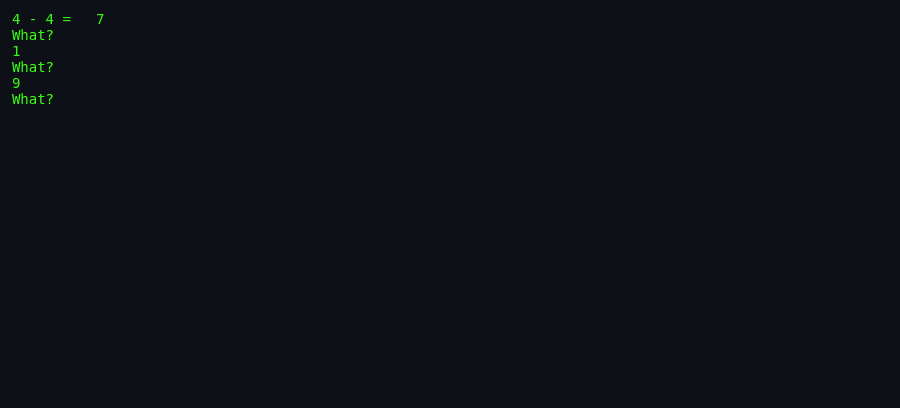
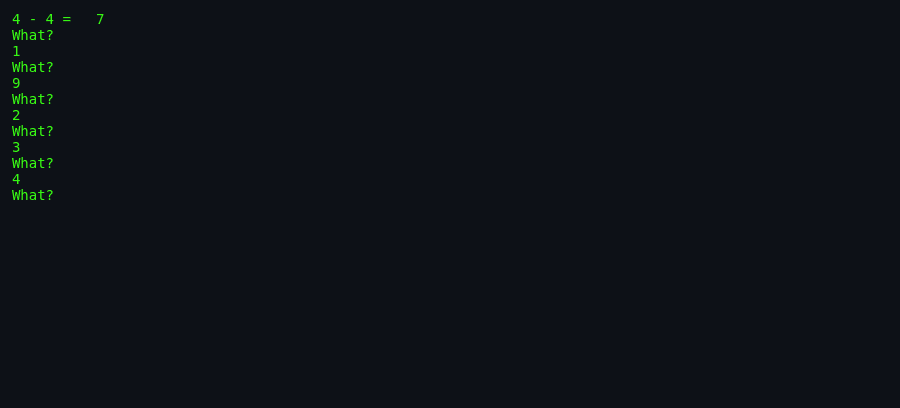

# About `arithmetic`

> **`arithmetic`** — the original computerized flash-card drill.

---

## What Is `arithmetic`?

`arithmetic` is a command-line math tutor. It fires simple problems at
you (`3 + 4 =`, `8 - 2 =`) and demands the right answer before moving
on. After every 20 problems it prints a score, the total time, and the
average time per correct answer, then waits for you to press RETURN.

The clever part is the adaptive bias: every time you miss a number,
that number gets extra "tickets" in the random-selection hat for the
same operation, so you see it again sooner. Get it right a few times
and the tickets expire, so the drill gradually forgets your old
mistakes.

## Screenshots

*The program starts with addition and subtraction in the 0–10 range.*

*A wrong answer earns a "What?" and biases future questions toward the
missed number.*

*After 20 questions the score and timing summary appear.*

## Authors & Publisher

- **Author(s):** Eamonn McManus — Trinity College Dublin.
- **Publisher / distributor:** University of California / BSDGames
  package.
- **Release year:** 1989 / 1993 (BSD 4.3).
- **Language:** C.

## The Era

`arithmetic` was written when Unix workstations were appearing in
universities and schools. It provided a quick, no-frills way to drill
math facts without graphics or sound — just a prompt and a keyboard.

## Why It's Interesting

- **Adaptive quizzing** implemented with a simple penalty list.
- **Clean separation** between problem generation, answer checking, and
  statistics.
- **No hand-holding** — the program never tells you the right answer;
  you must work it out.

## Difficulty & Progression

The game has no levels, but difficulty scales through the command-line
options:

- **Operators:** `-o +x/` adds multiplication and division.
- **Range:** `-r 100` increases operand size.
- **Implicit progression:** as you improve, the penalty system shows
  you your old mistakes less often.

## Making-Of / Anecdotes

The source header notes that the author wrote this version without
looking at the original source, then lists the deliberate differences:
penalties decay over time, there is no artificial delay after the
score, and there is no maximum range limit.

## Cultural Impact

`arithmetic` is the ancestor of every flash-card app, Khan Academy
exercise, and math-drill web site. Its core loop — ask, check,
reinforce mistakes — is still the standard design for spaced-repetition
and drill software.

## Known Bugs (Historical)

- The original would infinite-loop if invoked as `arithmetic / 0`;
  this version avoids that.
- Very large ranges can cause integer overflow in `left` or `result`.

## See Also

- [`how-to-play.md`](./how-to-play.md) — controls and scoring.
- [`architecture.md`](./architecture.md) — the penalty system.
- [`lineage.md`](./lineage.md) — descendants.
- [`references.md`](./references.md) — sources.
