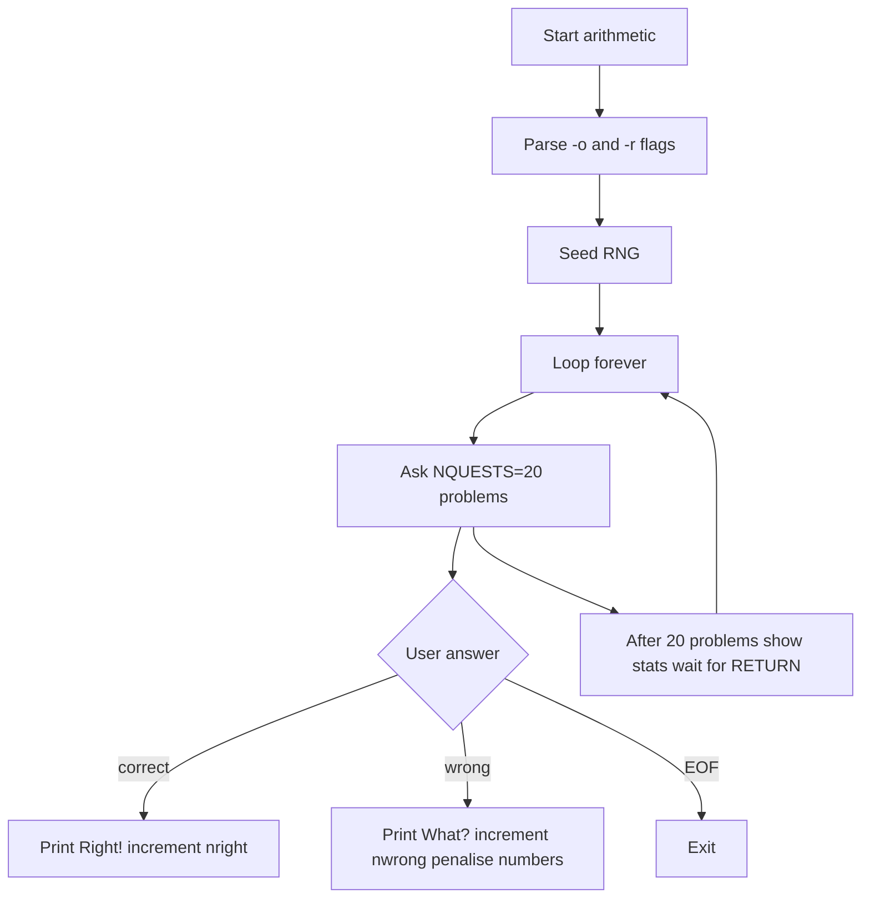

# `arithmetic` — Architecture

`arithmetic` is a small interactive C program built around a loop that
generates problems, reads answers, and updates a penalty-based adaptive
model.

---

## Control Flow



## Game Loop / Control Flow

The main loop in `main()` is intentionally infinite. It asks 20
questions, prints statistics, waits for the user to press RETURN, and
repeats. The only exits are EOF on stdin or `SIGINT`.

## AI Logic

There is no opponent AI. The "intelligence" is the adaptive penalty
system:

- Each wrong answer adds a penalty entry for the involved number(s).
- `penalty[op][operand]` stores the total extra weight.
- `getrandom()` picks a random value from `0 .. maxval+penalty-1`.
- Values above `maxval` map into the penalty list, returning the
  penalised number and decrementing its weight.

This makes recently-missed numbers more likely to reappear, but the
bias decays as those numbers are selected.

## Random-Event System

`random()` is used for:

- Selecting the operator (`op = keys[random() % nkeys]`).
- Selecting operands and results (`getrandom()`).
- Adding a remainder in division problems (`random() % right`).

The RNG is seeded once with `srandom(time(NULL))`.

## Difficulty Progression & Runtime Setup

Difficulty is set by flags before the loop starts:

- `keys` and `nkeys` from `-o`.
- `rangemax` from `-r`.

There is no in-game difficulty ramp; the challenge is static unless the
user restarts with different flags.

## Key Code Excerpts

### Main loop (`arithmetic.c:150-157`)

```c
for (;;) {
    for (cnt = NQUESTS; cnt--;)
        if (problem() == EOF)
            exit(0);
    showstats(0);
}
```

### Problem generation (`arithmetic.c:195-279`)

```c
op = keys[random() % nkeys];
if (op != '/')
    right = getrandom(rangemax + 1, op, 1);
retry:
switch (op) {
case '+': left = getrandom(...); result = left + right; break;
case '-': result = getrandom(...); left = right + result; break;
case 'x': left = getrandom(...); result = left * right; break;
case '/': right = getrandom(rangemax, op, 1) + 1;
           result = getrandom(rangemax + 1, op, 0);
           left = right * result + random() % right;
           break;
}
```

### Penalty tracking (`arithmetic.c:294-321`)

```c
int penalty[sizeof(keylist) - 1][2];
struct penalty { int value, penalty; struct penalty *next; }
    *penlist[sizeof(keylist) - 1][2];

void penalise(value, op, operand) {
    op = opnum(op);
    p = malloc(sizeof(*p));
    p->next = penlist[op][operand];
    penlist[op][operand] = p;
    penalty[op][operand] += p->penalty = WRONGPENALTY;
    p->value = value;
}
```

### Weighted random selection (`arithmetic.c:330-371`)

```c
value = random() % (maxval + penalty[op][operand]);
if (value < maxval)
    return(value);
value -= maxval;
/* walk penalty list, decrement selected entry */
```

## Data Format

No external data. Operators, ranges, and penalties are all in memory.

## See Also

- [`spec.md`](./spec.md) — formal behaviour.
- [`lessons.md`](./lessons.md) — teaching points.
- [`references.md`](./references.md) — sources.
