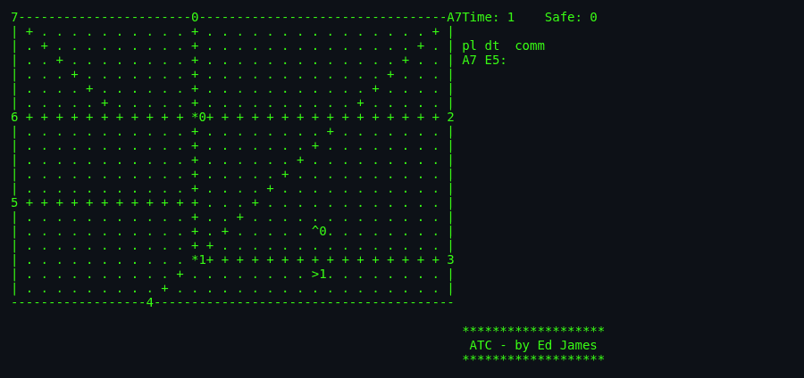
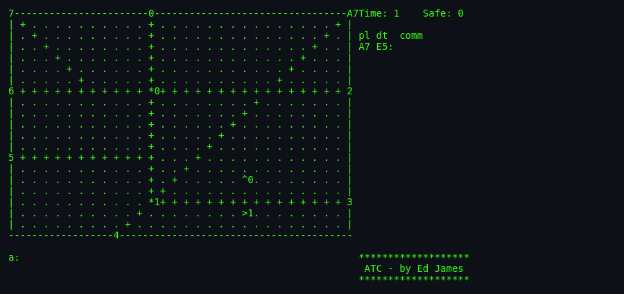
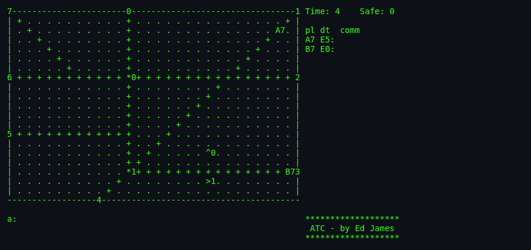

# About `atc`

> A radar screen full of jets and propeller planes, each with a
> destination and a fuel gauge. Every five seconds the clock ticks
> and they all move. You have those five seconds to type commands.
> Miss one and someone might collide. Miss two and the game is
> over. **Welcome to air traffic control.**

---

## What Is `atc`?

`atc` is a real-time simulation of air traffic control, written for
BSD Unix in 1986 by Ed James at UC Berkeley. You watch a top-down
radar view of a rectangular flight arena. Aircraft enter from
labelled *exits* around the border, or from *airports* inside the
field. Each has a *destination* — another exit, or an airport for
landing. Your job: type commands (altitude changes, turns, delayed
manoeuvres) to deliver every plane safely, without collisions,
without running out of fuel, without exiting through the wrong door.

The game does not stop. There is no pause. Even sending a talk
message won't help; the man page notes drily, *"When was the last
time an Air Traffic Controller got called away to the phone?"*

## Screenshots

*A brand-new game on the default 30×21 arena. The radar shows 8
numbered exits (`0`–`7`) on the border, 2 beacons (`*0`, `*1`), 2
airports (`^0` facing north and `>1` facing east), and helper lines
(`+`). One plane is already inbound: `a7` — jet `a` at 7,000 ft,
heading toward Exit 3.*

*Typing `a` at the input line. Auto-completion is baked into the
command grammar: hit `?` at any point and the game lists the valid
next characters.*

*After 4 update ticks, two planes are in the air. Right pane shows
the information area: `A7 E5:` = prop `A` at 7,000 ft going to Exit
5, `B7 E0:` = prop `B` going to Exit 0. `Time: 4  Safe: 0` — no
planes delivered yet.*

---

## Authors & Publisher

- **Author:** **Ed James**, UC Berkeley. Wrote `atc` in 1986. Email
  from that era: `edjames@ucbvax.berkeley.edu`. Notes in the source
  suggest the game was inspired by *"someone's description of the
  overall flavor of a game written for some unknown PC many years
  ago, maybe."*
- **Publisher / distributor:** entered BSD via CSRG (Computer
  Systems Research Group) at Berkeley; shipped in **4.3BSD-Reno**
  (1990) and later NetBSD / BSDGames / Debian `bsdgames`.
- **Language:** C using `curses`, plus **`yacc` and `lex`** for the
  command parser and the game-field DSL.
- **First BSD release:** ~1990 (4.3BSD-Reno). Ed James's own
  copyright header dates to 1987.

## The Era

`atc` is a Berkeley late-80s artefact. The typical target was a VT100
or better terminal, wired to a shared VAX. The real innovation is
that Ed James wrote a **real-time signal-driven game** with a
**yacc-parsed command grammar** in an era when most terminal games
were turn-based prompt-loops. `atc` reads more like an operations
system than a game — which is exactly why fans love it.

## Screenshots Are Just the Beginning

Unlike arcade games where a screenshot conveys the appeal, `atc`
needs to be experienced live. Every 5 seconds the world updates.
Every plane moves 1 square. Every plane's fuel drops by 1. If two
planes ever end a tick within 1 square of each other in *all three
axes* — game over.

## Why It's Fun

- **Genuine dread.** Once you have 5 planes on the radar, you feel
  your pulse in your fingertips. It's simulated stress, but real
  stress.
- **Command grammar is a small language.** Learning to type
  `atlab1` = "plane A: turn left at beacon 1" is like learning
  regex — awkward at first, then feels like second nature.
- **Perfect information puzzle in real time.** The state is
  visible; the challenge is *reacting fast enough*. Unlike chess
  (perfect info, slow) or FPS (imperfect info, fast), `atc`
  occupies a rare middle ground.
- **17 playfields**, hand-designed. Some are *cruel*. Killer and
  Atlantis are famous rites of passage.
- **The `?` completion feature** is remarkable for 1986 — Vim-like
  command discovery baked into gameplay.
- **A cult following.** Every experienced Unix user has an `atc`
  story.

## Difficulty & Progression

`atc` has **no traditional levels**. Difficulty is delivered
through **playfield selection** (17 game files, wildly different)
and **implicit density scaling** as more planes accumulate on the
radar.

### Explicit: Playfield Choice (`-g <name>`)

The 17 shipped playfields set the four tunable parameters (`update`
seconds between ticks, `newplane` update-count between spawns,
`width`, `height`) and the arena layout. Sample:

| Playfield | `update` | `newplane` | Size | Tone |
|---|---:|---:|---|---|
| `easy` | slower | rarer | small | Beginner-friendly |
| `default` | 5 s | 10 | 30×21 | Reference difficulty |
| `novice` | moderate | moderate | small-ish | Practice arena |
| `crossover` | fast | frequent | medium | Cross traffic drills |
| `Killer` | fast | frequent | tight | Notorious. Do not try first. |
| `Atlantis` | very fast | very frequent | large | Legendary. Almost unwinnable. |

The player picks with `atc -g <name>`. If the name is not in
`Game_List`, the game runs but **scoring is disabled** (test mode).

### Implicit: Radar Density

Even on `default`, difficulty increases *during* a game:

- Planes accumulate. New spawns don't stop until you exit them.
- **Fuel starts at `width + height`.** On the 30×21 default that's
  51 updates × 5 s = ~255 seconds of fuel per plane. Late-arriving
  planes have less runway.
- **Jets tick every update; props tick every OTHER update.**
  Mixing them stresses your timing.
- **Collision is 3-axis adjacency (`≤1` in altitude, x, y).**
  Density = collision risk.

### The Score Plateau

Score is `planes safely delivered`. There is no cap. There is no
win. You play until you lose. The `-t` / `-s` flag shows the
scoreboard — cross-user, cross-session — sorted by planes safe.

## Making-Of Notes

- Ed James is credited in a small **AUTHOR AREA** on the radar
  itself: `ATC - by Ed James` displayed permanently in the corner.
  Rare, charming.
- The 1987 copyright notice is separate from the standard BSD
  header and appears in every source file, giving Ed James
  independent recognition alongside the Regents.
- The `BUGS` file (verbatim contents, 4 lines):
  1. log restarts if interrupted
  2. Still refreshes after exit
  3. Should ^Z be disabled?
  4. does not exit after hup
- The scoring convention — sorted by *planes safe*, other stats
  "for fun" — is intentionally uncompetitive. Ed James wanted a
  meditation, not a leaderboard war.

## Cultural Impact

- `atc` is a **cult classic** in the Unix community. Users who
  discover it in college often remember it more vividly than
  courses they took.
- Genre it belongs to: **real-time management sim** — a lineage
  running through *SimAnt*, *Theme Hospital*, *Kerbal Space
  Program*, *Mini Metro*.
- Modern spiritual descendants: **Endless ATC**, **Airport
  Madness**, **ATC 4** (steam), **Global ATC Simulator**. Many
  cite `atc` in credits.

See [`lineage.md`](./lineage.md) for the full genealogy.

## Known Bugs (Historical)

Beyond the four in the `BUGS` file, the man page notes:

> The screen sometimes refreshes after you have quit.

Users report:

- **Disabling `^Z` is deliberate** (signals ignored in
  `main.c:149-150`). Users still ask about it.
- On some ncurses versions, the beacon glyph (`*`) can collide
  visually with plane markers.
- The `-r <seed>` flag is described as *"The purpose of this flag
  is questionable"* — Ed James's own comment. It reproduces
  starting conditions but the real-time signal timing makes exact
  replays impossible anyway.

## See Also

- [`how-to-play.md`](./how-to-play.md) — the actual player manual.
- [`architecture.md`](./architecture.md) — code deep-dive.
- [`lineage.md`](./lineage.md) — descendants.
- [`references.md`](./references.md) — source citations.
