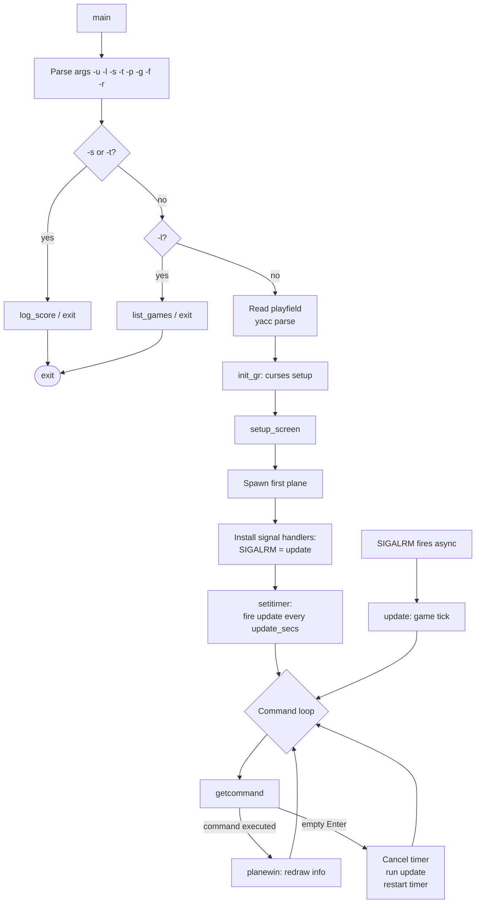
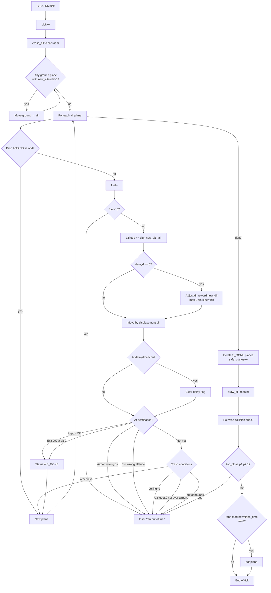

# `atc` — Original Architecture

> Real-time simulation driven by a `SIGALRM` timer, commanded
> through a `yacc`/`lex` grammar, animating dozens of concurrent
> plane state machines. Ed James's design is a small masterpiece
> of Unix systems programming.

Upstream source (not redistributed in this repo):
<https://github.com/vattam/BSDGames/tree/master/atc>

---

## Files & Roles

| File | Purpose | Approx. LoC |
|---|---|---:|
| `main.c` | Entry, arg parsing, signal setup, main game loop | ~320 |
| `update.c` | **Real-time update tick** — plane movement, collision, spawn | ~420 |
| `input.c` | Command completion loop, `?` list, backspace, submit | ~350 |
| `graphics.c` | Curses drawing: radar, info panel, input area, author area | ~250 |
| `grammar.y` | **Yacc grammar** for game-field DSL + player commands | ~400 |
| `lex.l` | **Lex tokeniser** for both DSL and commands | ~150 |
| `list.c` | Doubly-linked list of planes (air / ground) | ~80 |
| `log.c` | Score file read/write | ~200 |
| `tunable.c/.h` | Compile-time tunable defaults | ~80 |
| `def.h`, `include.h`, `struct.h`, `extern.h` | Constants, structs, prototypes | ~200 |
| `atc.6.in` | Man page | — |
| `games/*` | 17 hand-designed playfield files (parsed by yacc) | — |

Total: ~2400 LoC + assets. Substantial for BSDGames.

## High-Level Architecture



References: `main.c:64-208`.

## The Real-Time Loop

The single most interesting architectural choice: **the game tick is
driven by a Unix signal, not a polled clock.**

```c
// main.c:163-176
sa.sa_handler = update;
sigemptyset(&sa.sa_mask);
sigaddset(&sa.sa_mask, SIGALRM);
sigaddset(&sa.sa_mask, SIGINT);
sa.sa_flags = 0;
sigaction(SIGALRM, &sa, (struct sigaction *)0);

itv.it_value.tv_sec = 0;
itv.it_value.tv_usec = 1;
itv.it_interval.tv_sec = sp->update_secs;   // e.g. 5 seconds
itv.it_interval.tv_usec = 0;
setitimer(ITIMER_REAL, &itv, NULL);
```

- `setitimer(ITIMER_REAL, ...)` schedules `SIGALRM` every
  `update_secs` seconds.
- The signal handler is `update()` itself — running arbitrary game
  logic from a signal context.
- Meanwhile the main thread blocks in `getcommand()` reading input
  character-by-character.
- When the timer fires, the OS interrupts `getcommand`, runs
  `update()`, and returns control.

### Empty-Enter Fast-Forward

```c
// main.c:181-206
for (;;) {
    if (getcommand() != 1)
        planewin();
    else {
        // Cancel timer, run update immediately, restart timer
        itv.it_value.tv_sec = 0;
        setitimer(ITIMER_REAL, &itv, NULL);
        update(0);
        itv.it_value.tv_sec = sp->update_secs;
        setitimer(ITIMER_REAL, &itv, NULL);
    }
}
```

A `getcommand()` return of 1 means the user pressed Enter with no
input — a manual "next tick" trigger. The timer is stopped, an
update is forced, and the timer restarts. Elegant, and the reason
players can *fast-forward through quiet moments*.

## Plane Data Structure

Every plane is a node in a doubly-linked list (either `air` or
`ground`).

```c
// struct.h:73-91
typedef struct plane {
    struct plane *next, *prev;
    int status;              // S_MARKED / S_UNMARKED / S_IGNORED / S_GONE
    int plane_no;            // 0..25 (mapped to A..Z or a..z)
    int plane_type;          // 0 = prop, 1 = jet
    int orig_no, orig_type;  // where it entered
    int dest_no, dest_type;  // T_AIRPORT or T_EXIT
    int altitude;            // current, 0..9 thousand ft
    int new_altitude;        // target
    int dir;                 // current heading 0..7 (45° each)
    int new_dir;             // target heading
    int fuel;                // ticks of flight remaining
    int xpos, ypos;          // grid position
    int delayd;              // 1 if command awaiting a beacon
    int delayd_no;           // which beacon
} PLANE;
```

Total per plane: ~64 bytes. Trivial by modern standards; frugal in
1986.

## Per-Tick Update Loop

The heart of the game (`update.c:55-219`):



## AI Logic — Plane Movement

Every plane is a **deterministic state machine**. The "AI" is:

1. **Adjust altitude by ±1 toward target**
   ```c
   pp->altitude += SGN(pp->new_altitude - pp->altitude);
   ```
2. **Adjust direction, clamped to ±2 slots (=90°) per tick**
   ```c
   dir_diff = pp->new_dir - pp->dir;
   if (dir_diff > 2) dir_diff = 2;
   else if (dir_diff < -2) dir_diff = -2;
   pp->dir += dir_diff;
   ```
3. **Move by unit vector for the direction**
   ```c
   pp->xpos += displacement[pp->dir].dx;
   pp->ypos += displacement[pp->dir].dy;
   ```

Where `displacement[0..7]` is a lookup table of the 8 compass unit
vectors. No pathfinding, no target seeking, no AI decision-making
— the plane simply obeys its two "new" fields until the player
overrides them.

**The AI is you.** You're the intelligence in this system.

## Random Event System

Randomness in `atc` is used for **plane spawning** and **destination
assignment**, not for gameplay uncertainty during flight.

### Seed

```c
// main.c:82
start_time = seed = time(NULL);
// ... optionally overridden by -r flag ...
srandom(seed);
```

Note that even with a fixed seed, real-time signal timing is
non-deterministic — hence the man page comment about `-r`.

### New Plane Trigger

```c
// update.c:213
if ((rand() % sp->newplane_time) == 0)
    addplane();
```

Every tick, roll a die with `newplane_time` sides. On zero, spawn.
So the *average* interval between planes is `newplane_time`, but
the actual gap is geometrically distributed — bunches happen.

### Plane Attributes

```c
// update.c:312-336
p.plane_type = random() % 2;                  // prop or jet
num_starts = sp->num_exits + sp->num_airports;
rnd = random() % num_starts;                  // dest = exit or airport
// ...
while ((rnd2 = random() % num_starts) == rnd) ; // orig != dest
```

Plane type: uniform 50/50. Destination: uniform over exits+airports.
Origin: uniform over remaining, but if origin conflicts with a
nearby plane (`too_close(p1, &p, 4)`), the spawn slot is retried.
After N failures, the spawn is skipped that tick (`addplane` returns
-1).

### Spawn Table

| Trigger | Distribution | Effect |
|---|---|---|
| `update.c:213` — per-tick spawn roll | Uniform `[0, newplane_time)` | `== 0` → attempt spawn |
| `update.c:312` — plane type | Uniform `{0, 1}` | 0=prop, 1=jet |
| `update.c:315` — destination | Uniform `[0, num_exits + num_airports)` | Splits into exit vs. airport |
| `update.c:328` — origin | Uniform `[0, num_starts)` different from destination | Retried on adjacency conflict |

## The Yacc/Lex Command Grammar

Ed James wrote **two** yacc grammars:

1. **Command grammar** — parses `atlab1` into "plane A: turn left
   at beacon 1"
2. **Playfield DSL** — parses `beacon: (12 7) (12 17);` into a
   `C_SCREEN` struct

Both grammars share a single `lex.l` tokeniser. This is unusual;
most yacc-driven programs have one grammar.

The command grammar supports the `?` completion feature — during
parse, if the input is incomplete, the game inspects the current
parse state and lists valid next tokens. This is precocious for 1986.

For details: read `grammar.y` and `lex.l`. Skimming those files is
recommended reading for any C programmer curious about how compilers
work.

## Difficulty Progression Logic

`atc` has **no episodic level system**. Difficulty is set at
launch via the playfield file, then rises implicitly during play.

### 1. Playfield File Sets Difficulty

Every game-field file (`games/default`, `games/Killer`, etc.) sets
four **tunable parameters** at the top:

```
update = 5;         // seconds per tick
newplane = 10;      // average tick interval between spawns
width = 30;         // radar width
height = 21;        // radar height
```

These flow through yacc into `C_SCREEN` (`struct.h:59-71`) and
control:

- **Tick pace** — `update` shorter = faster real-time; less thinking.
- **Density** — smaller `newplane` = more spawns = more chaos.
- **Arena size** — smaller `width`/`height` = tighter corridors
  = more collisions.

### 2. Fuel Scales with Arena

```c
// update.c:353
p.fuel = sp->width + sp->height;
```

Small arena = smaller fuel. `default` is 30+21=51 ticks × 5s =
~255 seconds of flight per plane. Small maps punish slow decisions.

### 3. Implicit Density Spiral

Every tick has a `rand()%newplane_time == 0` spawn chance. New
planes accumulate. Old planes must be exited before ceiling
becomes too crowded. Player skill = keeping the population
bounded.

### 4. Playfield Difficulty Table

| Playfield | Difficulty | Signature Challenge |
|---|:---:|---|
| `easy` | 🟢 Beginner | Slow pace, large arena |
| `novice` | 🟢 | Moderate |
| `default` | 🟡 Standard | Reference difficulty |
| `crossover`, `crosshatch`, `box`, `two-corners`, `airports` | 🟡 | Puzzle geometries |
| `game_2`, `game_3`, `game_4`, `Tic-Tac-Toe` | 🟠 | Experimental |
| `Killer`, `OHare` | 🔴 Hard | Tight arena, fast pace |
| `Atlantis` | 🔴🔴 Legendary | Massive spawn rate |

### 5. What Does Not Scale

- **Plane speeds** — deterministic and constant per type.
- **Turn / altitude rates** — always ±2 direction slots, ±1
  altitude per tick.
- **Collision threshold** — always 3-axis adjacency ≤ 1.
- **Fuel formula** — always `width + height` for every plane.
- **RNG behavior** — same distribution, just different frequency.

### 6. Session Replay

The `-r <seed>` flag reproduces the RNG sequence. But because
`SIGALRM` timing is non-deterministic (kernel scheduling, terminal
I/O), the actual game state is **not exactly reproducible** — Ed
James's own comment.

## Clever Era Techniques

1. **`SIGALRM` + `setitimer` for real-time game loop.** No
   threads (didn't really exist), no polling, no busy-wait. Ed
   uses Unix signals to build what modern game engines use
   RAF/tick loops for. Signal handler code must be signal-safe;
   Ed's is not strictly (uses stdio) but works in practice.
2. **Yacc for player commands.** Nobody in the 1980s wrote game
   command parsers in yacc. Ed's grammar is the reason `?`
   completion is possible: yacc's LALR(1) tables know exactly
   what tokens are valid next.
3. **Command completion in a real-time game.** Modern text
   adventures use hand-tuned autocomplete. `atc` gets it for free
   from yacc's shift tables.
4. **Data-driven playfields via yacc DSL.** Same parser, two
   grammars. 17 hand-designed maps ship. Community can write more.
5. **Doubly-linked lists for planes.** Air and ground are
   separate lists; `list.c` provides `append`, `delete`. Simple,
   fast, safe.
6. **Occupancy-count-free collision.** Unlike `robots`, `atc`
   does full pairwise `O(N²)` collision. With N ≤ 26 planes max,
   O(N²) is trivial. Chose clarity over cleverness.
7. **`SGN` and `ABS` macros for compact math.** Signed step
   toward target, magnitude clamp — the two-line altitude/direction
   update reads like game-feel physics.
8. **`getopt` for CLI parsing.** Not fancy; correct.
9. **Score sorted by planes safe, ties by real time.** Uncompetitive
   design — you're not racing anyone, you're just trying to survive.

## Constraints Handled

- **CPU** — 1986 VAX. The 5-second default tick meant even slow
  hardware could handle it. Curses redraws optimised via
  `erase_all` / `draw_all` pattern.
- **Memory** — ~64 B per plane × 26 max = 1.7 KB. Playfield struct
  a few hundred bytes. Total < 10 KB.
- **Terminal size** — assumes 80×24 minimum. Radar dimensions come
  from playfield file, but info panel needs ~20 columns to the right.
- **Signal safety** — `update()` from SIGALRM context uses
  `printf`. Not portable-safe, but Ed knew his environment.
- **Score sharing across users** — `setregid(getgid(), getgid())`
  drops setgid privileges once score file is opened.

## What This Code Would Look Like Today

- **Game loop** → proper tick with `dt` interpolation, decoupled
  from render.
- **Yacc** → replace with parser combinator library (`pest`, `nom`,
  `chumsky`). Or hand-written state machine for the command
  language.
- **Playfield DSL** → JSON or YAML with schema validation.
  Migration script from yacc DSL for the 17 existing maps.
- **Signal-driven update** → single-threaded event loop, or
  proper multi-threading with locks around plane list.
- **`getcommand` character-by-character** → readline-style
  editor or full TUI framework.
- **Rendering** → still terminal-first (spiritual successor), but
  optionally graphical mode (SVG rendering of radar).
- **Playfield editor** → drag-and-drop map editor as tool.
- **Score storage** → SQLite + optional cloud sync.
- **Multiplayer** — see [`port-ideas.md`](./port-ideas.md).

## See Also

- [`lessons.md`](./lessons.md) — technique extracts for beginners.
- [`spec.md`](./spec.md) — implementation-independent contract.
- [`port-ideas.md`](./port-ideas.md) — modernisation ideas.
- [`references.md`](./references.md) — sources.
