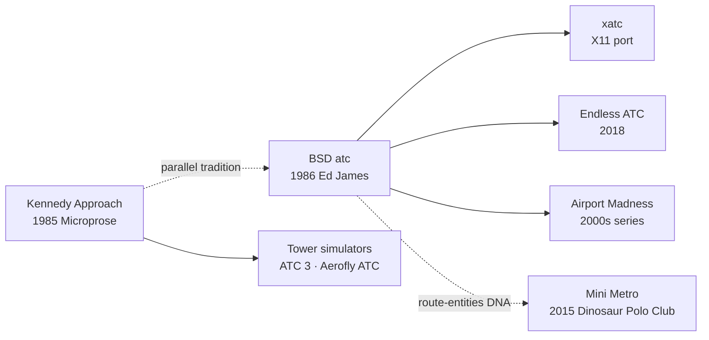

# `atc` — Lineage

> Where does `atc` sit in the wider genealogy of ATC games and
> real-time simulation games?

---

## Direct Ancestors

`atc` (1986) does not have a documented single ancestor. Ed James's
own comment in the source: *"This game is based on someone's
description of the overall flavor of a game written for some
unknown PC many years ago, maybe."*

Plausible predecessors:

- **Real-time simulator research on VAX / PDP-11 systems** in the
  early-to-mid 1980s. Ed's use of `SIGALRM` was standard technique.
- **Kennedy Approach** (Microprose, 1985) — commercial ATC sim on
  Atari/C64/PC. Very likely one of the games Ed's colleague
  described. Different mechanics but same problem domain.
- **Missile Command** (Atari, 1980) — the *"multiple concurrent
  entities requiring timely attention"* pattern.

## Direct Descendants

- **`xatc`** — an X11 port with graphical radar, community-driven.
- **Endless ATC** (2018, Reith Studios) — modern web/mobile ATC
  sim. Design directly inspired by `atc` per developer statements.
- **Airport Madness** series — commercial games in the ATC
  puzzle-sim tradition.

## Genre Family

## If You Like `atc`, Try…

**Faithful modern clones / spiritual successors:**

- **Endless ATC** (web/mobile) — clean modern implementation of
  the same core loop. Visually accessible.
- **Sky Haven** (2020, Steam) — airport management + ATC.
- **Global ATC Simulator** — accurate ATC training sim.

**Same design idiom (multiple concurrent entities, real-time
command):**

- **Mini Metro** (2015, Dinosaur Polo Club) — route metro trains
  in real-time, similar "keep the flow alive" pressure.
- **Overcooked** (2016, Team17) — real-time task juggling with
  command dispatch.
- **Diner Dash** and variants — dispatch tasks under time pressure.

**Serious ATC training:**

- **ATC 3 Radar Screen**.
- **Aerofly RC** family.
- **VATSIM / IVAO** — networks where you can be a real virtual
  air traffic controller.

**Real-time management sims descendants:**

- **SimAnt, SimCity** (Wright, late 80s–90s).
- **Theme Hospital** (Bullfrog, 1997).
- **Kerbal Space Program** (Squad, 2015).

## Communities

- **VATSIM** — Virtual Air Traffic Simulation Network. Real
  people play virtual ATC.
- **Reddit r/ATC, r/flightsim**.
- **Retro-Unix gaming communities** on Usenet archives (`comp.games`
  discussions of `atc` from 1990s).
- **Ed James's own homepage** if still active.

## References

See [`references.md`](./references.md) for citations.
