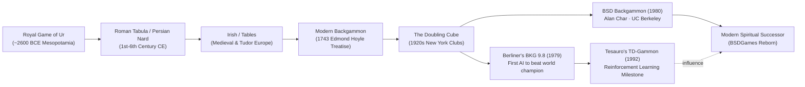

# About Backgammon

> *"Backgammon is the quintessential duel of destiny and calculation: five millennia
> of history distilled into thirty checkers, two dice, and a doubling cube."*

---

## 1. Game Overview

**Backgammon** is a two-player board game of strategy, probability, and race management. Each player
commands 15 checkers moving in opposite directions across a board of 24 triangular points. The goal
is to navigate all your checkers into your inner home board and bear them off before your opponent does,
while striking vulnerable opponent checkers (*blots*) to the central bar and utilizing the
**Doubling Cube** to amplify match stakes.

The BSD Unix implementation was written in **1980** by **Alan Char** at the Computer Systems
Research Group (CSRG), University of California, Berkeley. Notably, Char also created
**`teachgammon`**, one of the earliest interactive, terminal-based tutorial programs in computing
history, designed to teach UNIX users the rules, probability theory, and opening moves of Backgammon.

---

## 2. Historical & Cultural Context



### Five Millennia of Heritage
Archaeological excavations at the Royal Cemetery at Ur (modern-day Iraq) revealed gameboards
dating to **2600 BCE**, sharing the essential race and capture mechanics of Backgammon.
The Roman Emperor Claudius was so obsessed with *Tabula* (a direct ancestor with 24 points and 3 dice)
that he had a board mounted inside his chariot to play while traveling. In 1743, English games
authority **Edmond Hoyle** codified the laws of Backgammon, establishing it as a staple of European
salons and coffeehouses.

### The 1920s Invention: The Doubling Cube
In the mid-1920s, in the private gaming clubs of Manhattan (notably the Racquet and Tennis Club),
an anonymous player introduced the **Doubling Cube**—a six-sided die marked with powers of two
($2, 4, 8, 16, 32, 64$). This single innovation revolutionized the game, transforming it from a
leisurely race into a high-stakes psychological battlefield of game theory, leverage, and fold equity.

### A Milestone in Artificial Intelligence
Backgammon holds a revered position in computer science history:
- In **1979**, Hans Berliner's program **BKG 9.8** (running on a DEC PDP-10 at Carnegie Mellon) defeated
  the reigning World Champion Luigi Villa 7–1 in Monte Carlo—marking the **first time in history**
  that a computer program defeated a world champion in any recognized board game!
- In **1992**, Gerald Tesauro developed **TD-Gammon** at IBM, pioneering temporal difference
  reinforcement learning ($TD(\lambda)$) to train a neural network from self-play, directly inspiring
  DeepMind's later breakthroughs in AlphaGo and AlphaZero.

---

## 3. Visual Tour

Below are captures of BSD Backgammon running in its native ASCII terminal layout.

### Initial Starting Layout
The 24-point board is split into outer and inner tables by the central BAR, with 15 Red (`r`) and
15 White (`w`) checkers placed in standard starting positions:


*Figure 1: Initial starting position rendered via Alan Char's ASCII board engine.*

### Doubling Cube Offer & Escalation
Red offers a double; White evaluates board equity and accepts, elevating the game value from 2 to 4:


*Figure 2: Active doubling exchange with White on the bar and game value reaching 4 points.*

### Bearing Off & Match Victory
Red successfully bears off all 15 checkers from the home board to clinch the match:


*Figure 3: Endgame race showing Red bearing off the final checkers and securing victory.*

---

## 4. Why It's Fun: The Core Loop

1. **The Race vs. Combat Balance:** Backgammon is fundamentally a race, but checkers can be struck
   down at any moment. You must constantly balance running forward against maintaining safe anchors
   and building **primes** (walls of consecutive blocked points) to trap your opponent.
2. **The Horror of the Blot:** Leaving a single checker exposed on a point (a *blot*) is an invitation
   to disaster. Getting hit sends your checker back to the Bar, forcing you to re-enter through your
   opponent's home board while forfeiting precious pips.
3. **The Psychology of the Doubling Cube:** Knowing *when* to double—and knowing when to concede 1 point
   rather than risk losing 2, 4, or 8 points—is the true soul of Backgammon. The cube turns mathematical
   probability into an intense psychological poker match.

---

## 5. Making-of Stories & Teachgammon

In 1980, Alan Char developed `backgammon` at UC Berkeley. Rather than writing just an engine, Char
built an entire educational platform. He split the project into three cleanly decoupled modules:
- `common_source/`: Shared rules, board geometry, and a dedicated odds matrix (`odds.c`).
- `backgammon/`: The main interactive match driver.
- `teachgammon/`: A dedicated tutorial binary that led beginners step-by-step through board layout,
  rules of hitting, bearing off, doubling strategy, and conducted a live guided practice game.

This modular architecture allowed students on Berkeley's VAX-11/780 and PDP-11 systems to learn
and master Backgammon directly through their CRT terminals.

---

## 6. Difficulty & Progression

BSD Backgammon models full tournament rules across successive games. Progression is driven by
match point accumulation and victory tiers:

| Victory Condition | Multiplier | Criteria | Impact on Game Value |
|---|:---:|---|---|
| **Regular Win** | **$1\times$** | Winner bears off all 15 checkers; loser has borne off $\ge 1$ checker. | Awards base game value ($V$). |
| **Gammon** | **$2\times$** | Winner bears off all 15 checkers; loser has borne off **$0$ checkers**. | Doubles game value ($2 \times V$). |
| **Backgammon** | **$3\times$** | Winner bears off all 15 checkers; loser has borne off **$0$ checkers** AND still has a checker on the bar or in the winner's inner board. | Triples game value ($3 \times V$). |

### Progression Dynamics Across a Match
- **Early Games:** Players test each other with early doubling offers. Trailing players take aggressive
  risks to hit blots and build primes.
- **Match Point (DMP - Double Match Point):** When both players are 1 point away from winning the match,
  the doubling cube becomes completely inactive (neither player can gain an advantage from doubling).
- **Gammon Save / Gammon Go:** A player significantly trailing in a match will aggressively push for a
  Gammon, sacrificing defensive stability for an all-out attack.

---

## 7. Known Bugs and Historical Quirks

1. **The Candid Author Bug Notice:**
   In the original `backgammon.6` manual page, Alan Char included a famously honest bug report:
   ```man
   BUGS
        The program's strategy needs much work.
   ```
   The 1980 AI relied on basic 1-ply greedy heuristics (`move.c`), frequently leaving unnecessary
   blots or failing to recognize prime containment structures.
2. **Raw Termcap Assumptions:** The original `fancy.c` cursor addressing engine directly manipulated
   termcap string capabilities. On modern terminal emulators with non-standard resize behaviors,
   screen redrawing could occasionally drop characters without an explicit `R` command.
3. **Move Notation Delimiters:** Input parser accepts both `s-f` (start-to-finish) and `s/r`
   (start-by-roll). However, entering complex multi-checker moves with trailing spaces occasionally
   confused the early parser.
