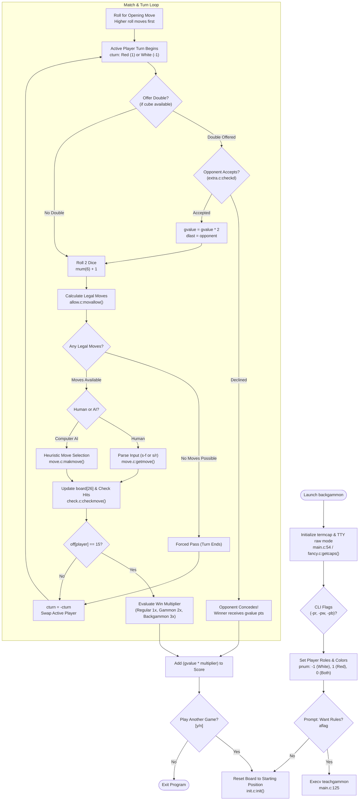

# Backgammon — Original Code Architecture

A technical deep-dive into the modular multi-program architecture, board representation duality,
real-time odds calculation engine, and termcap screen renderer in BSD `backgammon`.

---

## 1. Upstream Module Map

The original C source code is located in [`vattam/BSDGames/tree/master/backgammon`](https://github.com/vattam/BSDGames/tree/master/backgammon):

```
vattam/BSDGames/tree/master/backgammon/
├── common_source/          # Shared board engine and terminal primitives
│   ├── back.h              # Global structs, board[26] array, macros (swap, rnum)
│   ├── board.c             # Full-screen ASCII board renderer (wrboard, wrbsub)
│   ├── fancy.c             # High-speed cursor addressing using termcap (fboard)
│   ├── check.c             # Legal move verification (checkmove, movokay)
│   ├── allow.c             # Move generation and permutation generator (movallow)
│   ├── odds.c              # Dynamic hitting probability calculator (odds, count)
│   ├── table.c             # 6x6 odds lookup table for 36 dice outcomes
│   ├── one.c               # Single checker movement primitives (backone)
│   ├── subs.c              # Utility string and I/O subroutines
│   └── save.c              # Save and recover game state routines
│
├── backgammon/             # Main interactive match binary
│   ├── main.c              # Entry point, flag parsing (-pr/-pw/-pb), top-level turn loop
│   ├── move.c              # Human move parsing and AI move generator (makmove)
│   ├── extra.c             # Doubling cube logic and game value handling
│   ├── text.c              # Help text and in-game prompt strings
│   └── backlocal.h         # Local macros and message buffers
│
└── teachgammon/            # Interactive tutorial program
    ├── teach.c             # Tutorial driver and stage sequencing
    ├── tutor.c             # Interactive question-and-answer validator
    ├── ttext1.c            # Tutorial lessons: rules, board quadrants, movement
    ├── ttext2.c            # Advanced lessons: bearing off, doubling cube, strategy
    └── data.c              # Pre-scripted tutorial board layouts and moves
```

---

## 2. Main Game Loop Control Flow



---

## 3. The `board[26]` Representation Duality (`back.h`)

Alan Char utilized an elegant mathematical convention in `board[26]`
([`back.h:53-62`](https://github.com/vattam/BSDGames/tree/master/backgammon/common_source/back.h#L53)):
- **Sign represents color:**
  - Positive numbers ($+n$) = $n$ **Red** checkers.
  - Negative numbers ($-n$) = $n$ **White** checkers.
  - Zero ($0$) = Empty point.
- **Direction aligns with signs:**
  - Red moves in **ascending** order ($1 \rightarrow 24$).
  - White moves in **descending** order ($24 \rightarrow 1$).
- **Boundary points encode Bar and Home:**
  - `board[0]` = Red's Bar / White's Home.
  - `board[25]` = White's Bar / Red's Home.

This symmetry allowed a single movement loop in `check.c` to handle both players simply by
multiplying board indices by the player's sign `cturn` ($\pm 1$).

---

## 4. Real-Time Odds Engine (`odds.c` & `table.c`)

In [`common_source/odds.c:30`](https://github.com/vattam/BSDGames/tree/master/backgammon/common_source/odds.c#L30),
BSD Backgammon calculates exact mathematical hitting probabilities across all 36 combinations of two dice:
- `table[6][6]`: Lookup matrix containing all 36 dice rolls.
- Given a blot at distance $d \in [1, 24]$, `odds.c:count()` iterates over all 36 outcomes, checking
  if direct rolls ($r_1 = d$ or $r_2 = d$), additive combinations ($r_1 + r_2 = d$), or doublets
  can hit the blot without being blocked by intervening opponent anchor points.

---

## 5. Alan Char's 1980 AI Strategy Engine (`move.c`)

The computer AI in `move.c:makmove()` ([`move.c:120`](https://github.com/vattam/BSDGames/tree/master/backgammon/backgammon/move.c#L120))
relies on a 1-ply greedy static evaluation function:
1. **Hitting Priority:** If any legal move hits an opponent blot, execute it immediately.
2. **Safe Anchor Creation:** If a move allows pairing two checkers on an open point (making an anchor),
   prioritize it to eliminate blots.
3. **Running Priority:** Advance the furthest trailing checkers forward to reduce pip distance.
4. **Blot Minimization:** Heavily penalize moves that leave single blots within direct hitting distance
   (1–6 points) of opponent checkers.

While basic by modern neural network standards (as Char famously noted in the manual page), the engine
plays competent, rapid moves suitable for beginners.

---

## 6. High-Speed Termcap Screen Management (`fancy.c`)

Rather than relying on `curses`, Alan Char implemented a custom terminal optimization module using
raw `termcap` capabilities (`cm` for cursor motion, `cl` for clear screen):
- `fboard()` ([`fancy.c:45`](https://github.com/vattam/BSDGames/tree/master/backgammon/common_source/fancy.c#L45)):
  Pre-computes row and column offsets for all 24 points.
- Only points that have changed since the last turn are redrawn, transmitting minimal escape sequences
  over serial connections.
