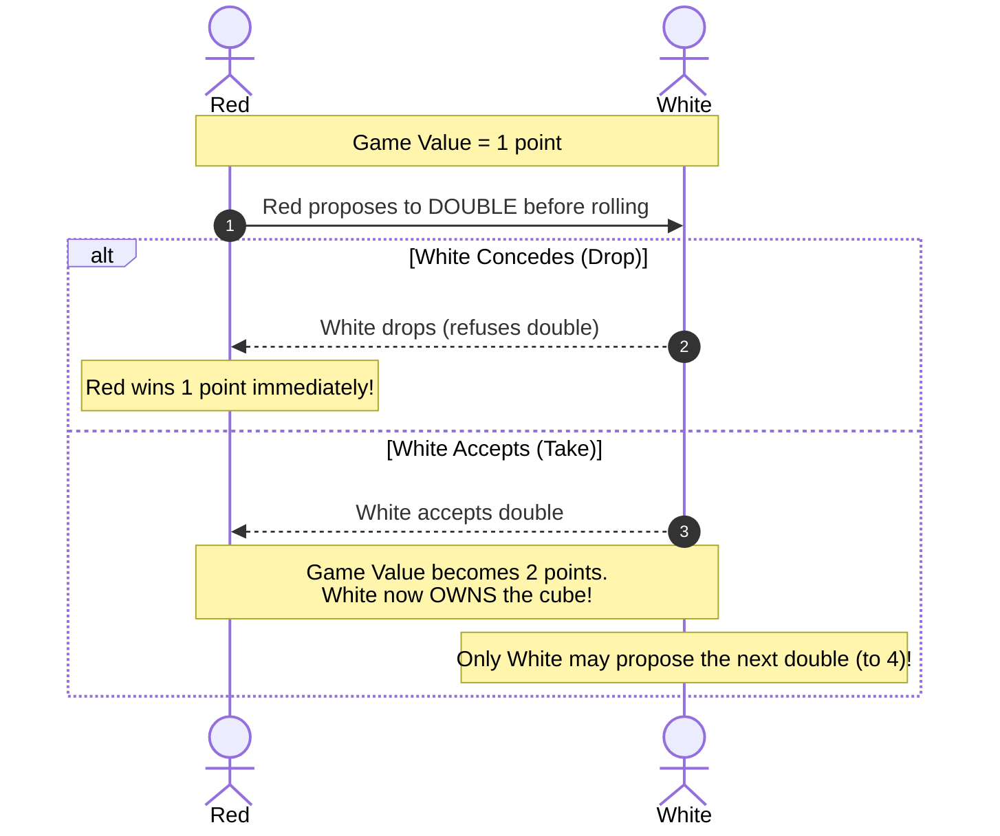

# How to Play Backgammon

A comprehensive player manual, movement syntax guide, and strategic handbook for BSD Backgammon.

---

## 1. Objective of the Game

The objective of Backgammon is to move all **15 of your checkers** into your inner **Home Board**,
and then **bear them off** the board before your opponent does.

Points are scored based on the final game value (determined by the **Doubling Cube**) and the victory
tier achieved:
- **Regular Win ($1\times$):** Opponent bore off at least one checker.
- **Gammon ($2\times$):** Opponent bore off zero checkers.
- **Backgammon ($3\times$):** Opponent bore off zero checkers AND still has a checker on the Bar
  or in your Home Board.

---

## 2. Command Line Flags & Match Setup

```bash
backgammon [options]
```

| Flag | Description |
|---|---|
| `-n` | Do not ask if you want rules or instructions at startup (starts immediately). |
| `-pr` | Play as **Red** (human moves ascending: points $1 \rightarrow 24$). |
| `-pw` | Play as **White** (human moves descending: points $24 \rightarrow 1$). |
| `-pb` | **Two-player hot-seat mode** (both Red and White controlled by human players). |
| `-t term` | Force specific terminal type from `/etc/termcap`. |
| `-s file` | Recover and resume a saved game from the specified file. |

---

## 3. Board Geometry & Starting Setup

The board consists of 24 narrow triangles called **points**, grouped into four quadrants of 6 points
separated by the central **BAR**:

```
_____________________________________________________
| 12  11  10   9   8   7 |   |  6   5   4   3   2   1 |   <-- White's Inner Table (1-6)
|  r                   w |   |  w                   r |
|  r                   w |   |  w                   r |
|  r                   w |   |  w                     |
|  r                     |   |  w                     |
|  r                     |   |  w                     |
|                        |BAR|                        |
|  w                     |   |  r                     |
|  w                     |   |  r                     |
|  w                   r |   |  r                     |
|  w                   r |   |  r                   w |
|  w                   r |   |  r                   w |
| 13  14  15  16  17  18 |   | 19  20  21  22  23  24 |   <-- Red's Inner Table (19-24)
-----------------------------------------------------
```

### Starting Positions (30 Checkers Total)
- **Red (`r`):** Moves **counter-clockwise** from point 1 up towards point 24:
  - 2 checkers on **Point 1** (opponent's home board)
  - 5 checkers on **Point 12** (outer board)
  - 3 checkers on **Point 17** (outer board)
  - 5 checkers on **Point 19** (home board)
- **White (`w`):** Moves **clockwise** from point 24 down towards point 1:
  - 2 checkers on **Point 24** (opponent's home board)
  - 5 checkers on **Point 13** (outer board)
  - 3 checkers on **Point 8** (outer board)
  - 5 checkers on **Point 6** (home board)

---

## 4. Movement Rules

```mermaid
flowchart TD
    ROLL["Roll 2 Dice (e.g. 5 and 3)"] --> CHECK_BAR{"Any checkers on BAR?"}
    CHECK_BAR -->|Yes| RE_ENTER["Must Re-enter from BAR First!<br/>Roll determines point in opponent home"]
    CHECK_BAR -->|No| CHOOSE_MOVE["Move Checkers by Die Values"]
    RE_ENTER --> CHOOSE_MOVE
    CHOOSE_MOVE --> CHECK_DOUBLES{"Are Dice Doubles?<br/>(e.g. 4-4)"}
    CHECK_DOUBLES -->|Yes| FOUR_MOVES["Make 4 Moves of that Value!"]
    CHECK_DOUBLES -->|No| TWO_MOVES["Make 2 Moves (one per die)"]
    FOUR_MOVES --> CHECK_TARGET
    TWO_MOVES --> CHECK_TARGET
    CHECK_TARGET{"Target Point Status"}
    CHECK_TARGET -->|Open or Owned| MOVE_OK["Move Accepted"]
    CHECK_TARGET -->|1 Opponent Checker (Blot)| HIT["HIT THE BLOT!<br/>Opponent checker sent to BAR"]
    CHECK_TARGET -->|2+ Opponent Checkers| BLOCKED["BLOCKED!<br/>Cannot land on that point"]
```

### The Rules of Dice & Movement
1. **Two Separate Moves:** A roll of 5 and 3 allows moving one checker 5 points and another checker
   3 points, or moving the *same* checker 8 points (as long as the intermediate point 5 or 3 is open).
2. **Doubles (Doublet):** Rolling identical numbers (e.g. $4\text{–}4$) grants **four moves** of that
   value (a total of 16 pips).
3. **Blots and Hitting:** A single checker standing alone on a point is a **blot**. If an opponent lands
   on your blot, your checker is **hit** and placed on the **BAR**.
4. **Entering from the Bar:** If you have checkers on the bar, you cannot move *any* other checker until
   all your bar checkers have legally entered the opponent's home board.
   - Red enters onto points $1 \dots 6$.
   - White enters onto points $19 \dots 24$.

---

## 5. Bearing Off

Once all 15 of your checkers are inside your inner **Home Board** (points 19–24 for Red; points 1–6
for White), you may begin **bearing off** (removing checkers from the board):
- You may bear off a checker that sits on the point corresponding exactly to the rolled die.
- If a die roll is higher than any point with a remaining checker, you must bear off a checker from
  your highest occupied point.
- If any checker is hit and sent to the Bar while bearing off, you **cannot bear off another checker**
  until that checker has traveled all the way around the board back into your home board!

---

## 6. The Doubling Cube

The Doubling Cube starts at **1** (inactive in the center of the board).



1. Before rolling your dice, if you feel you have an advantage, you may propose a **Double** (`D`).
2. Your opponent must decide:
   - **Drop / Refuse (`n`):** Concede the game on the spot, losing the current game value (e.g. 1 pt).
   - **Accept / Take (`y`):** The game value doubles (e.g. $1 \rightarrow 2$, $2 \rightarrow 4$, up to 64).
     The accepting player now **owns the cube**—only they have the right to propose the next double!

---

## 7. Command & Move Notation

BSD Backgammon features a highly efficient shorthand move syntax:

| Syntax Format | Example | Action Description |
|---|---|---|
| `s-f` | `12-16` | Move checker from point `12` to point `16`. |
| `s/r` | `12/4` | Move checker from point `12` by roll `4` (lands on 16). |
| `s-f1-f2` | `1-5-8` | Chained move: move checker from 1 to 5, then from 5 to 8. |
| `s/r1r2` | `12/43` | Chained roll: move checker from 12 by 4, then by 3. |
| `b` or `0` | `b-3` / `0/3` | Move checker from the **BAR** onto point 3. |
| `h` or `25` | `21-h` / `21/4` | Bear off checker from point 21 to **HOME**. |

### Single-Letter In-Game Commands
- **`Space` or `Enter`:** Roll dice.
- **`D`:** Propose a double.
- **`R`:** Reprint / redraw the entire board.
- **`S`:** Save game state to file.
- **`Q`:** Resign / quit game.
- **`?`:** Display context-sensitive help.

---

## 8. Strategy & Grandmaster Tips

1. **The Rule of 8 (Safe Hitting):** Opponents within 1 to 6 points can hit you with a direct roll
   (high probability, up to $42\%$). At a distance of 7 or 8, they require combination rolls, dropping
   their hitting chance to under $17\%$.
2. **Build Primes, Not Towers:** Stacking 5 or 6 checkers on a single point is inefficient. Spread your
   checkers across consecutive points (e.g. points 4, 5, 6, 7, 8) to construct a **6-prime**—an
   insurmountable wall that no opponent checker can jump!
3. **The 25% Doubling Take Rule:** Under pure game theory, if your winning probability is greater than
   **$25\%$**, you should mathematically **accept (take)** a double offer rather than drop! (Dropping
   guarantees a $-1.0$ loss; taking at $25\%$ yields an expected value of $0.25(+2) + 0.75(-2) = -1.0$).
