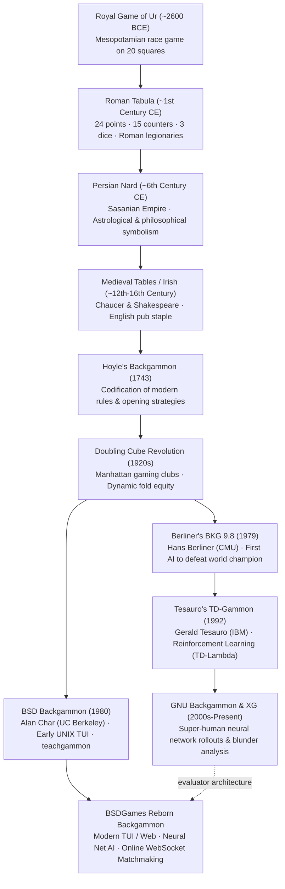

# Backgammon — Lineage & Heritage

A historical and computational genealogy of Backgammon, tracing its five-millennium journey
from Mesopotamian royal tombs to BSD terminal curses and modern reinforcement learning engines.

---

## 1. The 5,000-Year Evolutionary Tree

---

## 2. Comparative Evolution Across Historic Eras

| Era / Title | Points | Checkers | Dice Count | Doubling Cube | AI / Computation Model | Platform |
|---|:---:|:---:|:---:|:---:|---|---|
| **Royal Game of Ur (2600 BCE)** | 20 squares | 7 per side | 4 tetrahedron | No | Human cognition | Inlaid lapis lazuli board |
| **Roman Tabula (100 CE)** | 24 points | 15 per side | 3 six-sided | No | Human cognition | Wood / bronze chariot board |
| **Hoyle Backgammon (1743)** | 24 points | 15 per side | 2 six-sided | No | Mathematical odds tables | Wood & leather salon board |
| **Modern Backgammon (1920s)** | 24 points | 15 per side | 2 six-sided | **Yes ($1..64$)** | Pip count & equity math | Cork & felt tournament table |
| **BSD Backgammon (1980)** | 24 points | 15 per side | 2 six-sided | **Yes** | 1-ply greedy heuristics | VAX / PDP-11 CRT terminal |
| **TD-Gammon (1992)** | 24 points | 15 per side | 2 six-sided | **Yes** | Multilayer Neural Net ($TD(\lambda)$) | IBM RISC System/6000 |
| **GNU Backgammon (2000s)** | 24 points | 15 per side | 2 six-sided | **Yes** | Deep Neural Net + 2-ply lookahead | Modern PC / Linux clusters |

---

## 3. Cultural & Intellectual Significance

- **The Catalyst for Deep Learning:** While Chess and Go eventually succumbed to deep tree searches
  (Deep Blue, AlphaGo), Backgammon was the true testing ground for pure **Temporal Difference
  Reinforcement Learning**. Gerald Tesauro proved that a neural network, given nothing more than raw
  board inputs and the rules of the game, could achieve world-class grandmaster play through self-play alone.
- **The Philosophy of Life and Chance:** In Persian culture, *Nard* was invented by the sage
  Bozorgmehr as a counterpoint to Indian Chess (*Shatranj*): Chess represented human intellect and
  destiny under determinism, while Nard reflected human life governed by fortune (the roll of the dice)
  guided by human wisdom (checker movement).
