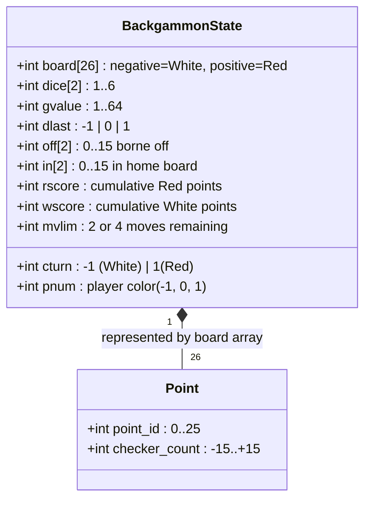

# Backgammon — Reverse Specification

Formal mechanical specification, state variables, 30-checker entity inventory, pip count mathematics,
and doubling invariants reverse-engineered from BSD `backgammon` (Alan Char, 1980).

---

## 1. Mathematical Objective

A game is won by the player who:
1. Bears off all **15 checkers** from the board:
   $$\text{off}[\text{player}] = 15$$
2. OR induces opponent resignation by offering a double which the opponent declines (drops):
   $$\text{Opponent drops double offer} \implies \text{Score}_{\text{winner}} \mathrel{+}= V_{\text{current}}$$

A match is contested until one player reaches the target match points $M_{\text{target}}$:
$$\max(S_{\text{red}}, S_{\text{white}}) \ge M_{\text{target}}$$

---

## 2. Formal State Variables

| Variable | Type / Domain | Meaning | Upstream C Identifier |
|---|---|---|---|
| `board[26]` | `int[26]` | Board state: index $1..24$ are points. Negative = White, positive = Red. | `board` (`back.h:84`) |
| `board[0]` | `int` | White's home / Red's bar | `board[0]` (`back.h:84`) |
| `board[25]` | `int` | Red's home / White's bar | `board[25]` (`back.h:84`) |
| `dice[2]` | `int[2]` $\in [1, 6]$ | Current dice roll | `dice` (`back.h:86`) |
| `gvalue` | `int` $\in \{1, 2, 4, 8, 16, 32, 64\}$ | Active game point value | `gvalue` (`back.h:103`) |
| `dlast` | `int` $\in \{-1, 0, 1\}$ | Player who doubled last ($0 = \text{neither}$) | `dlast` (`back.h:104`) |
| `cturn` | `int` $\in \{-1, 1\}$ | Current active player ($-1 = \text{White}, 1 = \text{Red}$) | `cturn` (`back.h:92`) |
| `off[2]` | `int[2]` $\in [0, 15]$ | Checkers borne off (`off[0]`=White, `off[1]`=Red) | `off` (`back.h:107`) |
| `in[2]` | `int[2]` $\in [0, 15]$ | Checkers in inner table | `in` (`back.h:110`) |
| `rscore` | `int` $\ge 0$ | Cumulative match score for Red | `rscore` (`back.h:101`) |
| `wscore` | `int` $\ge 0$ | Cumulative match score for White | `wscore` (`back.h:102`) |
| `mvlim` | `int` $\in \{0, 2, 4\}$ | Moves remaining in current turn (2 for normal, 4 for doubles) | `mvlim` (`back.h:87`) |

---

## 3. Complete 30-Checker Entity Inventory

The game consists of exactly 30 identical checkers (15 Red, 15 White).

### Initial Board Configuration Directory

| Point Index | Red Checkers (`+`) | White Checkers (`-`) | Point Function & Quadrant |
|:---:|:---:|:---:|---|
| **Point 1** | **+2** | 0 | Red Starting Point (White Home Board / Red 24-pt away) |
| **Point 6** | 0 | **-5** | White Home Board Anchor (White 6-pt) |
| **Point 8** | 0 | **-3** | White Outer Board Anchor (White 8-pt) |
| **Point 12** | **+5** | 0 | Red Mid-Point (Red 12-pt) |
| **Point 13** | 0 | **-5** | White Mid-Point (White 12-pt) |
| **Point 17** | **+3** | 0 | Red Outer Board Anchor (Red 8-pt) |
| **Point 19** | **+5** | 0 | Red Home Board Anchor (Red 6-pt) |
| **Point 24** | 0 | **-2** | White Starting Point (Red Home Board / White 24-pt away) |
| **Point 0 (Bar/Home)** | 0 | 0 | Red Bar / White Home Tray |
| **Point 25 (Bar/Home)**| 0 | 0 | White Bar / Red Home Tray |

$$\sum \text{Red Checkers} = 2 + 5 + 3 + 5 = 15, \quad \sum \text{White Checkers} = 5 + 3 + 5 + 2 = 15.$$

---

## 4. Pip Count Formal Mathematics

The **Pip Count** represents the total number of point-steps a player must move all their checkers
to bear them off the board:

### Red Pip Count Formula ($P_{\text{red}}$)
Red moves from point $p \rightarrow 25$ (Home):
$$P_{\text{red}} = \sum_{p=1}^{24} \max(0, \text{board}[p]) \times (25 - p) + (\text{Red on Bar}) \times 25$$

### White Pip Count Formula ($P_{\text{white}}$)
White moves from point $p \rightarrow 0$ (Home):
$$P_{\text{white}} = \sum_{p=1}^{24} \max(0, -\text{board}[p]) \times p + (\text{White on Bar}) \times 25$$

### Initial Starting Pip Count Invariant
$$P_{\text{red}}^{\text{initial}} = (2 \times 24) + (5 \times 13) + (3 \times 8) + (5 \times 6) = 48 + 65 + 24 + 30 = \mathbf{167\text{ pips.}}$$
$$P_{\text{white}}^{\text{initial}} = (2 \times 24) + (5 \times 13) + (3 \times 8) + (5 \times 6) = 48 + 65 + 24 + 30 = \mathbf{167\text{ pips.}}$$

---

## 5. Formal Legal Rules & Invariants

Let $c$ be active player ($c = 1$ for Red, $c = -1$ for White).
Let move be from source point $s$ to goal point $g$ via roll $r$.

1. **Direction Invariant:**
   - If $c = 1$ (Red), $g = s + r$ ($s < g$).
   - If $c = -1$ (White), $g = s - r$ ($s > g$).
2. **Open Point Invariant:**
   Goal point $g$ is legally accessible if and only if:
   $$c \times \text{board}[g] \ge -1$$
   *(Point is open if unoccupied, occupied by friendly checkers, or occupied by exactly 1 opponent checker).*
3. **Blot Hit Invariant:**
   If $c \times \text{board}[g] = -1$, landing on $g$ hits the opponent checker:
   $$\text{board}[g] \leftarrow c, \quad \text{board}[\text{bar}_{\text{opp}}] \mathrel{-}= c$$
4. **Bar Re-Entry Priority Invariant:**
   If $|\text{board}[\text{bar}_c]| > 0$, NO move with source $s \ne \text{bar}_c$ may be executed.
5. **Bearing Off Legality Invariant:**
   Bearing off from $s$ to $\text{home}_c$ is valid if and only if:
   $$\text{in}[c] + \text{off}[c] = 15$$
   And either:
   - $s$ exactly matches die roll $r$ ($|s - \text{home}_c| = r$).
   - OR $r > |s - \text{home}_c|$ AND $\forall p > s$ (in direction away from home), $\text{board}[p] = 0$.

---

## 6. Doubling Cube Invariants & Equity

1. **Cube Progression:**
   $$V \in \{1, 2, 4, 8, 16, 32, 64\}$$
2. **Cube Ownership:**
   Player $c$ may offer a double if and only if:
   $$\text{dlast} = 0 \lor \text{dlast} \ne c$$
   *(A player cannot double if they were the last player to double).*
3. **Double Rejection:**
   If recipient declines double, game terminates immediately; offering player receives current $V$.

---

## 7. Match Victory & Termination Conditions

When a player bears off all 15 checkers ($\text{off}[c] = 15$):

$$\Delta S = V \times M_{\text{tier}}$$

Where multiplier $M_{\text{tier}}$ is evaluated as follows:
$$M_{\text{tier}} = \begin{cases}
3 & \text{if } \text{off}[\text{loser}] = 0 \land (\text{loser has checker on Bar or in winner's home}) \quad [\textbf{Backgammon}] \\
2 & \text{if } \text{off}[\text{loser}] = 0 \quad [\textbf{Gammon}] \\
1 & \text{otherwise} \quad [\textbf{Regular Win}]
\end{cases}$$
