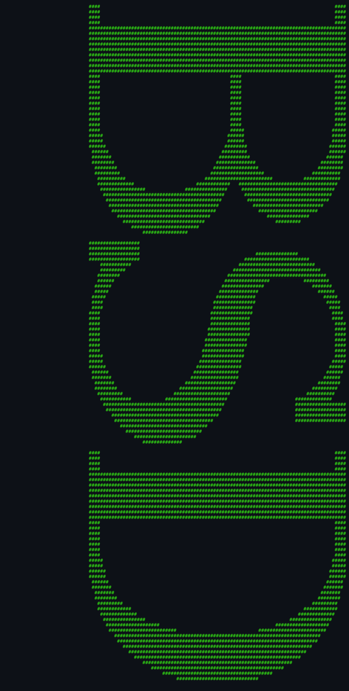
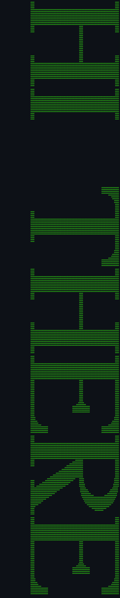

# About `banner`

> **The original command-line party sign-maker.**

---

## What Is `banner`?

`banner` takes a string and prints it as oversized ASCII art, one huge letter at a time. Type `banner HELLO` and your terminal fills with blocky `#` characters spelling out the word. It was designed for line printers — the kind that print continuous fan-fold paper — but works just as well on a wide terminal.

## Screenshots

*Screenshots captured via [`docs/scripts/capture-screenshots.sh`](../../../docs/scripts/capture-screenshots.sh).*

*`banner BSD` at the default 132-column width.*

*`banner -w 80 BSD` scrunched for a normal terminal.*

*`banner HELLO WORLD` rendered across several lines.*

## Authors & Publisher

- **Author(s):** Mark Horton.
- **Publisher / distributor:** University of California, Berkeley; later NetBSD.
- **Release year:** 1980 (shipped in 3BSD).
- **Language:** C.

## The Era

`banner` appeared in the early 1980s, when dot-matrix and line printers were common office equipment. Printing a large “HAPPY BIRTHDAY” banner on fan-fold paper was a popular prank and decoration. The program squeezes an entire glyph atlas into ~9 KB of C data.

## Why It's Interesting

- **Glyph compression:** The whole ASCII alphabet fits in a hand-optimised byte table with run-length encoding.
- **Printer heritage:** Default width is 132 columns because that was standard line-printer paper.
- **Instant gratification:** Type a word, get a wall of text.
- **Cultural staple:** Every ASCII-art generator and “figlet” descendant owes something to `banner`.

## Difficulty & Progression

There is no difficulty or progression. The output depends only on the input text and the width option.

## Making-Of / Anecdotes

The glyph table (`data_table`) is the bulk of the source — over 9,000 bytes of carefully packed drawing instructions. Each character is encoded as a series of “put a run of `#` at column X” commands, with special markers for repeating lines and ending a glyph.

## Cultural Impact

`banner` is the direct ancestor of `figlet`, `toilet`, and countless online ASCII-art generators. It also appears in retro computing demos and terminal decoration scripts.

## Known Bugs (Historical)

- **Missing glyphs:** `< > [ ] \ ^ _ { } | ~` have no definition.
- **Funny-looking quotes:** `"`, `'`, and `&` are described as “funny looking (but in a useful way).”
- **Scrunching artifacts:** The `-w` option skips rows and columns, which can make letters grainy or run together.

## See Also

- [`how-to-play.md`](./how-to-play.md) — for actually using the tool.
- [`architecture.md`](./architecture.md) — for the code side.
- [`lineage.md`](./lineage.md) — for descendants.
- [`references.md`](./references.md) — for source citations.
