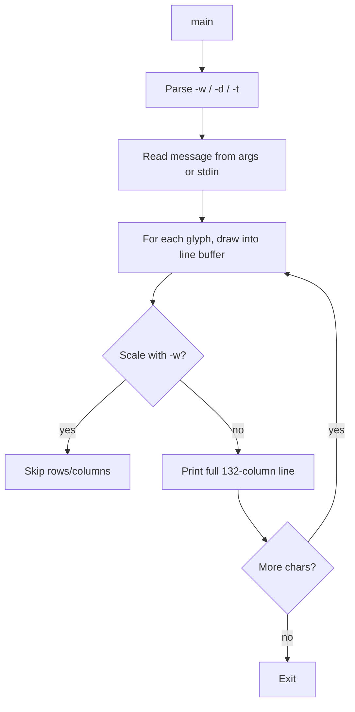

# `banner` — Original Architecture

> Deep analysis of the original C source. What did the programmer build, and how?

Cite upstream file:line references only (never local paths). Upstream tree: <https://github.com/vattam/BSDGames/tree/master/banner>.

---

## Files & Roles

| File | Purpose | Approx. LoC |
|---|---|---:|
| `banner.c` | Glyph data, argument parsing, renderer | 1169 |
| `banner.6` | Man page | — |

## High-Level Flow



## Game Loop Detail

`main()` (`banner.c:1032`) reads the message, then iterates over the glyph data for each character, decoding runs of `#` into a 132-column line buffer. After each glyph it either prints the buffer or continues building the line until a newline marker is reached.

## Data Structures

```c
// banner.c:63-80
const int asc_ptr[NCHARS] = { ... };
```

- `asc_ptr[]` — offset into `data_table` for each ASCII character.
- `data_table[]` (~9 KB) — encoded glyph drawing commands.
- `line[]` / `print[]` — 132-column output buffers.

The encoding uses three command types (`banner.c:83-89`):
- `128+n` — repeat current line `n` times.
- `64+n` — end of character glyph.
- Otherwise — put `m` `#` characters at column `n`.

## AI Logic

Not applicable — `banner` is a deterministic renderer.

## Random Events

Not applicable — no randomness is used.

## Difficulty Progression Logic

There is no difficulty system. Output complexity scales linearly with message length.

## What Was Clever for Its Era

- **Custom glyph encoding:** The run-length scheme packs every ASCII glyph into ~9 KB.
- **Width scaling:** The `-w` option rescales 132-column art by integer skipping rather than re-rendering.
- **Self-contained:** No external font files; everything is in the source.

## Constraints the Original Had To Handle

- **Memory:** Only a few 132-byte line buffers plus the 9 KB glyph table.
- **Terminal size:** Designed for 132-column printers; narrow terminals need `-w`.
- **CPU:** Rendering is O(message length × glyph height × width).
- **Persistence:** None.

## What This Code Would Look Like Today

A modern port might use TrueType fonts, SVG paths, or Unicode block characters. A web demo could offer font selection, colour gradients, and export to PNG. See [`port-ideas.md`](./port-ideas.md) for more.

## See Also

- [`lessons.md`](./lessons.md) — beginner-friendly extraction of techniques.
- [`spec.md`](./spec.md) — implementation-independent specification.
- [`references.md`](./references.md) — sources & citations.
