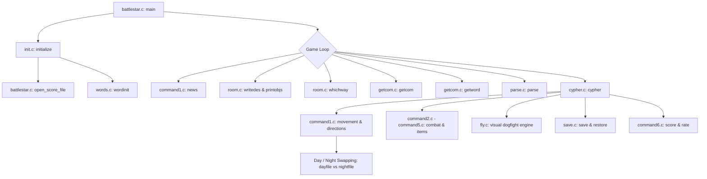
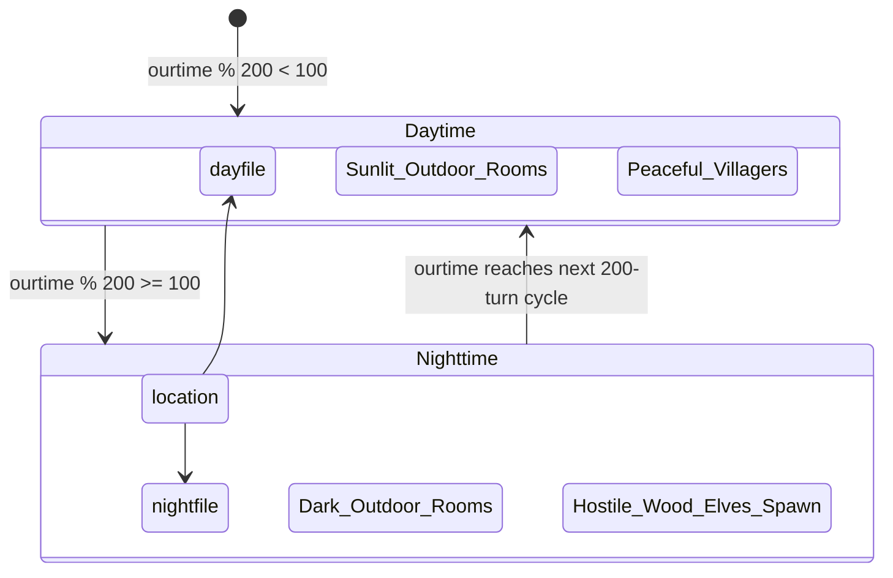

# `battlestar` — Architecture & Engine Mechanics

> Deep-dive technical analysis of the original C codebase, control loops, day/night transitions, relative coordinate geometry, and flight mechanics.

---

## 1. High-Level Engine Architecture

The architecture of *Battlestar* is modular, separating world geography, object definitions, command parsing, and specialized subsystems:



---

## 2. The Main Game Loop (`battlestar.c`)

The central driver resides in [`battlestar.c:48-96`](https://github.com/vattam/BSDGames/tree/master/battlestar/battlestar.c#L48-L96):

```c
start:
    news();
    if (beenthere[position] <= ROOMDESC)
        beenthere[position]++;
    if (notes[LAUNCHED])
        crash();    /* decrements fuel & checks crash */
    if (matchlight) {
        puts("Your match splutters out.");
        matchlight = 0;
    }
    if (!notes[CANTSEE] || testbit(inven, LAMPON) ||
        testbit(location[position].objects, LAMPON)) {
        writedes();
        printobjs();
    } else
        puts("It's too dark to see anything in here!");
    whichway(location[position]);
run:
    next = getcom(mainbuf, sizeof mainbuf, ">-: ", "Please type in something.");
    for (wordcount = 0; next && wordcount < NWORD - 1; wordcount++)
        next = getword(next, words[wordcount], -1);
    parse();
    switch (cypher()) {
    case -1:
        goto run;
    case 0:
        goto start;
    default:
        errx(1, "bad return from cypher()");
    }
```

### Turn Lifecycle Breakdown

1. **`news()` Evaluation:** Handles scheduled events: periodic fatigue decay (`snooze--`), nutrition decrement (`ate--`), injury hemorrhage, NPC stalking behaviors (`followgod`, `followfight`), and day/night transitions.
2. **Visibility Check:** Evaluates `notes[CANTSEE]`. If dark, player cannot view room descriptions or objects without an ignited `LAMPON` or active match.
3. **Exit Direction Display (`whichway()`):** Inspects the active room struct and prints accessible directional paths translated through the player's facing orientation.
4. **Tokenization & Parsing:** Reads raw string via `getcom()`, extracts tokens into `words[][]` via `getword()`, classifies parts of speech via `parse()`, and executes semantics via `cypher()`.

---

## 3. Dynamic Day / Night Transformation System

The world dynamically shifts between two distinct databases based on `ourtime`:



### Code Implementation (`command1.c:27-52`)

```c
if (ourtime % (2 * CYCLE) < CYCLE) {
    location = dayfile;
    if (ourtime % CYCLE == 0 && ourtime != 0)
        puts("The sun is rising over the horizon.");
} else {
    location = nightfile;
    if (ourtime % CYCLE == 0)
        puts("The sun has set, plunging the world into darkness.");
}
```

This pointer swap (`location = dayfile` vs `location = nightfile`) instantaneously alters descriptions, ambient light properties, and exit connections across all 275 rooms without needing complex runtime condition branching in room handlers.

---

## 4. Compass vs. Egocentric Navigation Logic (`command1.c`)

The player can navigate using absolute compass headings (`north`, `south`, `east`, `west`) or egocentric directions (`ahead`, `back`, `left`, `right`).

### Facing Rotation Mapping

In [`command1.c:85-115`](https://github.com/vattam/BSDGames/tree/master/battlestar/command1.c#L85-L115), relative motions rotate through a cardinal lookup table based on `direction`:

```c
switch (rel_move) {
case AHEAD:
    target_dir = direction;
    break;
case BACK:
    target_dir = (direction + 2) % 4;
    break;
case LEFT:
    target_dir = (direction + 3) % 4;
    break;
case RIGHT:
    target_dir = (direction + 1) % 4;
    break;
}
```

After determining the target cardinal direction, the engine accesses `location[position].link[target_dir]`. If non-zero, the player transitions to that room index, and `direction` is updated to face the direction of travel.

---

## 5. Orbital Flight Simulation Engine (`fly.c`)

When launching the Viper fighter, `battlestar` bypasses the standard parser and invokes `visual()` in [`fly.c:56-145`](https://github.com/vattam/BSDGames/tree/master/battlestar/fly.c#L56-L145), engaging Berkeley `curses`:

```c
int visual() {
    initscr();
    cbreak();
    noecho();
    screen();
    row = rnd(LINES - 3) + 1;
    column = rnd(COLS - 2) + 1;
    moveenemy(0);
    for (;;) {
        switch (getchar()) {
        case 'h': case 'r': dc = -1; fuel--; break;
        case 'l': case 'f': dc = 1;  fuel--; break;
        case 'j': case 'u': dr = 1;  fuel--; break;
        case 'k': case 'd': dr = -1; fuel--; break;
        case ' ': case 'f': blast(); break;
        case 'q': endfly(); return (0);
        }
        moveenemy(1);
    }
}
```

- **HUD Metrics:** Tracks real-time cockpit telemetry (`fuel`, `torps`, `ourclock`).
- **Target Tracking (`moveenemy()`):** Updates enemy Cylon coordinates on screen. If player fires (`blast()`) while crosshairs align within 2 character cells of the enemy, the Cylon is destroyed, rewarding +10 Power score.

---

## 6. Medical Trauma & Injury Matrix (`misc.c`)

Player health is tracked as an array of 13 discrete physical trauma flags in [`extern.h:130-142`](https://github.com/vattam/BSDGames/tree/master/battlestar/extern.h#L130-L142):

```c
#define ARM     6       /* broken arm */
#define RIBS    7       /* broken ribs */
#define SPINE   9       /* broken back */
#define SKULL   11      /* fractured skull */
#define INCISE  10      /* deep incisions */
#define NECK    12      /* broken neck */
```

### Trauma Impact on Carrying Capacity

When computing weight limits in `cypher.c`:

$$\text{Available Weight} = \text{MAXWEIGHT} - \sum_{i} \text{Penalty}(i)$$

- Broken arm disables wielding two-handed weapons and deducts 15 kg.
- Broken ribs impede running and increase fatigue drain.
- Severed back/spine sets maximum carrying limit to 5 kg.
- Broken neck triggers instantaneous game-over (`die()`).

---

## 7. Difficulty Progression & Runtime Setup Logic

### Representation in Code

1. **Explicit Startup Flags:**
   - Evaluated in `main()` at [`battlestar.c:55-62`](https://github.com/vattam/BSDGames/tree/master/battlestar/battlestar.c#L55-L62):
     - `battlestar -r [savefile]`: Calls `restore()` in `save.c`.
     - `battlestar [savefile]`: Alternative invocation syntax.
2. **Hereditary Privilege Mechanism:**
   - In [`init.c:88-105`](https://github.com/vattam/BSDGames/tree/master/battlestar/init.c#L88-L105), `getpwuid(getuid())` extracts the system username.
   - If username matches `list[]` (`riggle`, `chris`, `edward`, `dmr`, `ken`), `wiz = 1`, granting godmode teleportation via `su`.
3. **Dynamic Difficulty Scaling:**
   - While the game lacks an explicit "EASY/HARD" menu flag, difficulty scales organically across the turn counter:
     - Turns $0 \dots 99$: High survival grace (daylight, abundant beach fruit).
     - Turns $100 \dots 199$: Nocturnal difficulty spike (wood-elves spawn with lethal halberds; total darkness in unlit caverns).
     - Turn $\ge 200$: Progressive resource exhaustion (batteries expire, matches run out).
