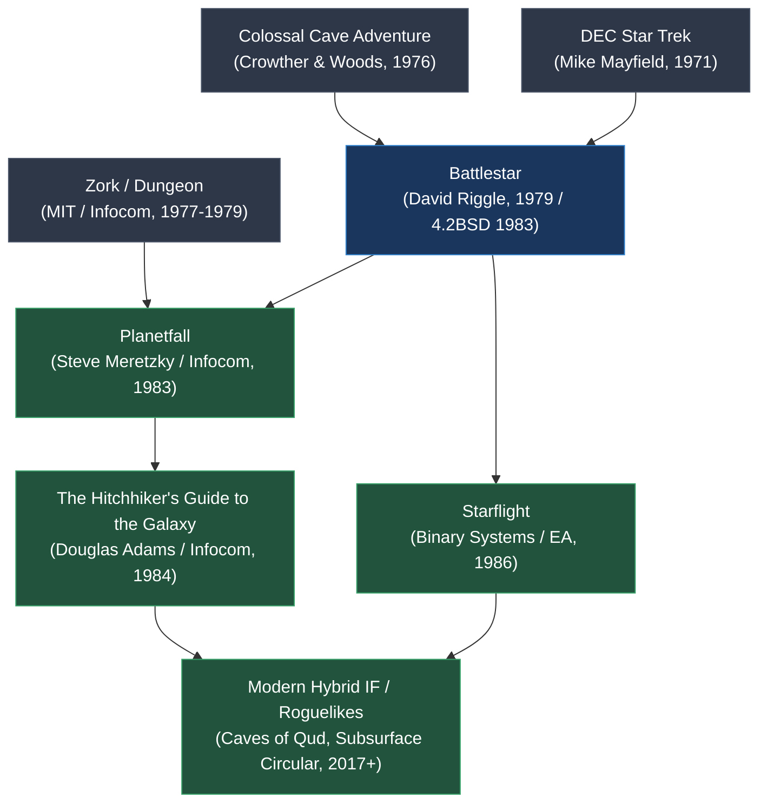

# `battlestar` — Lineage & Genre Siblings

> Tracing the genealogy of science fiction interactive fiction, from early mainframe text games to modern hybrids.

---

## The Interactive Fiction Timeline

---

## Historical Ancestors

1. **Colossal Cave Adventure (1976):**
   - Established the two-word parser vocabulary (`VERB NOUN`), inventory mechanics, score trackers, and room description paradigms that *Battlestar* adopted.
2. **Battlestar Galactica (1978 TV Series):**
   - Glen A. Larson's television series provided the direct aesthetic inspiration: human battlestars fleeing an apocalyptic robot surprise attack, Viper fighters launched through pressurized launch tubes, and dogfights against "Cylon raiders."
3. **DEC PDP Star Trek (1971):**
   - Early mainframe grid-based space warfare games inspired the coordinate-based space flight simulation in Sector 2.

---

## Contemporaries & Genre Siblings

- **Infocom's *Planetfall* (1983):**
  - Released the same year as 4.2BSD *Battlestar*. Shares the iconic opening scenario: the player begins as an unappreciated junior crew member (deck scrubber in *Planetfall*, sleeping in pajamas in *Battlestar*) aboard an exploding spaceship, evacuates via escape pod/fighter, and crashes onto a mysterious uninhabited planet filled with forgotten technology.
- **Infocom's *Starcross* (1982):**
  - Hard sci-fi parser adventure by Dave Lebling set aboard a mining ship intercepting an alien artifact.

---

## Modern Descendants & Spiritual Successors

1. **Hybrid Roguelike / Text Games (*Caves of Qud*, 2015):**
   - Blends detailed anatomical injury simulation (amputations, dismemberment) and quirky sci-fi/fantasy worldbuilding directly recalling *Battlestar*'s medical trauma and tropical mythos.
2. **Text-Driven Space Simulators (*Subsurface Circular*, *Event[0]*):**
   - Combines terminal interfaces and parser interactions with cinematic sci-fi settings.
