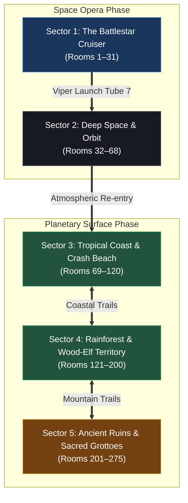
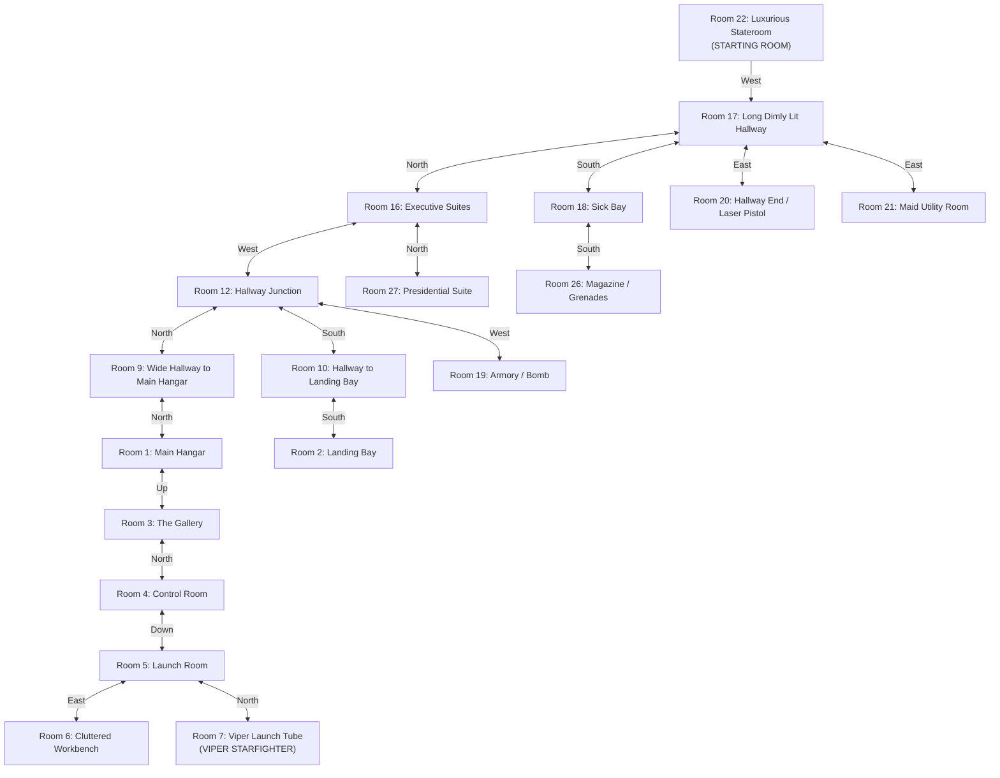
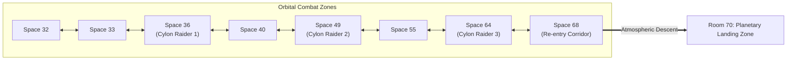
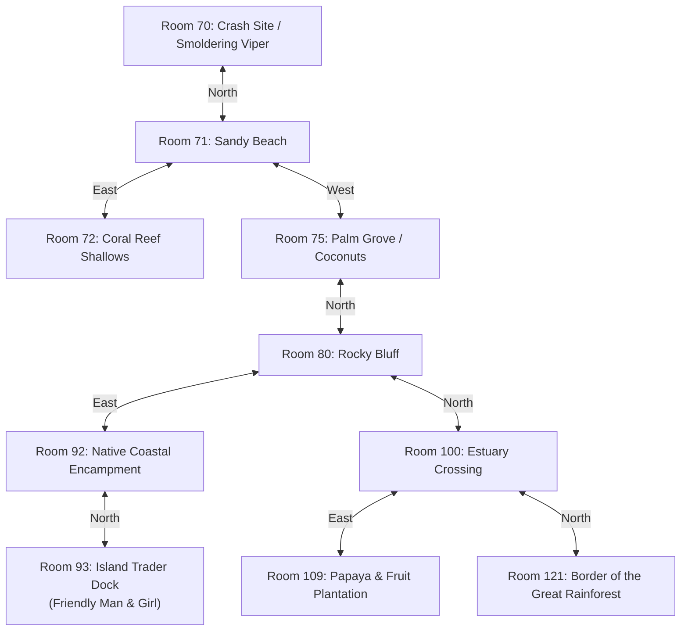
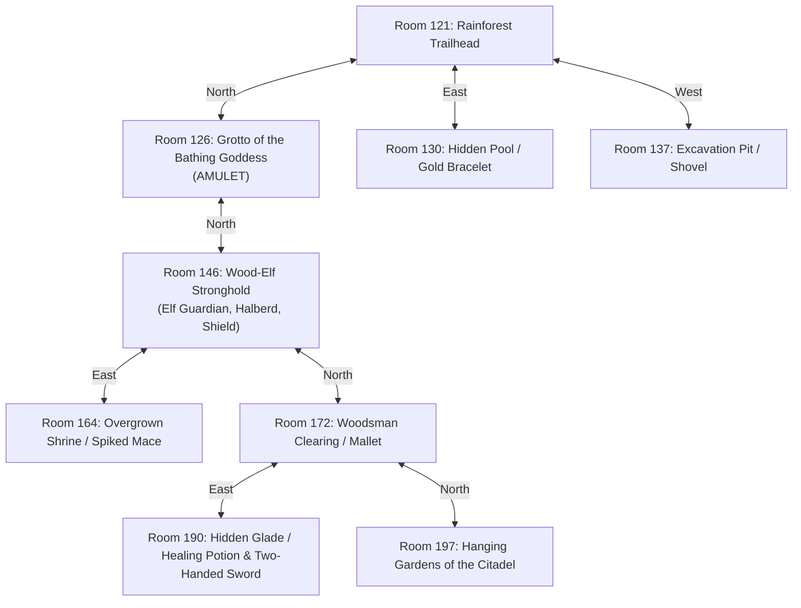
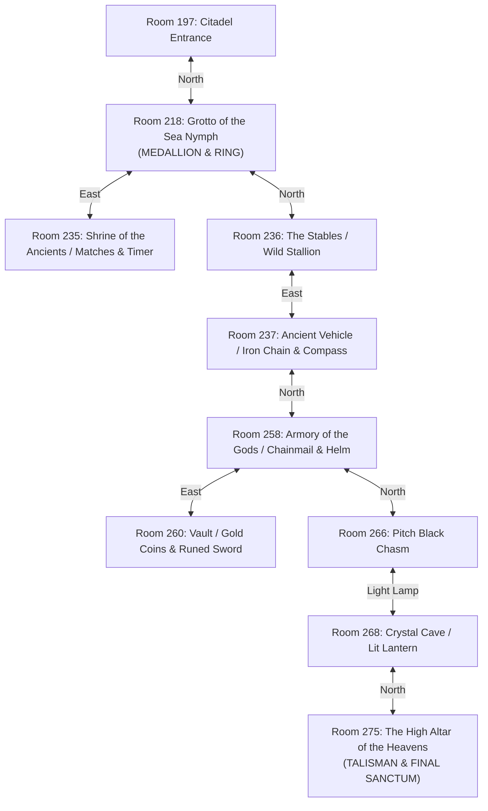

# `battlestar` — World Map & Sector Topology

> Complete graph topology, regional Mermaid flowcharts, and the Master 275-Room Directory for *Battlestar*.

---

## Overview of the World Graph

The world of *Battlestar* is composed of **275 distinct rooms** (`NUMOFROOMS 275`) partitioned into five macro-sectors:

---

## 1. Sector 1: The Battlestar Cruiser (Rooms 1–31)

---

## 2. Sector 2: Deep Space & Orbital Dogfight (Rooms 32–68)

Outer space is modeled as a 3D coordinate grid of 37 space sectors (`Rooms 32–68`). Patrols of Cylon raiders wander through these coordinates.

---

## 3. Sector 3: Tropical Coast & Crash Beach (Rooms 69–120)

---

## 4. Sector 4: Rainforest & Wood-Elf Territory (Rooms 121–200)

---

## 5. Sector 5: Ancient Ruins & Sacred Grottoes (Rooms 201–275)

---

## Master Room & Object / Entity Directory

Below is the complete room-by-room entity directory for key interactive locations across all 275 game rooms, detailing day versus night presence:

| Room ID | Room Name | Sector | Day Entities & Objects | Night Entities & Objects | Puzzle & Gameplay Role |
|:---:|---|---|---|---|---|
| **1** | Main Hangar | Battlestar | Pilots, Debris | Debris, Fires | Central ship junction; leads to gallery and bays. |
| **4** | Control Room | Battlestar | Technicians | Empty console | Contains stairs descending to launch room #5. |
| **5** | Launch Room | Battlestar | Guard fighters | Empty racks | Leads to Viper launch tube. |
| **6** | Workbench | Battlestar | Cluttered tools | Tools | Provides contextual clues for ship maintenance. |
| **7** | Viper Launch Tube | Battlestar | **VIPER Starfighter** | **VIPER Starfighter** | Player enters Viper here and issues `launch`. |
| **8** | Walk-in Closet | Battlestar | **Robe** (`ROBE`) | **Robe** | Wearable warm clothing. |
| **11** | Rubble Hallway | Battlestar | **Gold Coins** (`COINS`) | Gold Coins | Valuable treasure boosting score. |
| **13** | Elegant Stateroom | Battlestar | **First Sacred Amulet** (`AMULET`) | Amulet | Key artifact 1 of 3 for wizard status. |
| **18** | Sick Bay | Battlestar | Medical supplies | Medical supplies | Resting here treats injuries and stops bleeding. |
| **19** | Armory | Battlestar | **Fusion Bomb** (`BOMB`) | Fusion Bomb | Heavy explosive weapon. |
| **20** | Presidential Corridor | Battlestar | **Laser Blaster** (`LASER`) | Laser Blaster | Powerful ranged weapon for ship defense. |
| **21** | Maid's Room | Battlestar | **Hunting Knife** (`KNIFE`), Maid | Knife, Maid | Initial cutting weapon. |
| **22** | Luxurious Stateroom | Battlestar | **Silk Pajamas** (`PAJAMAS`) | Pajamas | **STARTING ROOM.** Player awakens wearing pajamas. |
| **24** | First Class Lounge | Battlestar | **Book of Matches** (`MATCHES`) | Matches | Light source to ignite lanterns. |
| **26** | Magazine | Battlestar | **Grenades** (`GRENADE`) | Grenades | Throwable ordnance. |
| **30** | Kitchen | Battlestar | **Cleaver** (`CLEAVER`), **Knife** | Cleaver, Knife | Weapons and cooking implements. |
| **36** | Deep Space Sector | Orbit | **Cylon Raider #1** (`CYLON`) | Cylon Raider #1 | Hostile fighter to shoot down in `fly.c`. |
| **49** | Deep Space Sector | Orbit | **Cylon Raider #2** (`CYLON`) | Cylon Raider #2 | Hostile fighter to shoot down in `fly.c`. |
| **64** | Deep Space Sector | Orbit | **Cylon Raider #3** (`CYLON`) | Cylon Raider #3 | Hostile fighter to shoot down in `fly.c`. |
| **70** | Crash Beach | Island Shore | Damaged Viper, Landing gear | Damaged Viper | Atmospheric touch-down coordinate. |
| **92** | Native Encampment | Island Shore | Papayas, Pineapples, Mangoes | **Natives**, **Campfire**, **Lit Lamp** | Friendly gathering; food and night light. |
| **93** | Coastal Pier | Island Shore | **Trader Man** (`MAN`), **Island Girl** (`GIRL`) | Trader Man, Girl | NPC interaction; trading and clues. |
| **109** | Papaya Grove | Island Plains | **Fresh Papayas** (`PAPAYAS`) | Papayas | Essential nourishing food. |
| **110** | Pineapple Patch | Island Plains | **Pineapples** (`PINEAPPLE`) | Pineapples | Essential nourishing food. |
| **111** | Kiwi Orchard | Island Plains | **Kiwi Fruit** (`KIWI`) | Kiwi Fruit | Essential nourishing food. |
| **112** | Coconut Palms | Island Plains | **Coconuts** (`COCONUTS`) | Coconuts | Thirst quenching and nutrition. |
| **124** | Darkened Clearing | Jungle | Forest flora | **Armed Wood-Elf** (`ELF`), **Shield**, **Halberd** | Nocturnal ambush point. |
| **126** | Emerald Pools | Rainforest | **Bathing Goddess** (`BATHGOD`) | Slumbering waters | Second nymph encounter. |
| **130** | Hidden Grotto | Rainforest | **Jeweled Bracelet** (`BRACELET`) | Jeweled Bracelet | Precious treasure boosting Ego score. |
| **137** | Sandy Pit | Rainforest | **Excavation Shovel** (`SHOVEL`) | Shovel | Tool needed to dig buried artifacts. |
| **146** | Forest Clearing | Deep Jungle | **Wood-Elf Guardian** (`ELF`), **Shield**, **Halberd** | Wood-Elf Guardian, Shield, Halberd | High-tier combat encounter. |
| **164** | Ancient Pedestal | Deep Jungle | **Spiked Mace** (`MACE`) | Spiked Mace | Heavy blunt crushing weapon. |
| **172** | Timber Clearing | Highlands | **Woodsman** (`WOODSMAN`), **Mallet** (`MALLET`), **Deadwood** | Woodsman, Mallet, Deadwood | Woodcutting puzzle and tool source. |
| **181** | Forest Path | Highlands | Dark path | **Hanging Lantern** (`LAMPON`) | Nocturnal light beacon. |
| **190** | Mystic Spring | Highlands | **Two-Handed Sword** (`TWO_HANDED`), **Healing Potion** (`POTION`) | Two-Handed Sword, Healing Potion | Curative draught for mortal trauma. |
| **197** | Citadel Steps | Highlands | Marble portal | Marble portal | Threshold to final sacred sectors. |
| **216** | Stone Archway | Ancient Ruins | **Leather Shoes** (`SHOES`) | **Wood-Elf Guardian**, **Shield**, **Halberd** | Armor for feet; dangerous at night. |
| **218** | Sacred Springs | Ancient Ruins | **Denim Levis** (`LEVIS`), **Diamond Ring** (`RING`) | **Second Sacred Medallion** (`MEDALION`) | Night appearance of key artifact 2 of 3. |
| **235** | Sunken Crypt | Ancient Ruins | **Timer Mechanism** (`TIMER`), **Matches** | **Tribal Shaman** (`NATIVE`) | Mechanical puzzle component. |
| **236** | Ancient Paddock | Ancient Ruins | **Wild Stallion** (`HORSE`) | Wild Stallion, **Lit Lantern** | Rideable mount to travel swiftly. |
| **237** | Vehicle Wreck | Ancient Ruins | **Iron Chain** (`CHAIN`), **Magnetic Compass** (`COMPASS`), **Car** | Chain, Compass, Car | Heavy utility items and orienteering tool. |
| **258** | Citadel Armory | Citadel Interior | **Chainmail Coat** (`MAIL`), **Iron Helmet** (`HELM`) | Chainmail Coat, Iron Helmet | Maximum physical defense armor. |
| **260** | Royal Treasury | Citadel Interior | **Runed Broadsword** (`SWORD`), **Gold Coins** (`COINS`) | Broadsword, Coins | Elite masterwork blade. |
| **266** | Dark Vault | Citadel Interior | **Pitch Darkness** (`DARK`) | Pitch Darkness | Requires active light source to cross. |
| **268** | Crystal Chamber | Citadel Interior | **Brass Lantern** (`LAMPON`) | Brass Lantern | Permanent portable illumination. |
| **275** | Altar of the Gods | Citadel Zenith | **Third Sacred Talisman** (`TALISMAN`), **Pot of Gold** (`POT`), **Gold Bar** (`BAR`) | Sacred Talisman, Pot of Gold, Gold Bar | **FINAL SANCTUM.** Uniting all three artifacts wins the game. |

---

## Traversal Notes & Invariants

1. **Directional Inversion:** Because movements may be relative (`ahead`, `back`, `left`, `right`), the player's facing direction must be monitored at all times.
2. **Day vs. Night Connectivity:** Room descriptions swap entirely at turn multiples of 100 (`ourtime % 100 == 0`). Dark interior spaces (e.g. rooms 266–268) become fatal without light.
3. **Viper Spaceflight Gate:** The player cannot enter space without boarding the Viper in Room 7 and issuing `launch`.
