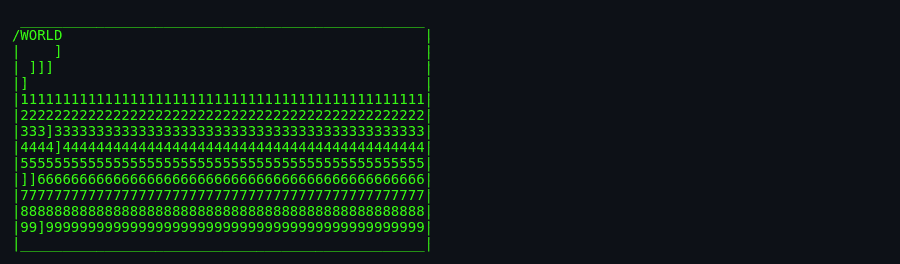
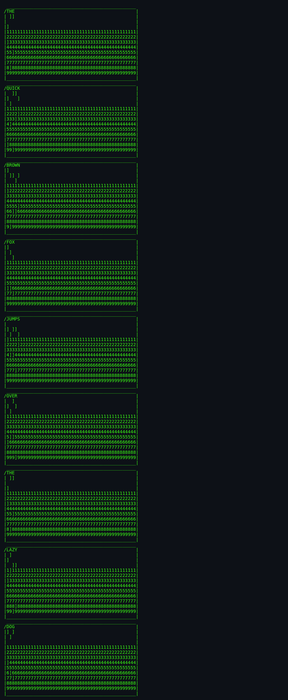

# About `bcd`

> **Turn any line of text into a 12-row IBM punch card.**

---

## What Is `bcd`?

`bcd` reads a line of text and prints it as an ASCII-art punched card. Each character becomes a column of up to 12 possible holes, drawn with `]` for punched positions and row numbers for unpunched positions. The result looks like a slice of 1960s data processing — nostalgic, oddly satisfying, and historically grounded.

## Screenshots

*Screenshots captured via [`docs/scripts/capture-screenshots.sh`](../../../docs/scripts/capture-screenshots.sh).*

*`bcd HELLO` rendered as a punch card.*

*Reading text from standard input.*

*A 48-character line showing the full card width.*

## Authors & Publisher

- **Author(s):** Steve Hayman (Indiana University Computer Science Dept.).
- **Publisher / distributor:** University of California, Berkeley; later NetBSD.
- **Release year:** 1989 (shipped in 4.3BSD-Reno); table bug fixed 1993.
- **Language:** C.

## The Era

`bcd` arrived just as punched cards were disappearing from daily computing. It preserves the look of 80-column IBM cards, where each column encoded one character as a pattern of rectangular holes. For programmers who never touched a card reader, it is a compact history lesson.

## Why It's Interesting

- **Historical fidelity:** The hole patterns are based on actual IBM card codes.
- **Self-contained table:** A 256-entry `u_short` array encodes every possible byte.
- **Famous bug:** The original table gave `Q` and `R` the same code; the fix is documented in the source.
- **Companion utilities:** `ppt` (paper tape) and `morse` share the same man page.

## Difficulty & Progression

There is no difficulty or progression. The output is purely determined by the input text.

## Making-Of / Anecdotes

Steve Hayman wrote the program from the man page alone, then deduced the hole table by feeding characters through the old binary. Dyane Bruce later corrected four table errors, including the duplicated `Q`/`R` code, after someone spotted it on an APA cover.

## Cultural Impact

`bcd` is part of a small family of "retro format" BSD toys that also includes `ppt` and `morse`. It influenced later visualisers that reformat modern data as obsolete media — QR codes rendered as punch cards, terminal demos, and museum exhibits.

## Known Bugs (Historical)

- **Fixed table error:** Pre-1993 versions mapped `Q` and `R` to the same hole pattern.
- **48-column truncation:** Long input is silently truncated; an 80-column card would need a wider layout.
- **Control characters:** Most non-printable bytes map to no holes and print blank columns.

## See Also

- [`how-to-play.md`](./how-to-play.md) — for actually using the tool.
- [`architecture.md`](./architecture.md) — for the code side.
- [`lineage.md`](./lineage.md) — for descendants.
- [`references.md`](./references.md) — for source citations.
