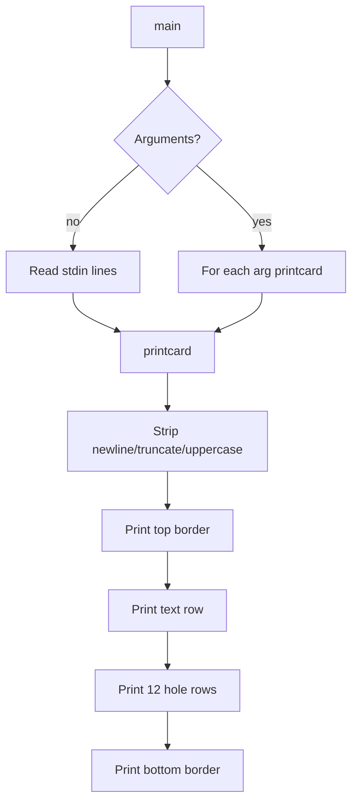

# `bcd` — Original Architecture

> Deep analysis of the original C source. What did the programmer build, and how?

Cite upstream file:line references only (never local paths). Upstream tree: <https://github.com/vattam/BSDGames/tree/master/bcd>.

---

## Files & Roles

| File | Purpose | Approx. LoC |
|---|---|---:|
| `bcd.c` | Hole table, argument/stdin parsing, card renderer | 224 |
| `bcd.6` | Man page (shared with `ppt` and `morse`) | — |

## High-Level Flow



## Game Loop Detail

`main()` (`bcd.c:130-152`) either loops over command-line arguments or reads stdin lines. Each input is passed to `printcard()`, which draws the card in five stages (`bcd.c:156-223`).

## Data Structures

```c
// bcd.c:87-120
const u_short holes[256] = { ... };
```

- `holes[256]` — maps each input byte to a 12-bit punch pattern.
- `rowchars[]` — characters printed in unpunched positions (`"   123456789"`).
- `cardline[80]` — input buffer.

## AI Logic

Not applicable — `bcd` is a deterministic formatter.

## Random Events

Not applicable — no randomness is used.

## Difficulty Progression Logic

There is no difficulty system. Output complexity scales linearly with input length.

## What Was Clever for Its Era

- **Compact lookup table:** 256 input values fit in a 512-byte array.
- **Bit-mapped hole positions:** Each bit directly corresponds to one of 12 card rows.
- **Reverse-engineered table:** The author deduced the original BSD hole patterns by observation.

## Constraints the Original Had To Handle

- **Memory:** Only the 512-byte hole table and an 80-byte input buffer.
- **Terminal size:** Cards are 50 characters wide (top/bottom borders + 48 columns).
- **CPU:** Rendering is O(input length × 12 rows).
- **Persistence:** None.

## What This Code Would Look Like Today

A modern port might render SVG punch cards, animate a card reader, or generate actual card-image files. See [`port-ideas.md`](./port-ideas.md) for more.

## See Also

- [`lessons.md`](./lessons.md) — beginner-friendly extraction of techniques.
- [`spec.md`](./spec.md) — implementation-independent specification.
- [`references.md`](./references.md) — sources & citations.
