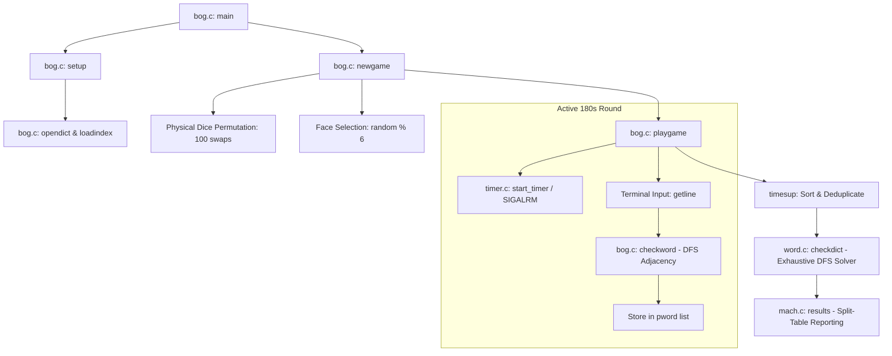
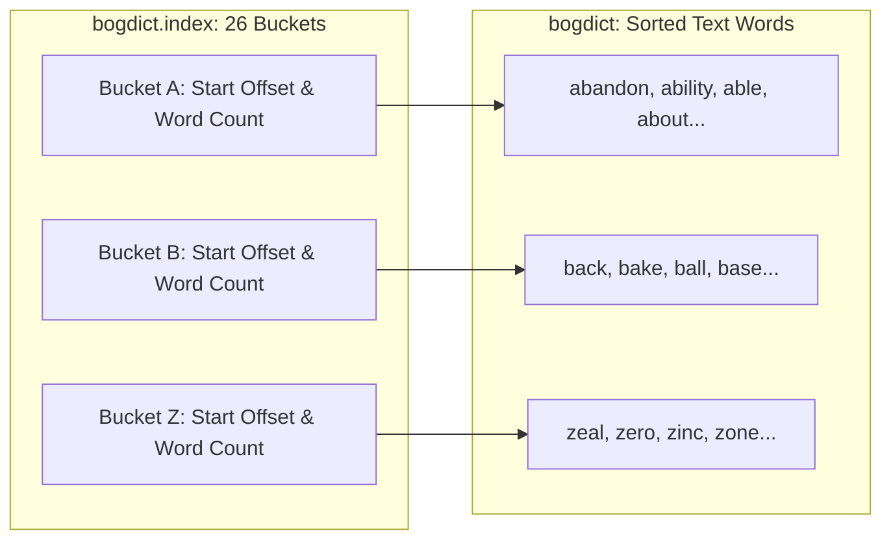

# `boggle` — Architecture & Algorithmic Design

> Deep technical analysis of the recursive backtracking word solver, dictionary index data structures, timer architecture, and curses terminal rendering.

---

## 1. High-Level System Architecture



---

## 2. The Board Generation Engine (`bog.c:300-340`)

In [`bog.c:300-340`](https://github.com/vattam/BSDGames/tree/master/boggle/boggle/bog.c#L300-L340), `newgame()` simulates physical dice rolling:

```c
void newgame(const char *b) {
    int i, p, q;
    const char *tmp;
    static const char *cubes[16] = {
        "ednosw", "aaciot", "acelrs", "ehinps",
        "eefhiy", "elpstu", "acdemp", "gilruw",
        "egkluy", "ahmors", "abilty", "adenvz",
        "bfiorx", "dknotu", "abjmoq", "egintv"
    };

    if (b == NULL) {
        /* Shake the cubes and make the board: 100 random pairwise swaps */
        i = 0;
        while (i < 100) {
            p = (int)(random() % 16);
            q = (int)(random() % 16);
            if (p != q) {
                tmp = cubes[p];
                cubes[p] = cubes[q];
                cubes[q] = tmp;
                i++;
            }
        }
        for (i = 0; i < 16; i++)
            board[i] = cubes[i][random() % 6];
    } else {
        for (i = 0; i < 16; i++)
            board[i] = b[i];
    }
    board[16] = '\0';
}
```

### Algorithmic Properties

1. **Permutation Shuffle:** Swapping cubes 100 times ensures an even distribution across the 16 grid sockets, preventing specific letter clusters from clustering systematically in corner slots.
2. **Deterministic Replay:** Passing a 16-character string via `b` bypasses the dice roll entirely, enabling fixed puzzle challenges and regression testing.

---

## 3. Recursive Depth-First Word Search (`bog.c:350-410`)

When a player enters a word (or when testing dictionary words against the board), the engine invokes `checkword()`:

```c
int checkword(const char *word, int prev, int *path) {
    int *lm;

    if (*word == '\0')
        return (1);

    lm = letter_map[*word - 'a'];

    if (prev == -1) {
        /* Initial letter: iterate through all board occurrences of the letter */
        while (*lm != -1) {
            *path = *lm;
            usedbits |= (1 << *lm);
            if (checkword(word + 1, *lm, path + 1) == 1)
                return (1);
            usedbits &= ~(1 << *lm);
            lm++;
        }
        return (-1);
    }

    /* Successor letters: must be adjacent to 'prev' and not already used */
    while (*lm != -1) {
        if (adjacency[prev][*lm] && !(usedbits & (1 << *lm))) {
            *path = *lm;
            usedbits |= (1 << *lm);
            if (checkword(word + 1, *lm, path + 1) == 1)
                return (1);
            usedbits &= ~(1 << *lm);
        }
        lm++;
    }
    return (-1);
}
```

### Backtracking Optimizations

- **`letter_map[letter]` Pre-Indexing:** Rather than scanning all 16 board cells to find where letter `'c'` appears, a precomputed array `letter_map[26][16]` provides immediate indices of matching cells.
- **Bitmask Visited Tracking (`usedbits`):** Instead of traversing a path list to verify uniqueness, a single 16-bit integer bitmask (`usedbits & (1 << cell)`) performs instant $O(1)$ collision checks.

---

## 4. Dictionary Indexing & Pruning (`word.c` & `mkindex`)

To solve the board at the end of the round, the computer does not naively test all permutations against disk. It utilizes a pre-compiled binary index:



### Search Procedure (`word.c:checkdict()`)

1. For each letter $A \dots Z$ present on the board, open the corresponding offset in `bogdict`.
2. For each dictionary word, check if its length $\ge \text{minlength}$.
3. Test if the word exists on the board via `checkword()`.
4. If present on the board:
   - Perform binary search in the sorted `pword[]` array.
   - If found in `pword[]`: increment player points.
   - If missing from `pword[]`: append to `mword[]` (missed words).

---

## 5. Difficulty Progression & Runtime Setup Logic

### Representation in Code

1. **CLI Flag Parser:** Handled in `main()` at [`bog.c:135-185`](https://github.com/vattam/BSDGames/tree/master/boggle/boggle/bog.c#L135-L185):
   - `-t <seconds>`: Directly sets `tlimit` (checked each turn against `time(NULL) - start_t`).
   - `-w <minlength>`: Sets minimum required string length (`minlength`, validated at `bog.c:265`).
   - `-s <seed>`: Passed to `srandom(seed)`.
   - `++` (`selfuse`): Inverts diagonal adjacency `adjacency[i][i] = 1`, permitting single-cube repeats.
2. **Implicit Round Scaling:**
   - As round time ticks down, visual updates accelerate.
   - Cumulative percentage (`tnpwords / (tnpwords + tnmwords)`) tracks long-term player skill across multiple games (`ngames`).
