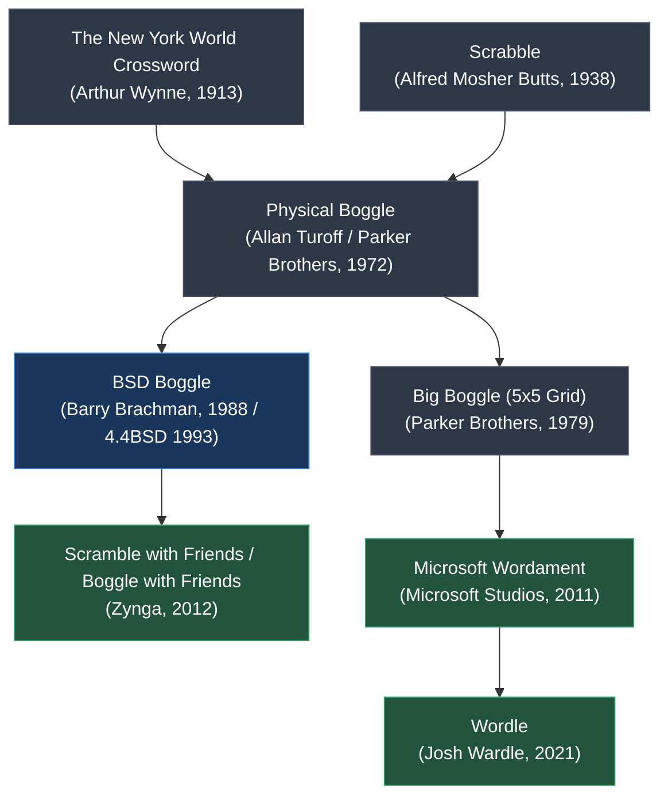

# `boggle` — Lineage & Genre Siblings

> Tracing the evolution of word-search grid puzzles, from tabletop dice shakers to modern mobile hits.

---

## Word Puzzle Evolution Timeline

---

## Key Historical Predecessors

1. **Physical Boggle (1972):**
   - Allan Turoff designed the 16 letter cubes with letter frequencies carefully balanced to maximize valid word formations while preventing letter starvation (e.g. ensuring vowels appear on nearly every cube).
2. **Big Boggle (1979):**
   - Expanded the grid from 4x4 (16 cubes) to 5x5 (25 cubes), introducing a minimum word length of 4 letters and an optional black blocker cube.

---

## Modern Digital Descendants

1. **Microsoft Wordament (2011):**
   - A massive real-time online adaptation where thousands of players simultaneously compete on the identical 4x4 grid across 2-minute rounds, ranking players on speed and word rarity.
2. **Zynga's Scramble with Friends (2012):**
   - Brought asynchronous head-to-head turn-based Boggle to touchscreens with power-ups, multipliers, and word-tracing gestures.
3. **Daily Wordle Variants (Strands, Squareword, 2022+):**
   - Daily puzzle games utilizing spatial grid connections and letter association heuristics popularized by Boggle.
