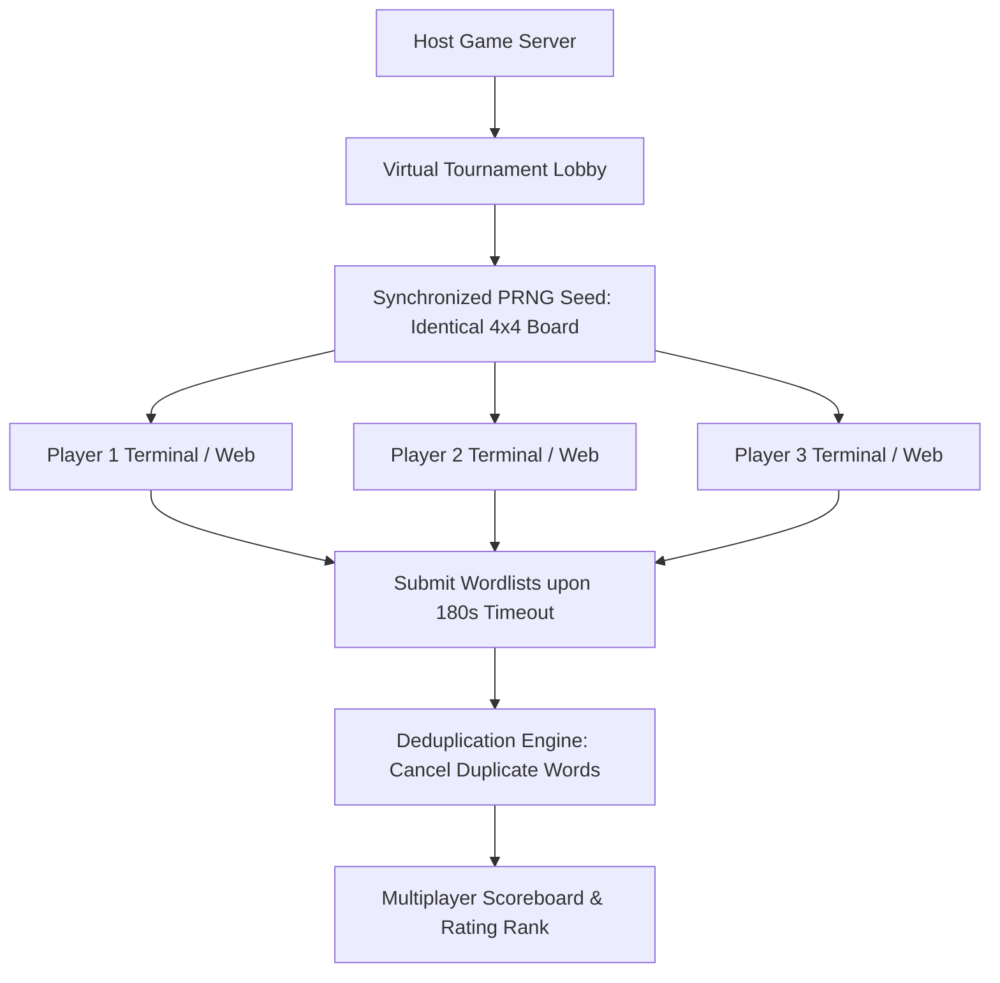

# `boggle` — Modernization & Port Ideas

> Brainstorming modern features, networking, real-time multiplayer, and UI enhancements for the spiritual successor port.

---

## 1. Modern Gameplay & UI Enhancements

### Interactive Mouse & Touch Swiping
- In addition to typing words in the terminal, allow modern players to click/drag across the 4x4 grid (like mobile Boggle or Scramble with Friends) to trace word paths interactively.
- Highlight connected cubes in real-time with vibrant ANSI background colors as letters are traced.

### Modern Lexicons & Custom Wordlists
- **Enable Modern Dictionaries:** Support official tournament wordlists (TWL06, CSW21 / SOWPODS, ENABLE) selectable via `--dict <name>`.
- **Foreign Language Boggle:** Support Spanish, French, and German cube distributions and localized wordlists.
- **Thematic Puzzles:** Specialized wordlists (e.g. medical, technical, computing jargon).

---

## 2. Real-Time Internet Multiplayer

Boggle is inherently a social party game. Modern networking can elevate it into an online tournament platform:

### Classic Tournament Rule Support
- When multiple players enter the same word, that word is crossed out and scores 0 points for all players.
- Only **unique words** found by a single player award points, creating intense competitive depth.

---

## 3. What NOT to Change (Preservation Invariants)

1. **The Authentic 16-Die Distribution:** The 16 physical cubes and their specific letter faces must remain identical to Allan Turoff's original 1972 design.
2. **The 3-Minute Standard:** 180 seconds remains the default canonical round duration.
3. **The Exhaustive Post-Game Solver:** The computer must always show every single word that was mathematically possible on the board.

---

## 4. Open Questions

1. **Should the Dictionary Be Embedded in the Binary?**
   - *Recommendation:* Yes. Compiling an optimized DAWG (Directed Acyclic Word Graph) directly into the executable eliminates external file dependencies like `/usr/share/dict/words`.
2. **Scoring Formula Choice:**
   - Should the default score be the BSD percentage (Found / Total) or the Parker Brothers point table (1 pt for 3-4 letters, up to 11 pts for 8+ letters)? Supporting a toggle `--scoring [percent|tournament]` is ideal.
