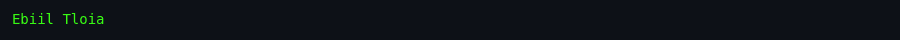
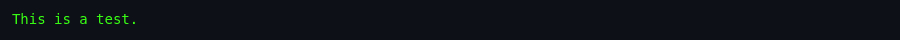

# About `caesar`

> **Brochure.** History, authors, cultural notes, and why this utility
> matters.

---

## What Is `caesar`?

A tiny Unix utility that decrypts Caesar ciphers. Give it rotated text on stdin and it tries every rotation, picking the one whose letter frequencies best match English. You can also pass a specific rotation, making it a general ROT-N encoder/decoder. It is the command-line ancestor of every "decode this secret message" tool on the internet.

## Screenshots

*To be captured from the original BSDGames binary via
[`docs/scripts/capture-screenshots.sh`](../../../docs/scripts/capture-screenshots.sh).*

*The utility reads rotated text from stdin and outputs the most likely decryption.*

*Calling `caesar 13` applies a fixed ROT13 transform.*

*The original USENET note: many `fortune` databases were rotated by 13.*

## Authors & Publisher

- **Author(s):** **Stan King, John Eldridge**, based on an algorithm suggested by **Bob Morris**. Derived from software contributed to Berkeley by **Rick Adams**.
- **Publisher / distributor:** The Regents of the University of California (BSD) / NetBSD.
- **Release year:** 1989 (source header); man page dated 1993.
- **Language:** C.

## The Era

In the late 1980s and early 1990s, USENET newsgroups and system `fortune` databases often used ROT13 as a lightweight spoiler warning or joke obfuscation. `caesar` gave users a quick way to read those messages without reaching for a manual decryption chart. It also demonstrates the Unix philosophy: one small filter that does one thing well.

## Why It's Interesting

- **It is real cryptanalysis.** Not encryption-breaking, but genuine frequency-analysis code in 161 lines.
- **It teaches the ROT13 easter egg.** The man page winks at the `fortune` databases that used rotation 13.
- **It is a perfect filter.** Read stdin, write stdout; no state, no UI, no fuss.

## Difficulty & Progression

No explicit progression. The utility is stateless and deterministic. The "challenge" comes only from the input text: longer, more English-like inputs produce better auto-detection.

## Making-Of / Anecdotes

- **Bob Morris's algorithm.** The frequency-matching idea came from a renowned Bell Labs cryptographer.
- **ROT13 as social convention.** The program's name is Caesar, but the man page devotes its closing paragraph to the USENET/fortune ROT13 convention.

## Cultural Impact

ROT13 became the internet's first widely understood "spoiler tag." Caesar-cipher toys still appear in puzzle games,CTF challenges, and beginner cryptography courses. The BSD `caesar` utility is a direct ancestor of those tools.

## Known Bugs (Historical)

- **Short inputs.** A few characters are not enough for reliable frequency analysis.
- **Non-English text.** The hard-coded English frequencies fail on other languages.
- **ROT13 edge case.** A perfectly uniform or non-letter input can produce arbitrary rotations.

## See Also

- [`how-to-play.md`](./how-to-play.md)
- [`architecture.md`](./architecture.md)
- [`lineage.md`](./lineage.md)
- [`references.md`](./references.md)
