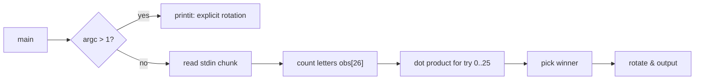

# `caesar` — Original Architecture

> Deep analysis of the original C source. What did the programmers
> build, and how?
>
> Cite upstream file:line references only. Upstream tree:
> <https://github.com/vattam/BSDGames/tree/master/caesar>.

---

## Files & Roles

| File | Purpose | Approx. LoC |
|---|---|---:|
| `caesar.c` | Frequency-analysis decryption + explicit rotation | 161 |
| `caesar.6` | Man page | 72 |
| `rot13.in` | Build-time note about rot13 symlink | 37 |
| `Makefrag` | Install rules | 39 |

## High-Level Flow

## Game Loop Detail

N/A. This is a batch filter, not an interactive game.

## Data Structures

- `stdf[26]` — hard-coded English letter frequencies, log-scaled. `caesar.c:72-76`.
- `obs[26]` — observed letter counts from input. `caesar.c:90`.
- `inbuf` — one `LINELENGTH` chunk of input. `caesar.c:99`.

## AI Logic

N/A.

## Random Events

N/A. The utility is fully deterministic.

## Difficulty Progression Logic

N/A. Utility.

## What Was Clever for Its Era

1. **Frequency analysis as a one-pass filter.** The whole program is a classic Unix filter: read stdin, process, write stdout. `caesar.c:109-146`.
2. **Log-scaled frequency table.** The code converts raw percentages to log probabilities before dotting, giving low-frequency letters less influence. `caesar.c:103-104`.
3. **Macro-based rotation.** The `ROTATE` macro handles both cases in one line. `caesar.c:64-66`.

## Constraints the Original Had To Handle

- **Memory.** Reads only `LINELENGTH` bytes at a time, so it works on tiny machines.
- **Speed.** The 26-rotation dot product is trivial even on 1980s hardware.

## What This Code Would Look Like Today

A modern port might use Bayesian scoring, support multiple languages, or provide a web UI showing each candidate rotation ranked by confidence.

See [`port-ideas.md`](./port-ideas.md).

## See Also

- [`lessons.md`](./lessons.md)
- [`spec.md`](./spec.md)
- [`references.md`](./references.md)
