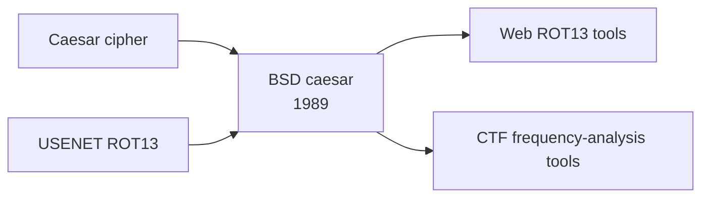

# `caesar` — Lineage

> Genre siblings and descendants.

---

## Direct Ancestors

- **Caesar cipher** (Julius Caesar, ~100 BCE) — the rotation substitution cipher.
- **USENET ROT13 convention** (1980s) — social use of ROT13 for spoilers.

## Direct Descendants

- **Online ROT13 decoders** — countless browser tools.
- **CTF/crypto puzzle tools** — frequency-analysis helpers.

## Genre Family

## If You Like `caesar`, Try…

- **CyberChef** — comprehensive encoding/decoding web tool.
- **dcode.fr** — cipher solvers and frequency analysis.

## References

See [`references.md`](./references.md).
