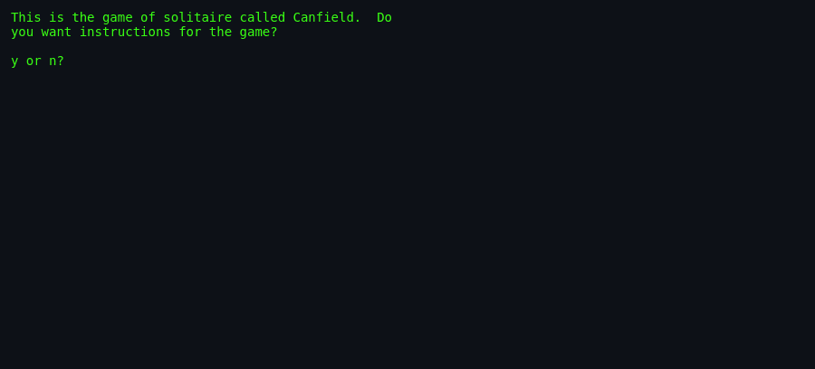
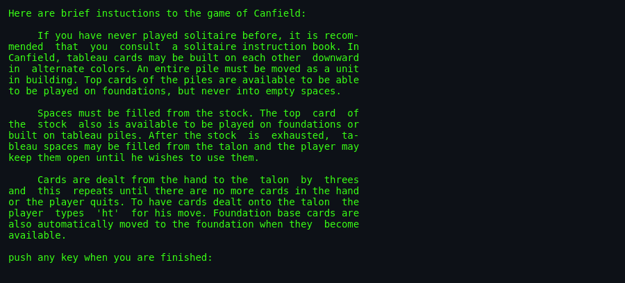
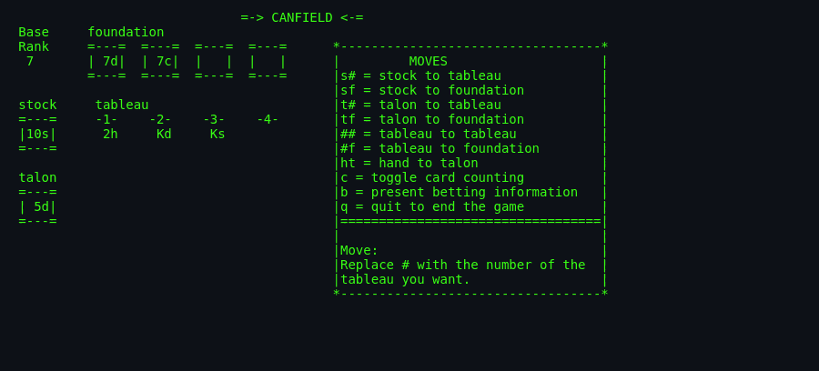
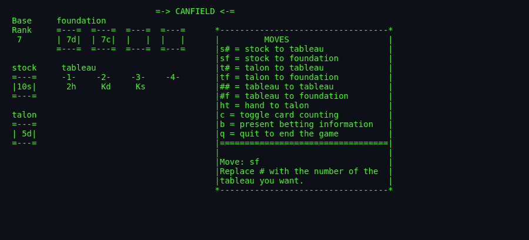

# `canfield` — About

> A curses-drawn implementation of the solitaire card game
> **Canfield**, with a twist: you play against the "casino." The
> deck costs money, thinking time costs money, hints cost money,
> and every card you land on a foundation earns money back.

---

## What is `canfield`?

Canfield (also called **Demon** in the UK) is a real 19th-century
solitaire variant, said to have been invented at Richard Canfield's
casino in Saratoga Springs, NY. Canfield the man ran it as a
gambling game — the house sold you the deck for $50 and paid $5
per card you finished, giving the player an expected loss.

Berkeley's `canfield(6)` is a faithful adaptation. Steve Levine
wrote the game logic; Steve Feldman ported it to curses; Kirk
McKusick and Mikey Olson added card counting; Kirk McKusick and
Eric Allman polished the UI; Kirk McKusick added the **betting
system** that makes this port unique.

## What makes it interesting

- **Casino-style betting.** $13 to open, $13 to inspect, $26 to
  commit — with running charges for hints and thinking time.
- **Card counting toggle** (`c`). Reveals every card seen so far,
  but you pay per revelation. Capped at $34 (all 34 cards you
  might see face-down).
- **Persistent bankroll.** A companion tool `cfscores(6)` shows
  your running account balance across every session. This is a
  proto-progression system in a solitaire game.
- **Three-cards-at-a-time talon.** Klondike-3 style — flip 3
  cards from the hand pile each `ht`.
- **Base card ≠ Ace.** Whatever card lands first on the first
  foundation is the "base rank"; other foundations must start
  with that same rank. This is what distinguishes Canfield from
  Klondike.
- **`It is impossible to cheat.`** The man page's terse BUGS
  section. Because the scores are stored in a game-owned file,
  you can't edit them without root.
- **Two-tool architecture.** `canfield(6)` plays; `cfscores(6)`
  reports. Follows the Unix "small, sharp tools" ethos.

## The 1980 context

- **Curses(3)** was still novel — cursor addressing meant a
  card game could redraw only the affected piles instead of
  reprinting the whole screen. Steve Feldman's port takes
  advantage.
- **Terminal font** meant cards had to fit in a 3×5 grid of
  characters. The rendering (`| Kh|` boxes with rank + suit)
  became an idiom. Later cursed card games copied it.
- **Berkeley's game culture** at the time was densely social —
  bank balances from `cfscores` were compared over coffee.

## Screenshots

<!-- Real captures from Debian bsdgames `canfield(6)`, 2026-09-17. -->

### 1. Instructions prompt
The game opens with a yes/no prompt: *"Do you want instructions
for the game?"*.



### 2. Instructions text
Typing `y` produces a full explanation of Canfield's rules, ending
with *"push any key when you are finished"*.



### 3. Initial deal
After the deal: base rank shown at top-left, four foundation
slots, four tableau piles, stock and talon piles on the left, and
a MOVES cheatsheet on the right listing every command:

```
s# = stock to tableau         tf = talon to foundation
sf = stock to foundation      ## = tableau to tableau
t# = talon to tableau         #f = tableau to foundation
                              ht = hand to talon
                              c = toggle card counting
                              b = present betting information
                              q = quit to end the game
```



### 4. Mid-game — after a few moves
A fresh seed showing the base rank (7), two foundations populated
(7d, 7c), tableau built downward, stock 10s, talon 5d. Every
`Move:` you type is echoed in the box.



## Difficulty & Progression

- **Skill of Canfield the solitaire:** the win rate for expert
  human play is estimated around 1 in 30 games (~3%). It is
  considered one of the hardest common solitaire variants.
- **Card counting = expert mode.** Toggling `c` reveals cards seen
  and gives the informed player a real edge. But you pay per
  revelation.
- **No difficulty setting.** The card layout is what it is;
  learning is on you.
- **Persistent bankroll via `cfscores`.** Your net worth across
  sessions is a rough progression signal — negative = losing,
  positive = winning.

## Not to be confused with

- **Klondike solitaire** — the standard Windows Solitaire.
  Related, but Canfield uses a different base-card rule and a
  reserve pile.
- **The "Solitaire" card game** in the Bicycle rulebook — usually
  means Klondike.
- **`solitaire(6)`** in other BSDGames collections — could be any
  variant.
- **`fish(6)`** — Go Fish; the other simple BSD card game.
- **`cribbage(6)`** — the peg-and-board game.

## Quick facts

- **First shipped:** ~1980 (Berkeley); NetBSD-refreshed 2004.
- **Lines of C:** ~1700 in `canfield.c`, ~250 in `cfscores.c`.
- **Deck size:** 52.
- **Foundation slots:** 4.
- **Tableau piles:** 4.
- **Hand deal-count:** 3 cards at a time.
- **Base card:** first foundation card determines the base rank
  for all four foundations.

## Where to go next

- Rules and how to play: [`how-to-play.md`](./how-to-play.md).
- Code architecture: [`architecture.md`](./architecture.md).
- Everything the port must decide:
  [`port-ideas.md`](./port-ideas.md).
- Lineage and inspiration: [`lineage.md`](./lineage.md).
