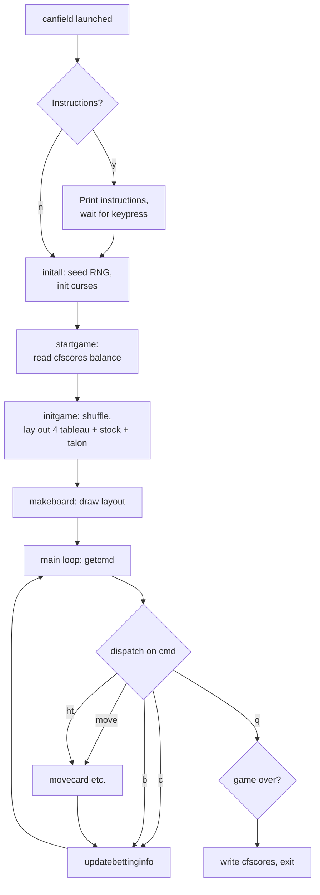

# `canfield` — Architecture

> How Steve Levine's original + Steve Feldman's curses port + Kirk
> McKusick's betting layer + Mikey Olson's card counting fit
> together. Read this before attempting a port.

---

## Source tree

Upstream:
<https://github.com/vattam/BSDGames/tree/master/canfield>

```text
canfield/
├── canfield/                — the game
│   ├── canfield.c           — everything (~1700 LOC)
│   ├── canfield.6.in        — man page
│   ├── pathnames.h.in       — path to score file
│   ├── Makefile.bsd
│   └── Makefrag
└── cfscores/                — the account-balance printer
    ├── cfscores.c           — ~250 LOC
    ├── Makefile.bsd
    └── Makefrag
```

Note the **two-binary architecture**. `canfield` plays; `cfscores`
reports on the shared score file. This is a strong Unix idiom and
worth preserving in the port.

## High-level flow



## The state

Global data (from `canfield.c` around line 152):

```c
struct cardtype {
    char suit;      /* s c h d */
    char color;     /* b or r  */
    bool visible;
    bool paid;      /* has $1 been charged for revealing? */
    int rank;       /* 1..13, Ace=1 King=13 */
    struct cardtype *next;   /* linked list in pile */
};

struct cardtype *deck[52];
struct cardtype cards[52];
struct cardtype *bottom[4], *found[4], *tableau[4];
struct cardtype *talon, *hand, *stock, *basecard;
int length[4];
int cardsoff, base, cinhand, taloncnt, stockcnt, timesthru;
```

Each pile is a **singly-linked list** of `cardtype` nodes. The
`cards[]` array is the actual card storage; `deck[]` is a pointer
array used during shuffling. `bottom[4]` remembers the bottom of
each tableau (for O(1) append during moves). `length[4]` caches
pile lengths.

Piles:

- `hand` — face-down deck to be dealt.
- `stock` — the reserve pile below the base rank (visible top).
- `talon` — the pile of 3-at-a-time deals (visible top).
- `tableau[4]` — the 4 build piles.
- `found[4]` — the 4 foundations.
- `basecard` — first foundation card, defines the base rank.

## The main loop

Roughly:

```c
main() {
    initall();          /* curses, signals, seed */
    startgame();        /* read cfscores balance */
    while (!done) {
        movecard();     /* getcmd() then dispatch */
        updatebettinginfo();
    }
    cleanup(0);
}
```

`movecard()` reads a 2-character command via `getcmd()` and
switches on the first char, second char, or both.

## Command dispatch

`getcmd()` at `canfield.c` reads a short string with echo into a
fixed buffer, then `movecard()` interprets it:

- First char `s` + digit → stock to tableau.
- First char `s` + `f` → stock to foundation.
- First char `t` + digit → talon to tableau.
- First char `t` + `f` → talon to foundation.
- Digits `12`, `13`, `14`, `21`, ... → tableau to tableau.
- Digit `1`–`4` + `f` → tableau to foundation.
- `ht` → hand to talon (deal 3).
- `c` → toggle `Cflag`.
- `b` → switch top-right box to betting info via
  `printtopbettingbox()` + `printbottombettingbox()`.
- `q` → set `done = TRUE` after confirmation.

## The betting system

Constants (canfield.c ~line 173):

```c
#define costofhand             13
#define costofinspection       13
#define costofgame             26
#define costofrunthroughhand    5
#define costofinformation       1
#define secondsperdollar       60
#define maxtimecharge           3
#define valuepercardup          5
```

State:

```c
struct betinfo {
    long hand;         /* $13 initial + $5 each rerun */
    long inspection;   /* $13 to inspect */
    long game;         /* $26 to commit */
    long runs;
    long information;  /* $1 * count of revealed cards */
    long thinktime;    /* $1 per minute, capped */
    long wins;         /* $5 per card on foundation */
    long worth;        /* wins - all costs */
};
struct betinfo this, game, total;
```

- **`this`** — the current move.
- **`game`** — the current game.
- **`total`** — running total from `cfscores` file.

`updatebettinginfo()` is called after every move. It reads the
wall clock, computes `thinktime`, adds up wins/costs, and updates
the on-screen betting box.

## The score file

`cfscores` is a **fixed-record binary file** — one `betinfo`
struct per Unix UID, indexed by UID as byte offset. Both
`canfield.c` and `cfscores.c` open it with the same layout.

Location: `/var/games/canfield.scores` in the traditional BSD
layout, or wherever `pathnames.h.in` says. Historically the file
was **setgid `games`** so the game could write to it while users
could not modify it directly.

This is the "impossible to cheat" mechanism.

## The `cfscores` companion tool

`cfscores.c` is a small (~250 LOC) reader that:

- With no args: prints the current user's balance.
- With `user`: prints that user's balance.
- With `-a`: iterates the file printing every user with a
  balance.

## Anti-patterns in the port

- **Setgid + shared world-visible score file.** A modern port
  should use per-user files (e.g., `~/.local/share/canfield/`)
  or an actual database, not a raw struct dump.
- **Hardcoded curses coordinates** (`taloncol`, `boxcol`, etc.).
  The port should compute positions from window dimensions.
- **`time()`-based thinking-time meter.** Sensitive to clock
  jumps, sleep, and time-zone changes.
- **Singly-linked lists everywhere.** Fine for a 52-card deck,
  but a `Vec<Card>` (or similar) is simpler in modern languages.
- **`bool` = `char`.** Predates `stdbool.h`.
- **All globals.** Encapsulate.

## What to preserve

- **The economics.** $13/$13/$26/$5/$1/$1min. The identity of
  the port.
- **`cfscores` sidecar.** Two-tool architecture.
- **The 10-command grammar.** Muscle memory of the UX.
- **Instructions-first prompt.** Front door of the game.
- **Base card = first foundation card.** Distinguishes Canfield
  from Klondike.
- **"Impossible to cheat" via file permissions.** Modern
  equivalent: cryptographically-signed score file.

## See also

- Lessons: [`lessons.md`](./lessons.md).
- Port ideas: [`port-ideas.md`](./port-ideas.md).
- Full spec: [`spec.md`](./spec.md).
