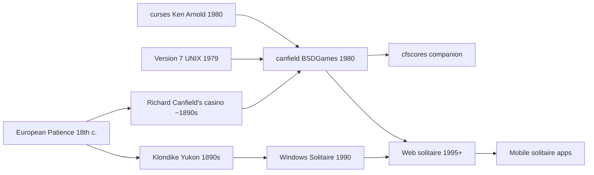

# `canfield` — Lineage

> Where `canfield(6)` sits in the family tree of solitaire card
> games and Berkeley's small-tools culture.

---

## Direct Ancestors

- **Solitaire card games** (18th-century Europe) — the general
  family. "Patience" in the UK, "solitaire" in the US.
- **Klondike solitaire** (late 19th century, Yukon gold rush) —
  the most popular Western variant. Windows Solitaire is
  Klondike.
- **Richard Canfield's casino game** (~1890s, Saratoga Springs,
  NY) — the specific rule variant this port implements, and
  the name. Canfield sold you the deck for $50, paid $5 per
  card off, and had an expected loss of ~$20 per deal for the
  player.
- **Version 7 UNIX + early BSD** — the software environment.
- **`curses(3)`** (Ken Arnold, 1980) — the terminal library
  Steve Feldman used to port the game.

## Direct Descendants

- **Windows Solitaire** (1990) — mainstream Klondike; direct
  design descendant. Made solitaire ubiquitous.
- **Solitaire.exe** (1990) — the specific Windows program.
- **Later BSDGames maintenance** by NetBSD (Kirk McKusick,
  others).
- **Web solitaire** (from ~1995 onwards) — JavaScript
  implementations of Klondike, FreeCell, Spider, Canfield.
- **Modern mobile solitaire apps** — most implement multiple
  variants including Canfield.

## Genre Family

## If you like `canfield`, try...

**Direct spiritual descendants:**

- **Klondike solitaire** — the ubiquitous variant. Every
  computer since 1990 has shipped one.
- **FreeCell** — deterministic solitaire; every deal is
  solvable. Michael Keller's implementation and later ports.
- **Spider** — 2-suit and 4-suit variants; longer, more
  strategic than Klondike.
- **Yukon** — closely related to Klondike; no stock or talon.

**Physical solitaire:**

- **Actual deck** — any Bicycle or Aviator pack. Canfield
  playable on a 3'×2' table.
- **Solitaire card game books** — old-school "Hoyle" or
  "Foster's Complete Hoyle" cover 100+ variants.

**Digital classics:**

- **Windows Solitaire** — the Klondike. Culturally huge.
- **KDE Patience Games (kpat)** — dozens of variants including
  Canfield.
- **AisleRiot** (GNOME) — even more variants.
- **Solitaire City / Solitaire XP** — commercial classics.
- **Microsoft Solitaire Collection** — modern Xbox-integrated
  version.

**Casino origins reference:**

- **Richard Canfield** biographies — for the man behind the
  variant.
- **Gambling reference books** — for the betting model this
  port implements.

**Other BSD card games:**

- **`cribbage(6)`** — peg-and-board, AI opponent.
- **`fish(6)`** — Go Fish.
- **`mille(6)`** — Mille Bornes.
- **`monop(6)`** — Monopoly (upstream only, trademark issue).

## Communities

- **`r/solitaire` on Reddit** — active discussion.
- **BoardGameGeek** — Canfield tagged as a solitaire variant.
- **Solitaire enthusiast forums** — small but present.
- **NetBSD community** — maintains upstream.
- **KDE / GNOME games projects** — active development of many
  solitaire variants.

## Historical curiosity

The betting economics in `canfield(6)` are a direct simulation of
Richard Canfield's casino rules:

- Canfield's casino: $50 for the deck, $5 per card off.
- BSD `canfield(6)`: $52 for full commitment, $5 per card off.

The $2 difference is essentially a rounding to what a computer can
model with meter charges — you pay for hints and time, whereas at
Canfield's casino you paid nothing for those but had a house
supervisor timing you.

The expected value in both cases is negative — you should lose
money over many deals. Card counting shifts this in your favor,
which is why the port charges $1 per revealed card: it prices
the information advantage.

## References

See [`references.md`](./references.md).
