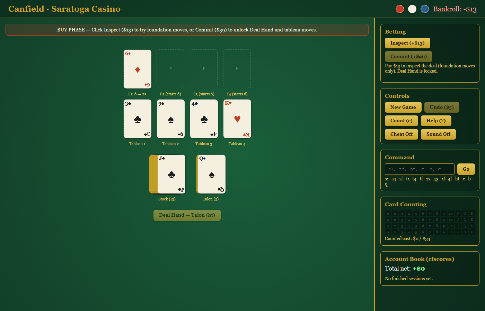
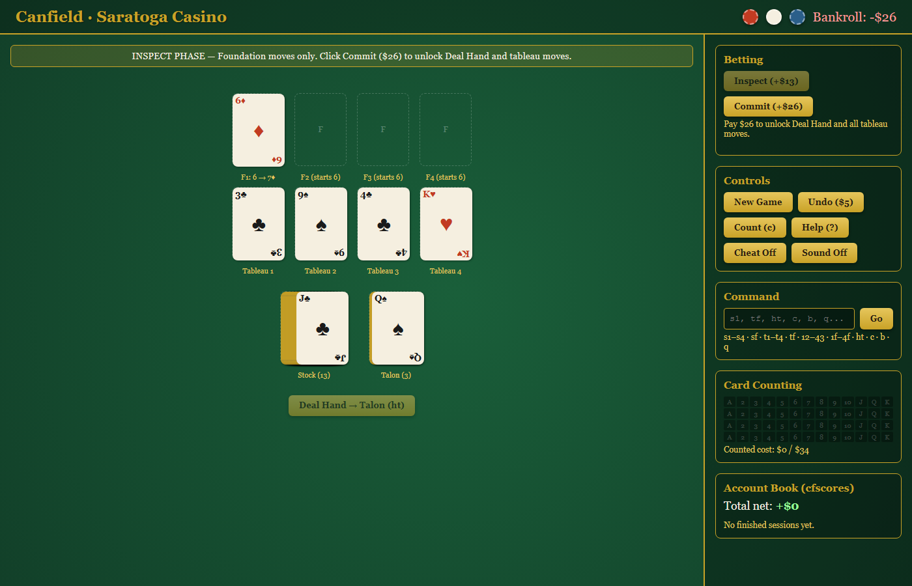
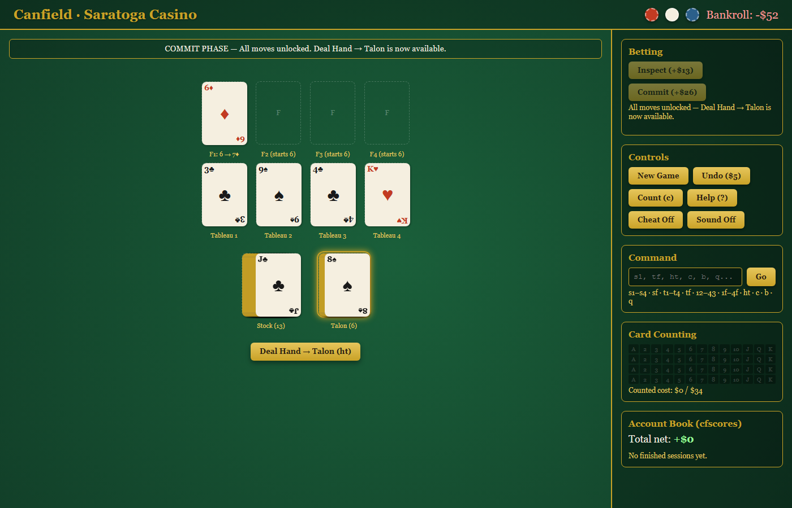
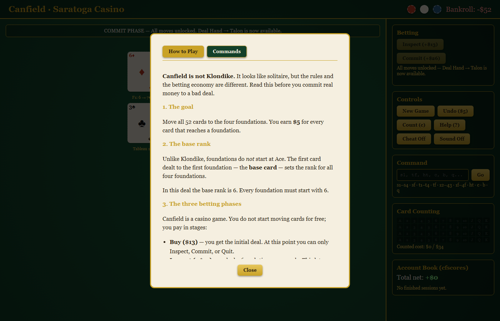
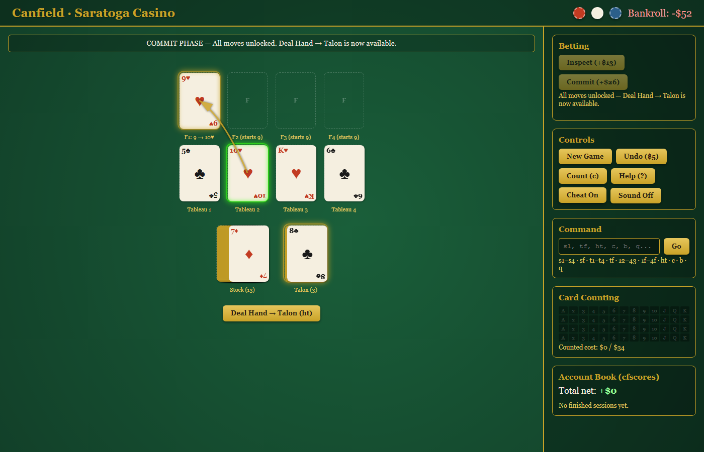

# `canfield` — `fancy-web` port

> A browser reimplementation of BSDGames `canfield` — the 19th-century casino solitaire — rendered as a **Victorian Saratoga Springs card table**. Faithful mechanics, betting economics intact, but with click-to-move play, a visual cheat coach, chip animations, an account book, and optional casino ambience.

## Status

- **Status:** 🟢 Released 2026-09-22 (Universal Port Contract baseline satisfied; cheat mode added).
- **Author:** Agun Wijaya
- **License:** MIT (root default)
- **Live URL:** *(pending deploy)*

**Verified**
- ✅ 29/29 Vitest unit tests pass.
- ✅ 6/6 Playwright e2e tests pass (click-to-select + cheat mode scenarios).
- ✅ TypeScript strict clean.
- ✅ Production build clean.
- ✅ 5 port-specific screenshots captured.

## Screenshots

| Initial deal | Betting panel |
|:---:|:---:|
|  |  |

| Mid-game | Help panel |
|:---:|:---:|
|  |  |

| Cheat mode |
|:---:|
|  |

## Pitch

BSDGames `canfield` was already unique among solitaire games: you played against the casino, paying for the deck, for time spent thinking, for hints, and for card-counting information. This fancy-web port keeps that tension and wraps it in a tactile casino table — SVG cards you can click to select and move, animated chips that bounce when you earn $5 per foundation card, and an account book that replaces the original `cfscores` companion.

For the game's history and rules see canonical [`../../docs/about.md`](../../docs/about.md).

## Tech Stack

- **Language:** TypeScript 5.6
- **UI framework:** React 18 (functional components + hooks)
- **Rendering:** SVG cards and UI chrome. No Canvas, no WebGL.
- **Build:** Vite 5
- **Tests:** Vitest 2 + Testing Library
- **Target platform:** Any modern browser (desktop + mobile).
- **Persistence:** `localStorage` — in-progress game resume + `cfscores`-style session log.

Full stack rationale: see [`docs/decisions/001-tech-stack.md`](docs/decisions/001-tech-stack.md).

## Install & Build

```bash
# From this port folder:
npm install
npm run dev         # dev server (http://localhost:5173)
npm run build       # production build → dist/
npm run preview     # preview production build
npm test            # watch-mode unit tests
npm run test:once   # single-run unit tests
npm run test:e2e    # Playwright end-to-end tests (requires preview server on :4173)
npm run typecheck   # tsc --noEmit
```

### Running e2e tests

1. Start the preview server: `npm run preview -- --port 4173`
2. In another terminal: `npm run test:e2e`

The e2e suite covers click-to-select interactions with a real Chromium browser.

## Play

*(Live URL pending. Locally: `npm run dev` then open `http://localhost:5173`.)*

### Controls

| Input | Action |
|---|---|
| Click card / pile | Select source |
| Click destination pile | Move selected card/pile |
| Click "Deal Hand" button | Draw next 3 cards to talon (`ht`) — only after Commit |
| Type `s1`, `tf`, `ht`, etc. + Enter | Execute original command grammar |
| Toggle "Cheat" | Show legal moves as glowing arrows; highlight Inspect/Commit when recommended |
| `u` / Ctrl+Z | Undo last move (penalty $5) |
| `n` | New game |
| `?` | Toggle help |

Rules: see canonical [`../../docs/how-to-play.md`](../../docs/how-to-play.md).

## What makes this port different

- vs `../classic-web/` *(pending)*: this port renders a full graphical casino table with click-to-move cards, chip animations, and sound. `classic-web` will reproduce the original curses ASCII-card layout faithfully.
- vs generic web solitaire: the **betting layer** is central, not cosmetic. Every move is charged or credited exactly as the original `canfield(6)` meter.

## Spec compliance

This port implements the mechanics in canonical [`../../docs/spec.md`](../../docs/spec.md) — 52-card deck, base-card foundation rule, tableau build by alternating color, foundation wrap-around, three-card talon deal, and the full betting economics. Deliberate deviations are documented as port-level ADRs under [`docs/decisions/`](docs/decisions/).

## Attribution

- Original BSDGames `canfield` — Steve Levine, Steve Feldman, Kirk McKusick, Eric Allman, Mikey Olson. See root [`ATTRIBUTION.md`](../../../../ATTRIBUTION.md).
- Upstream source: <https://github.com/vattam/BSDGames/tree/master/canfield>.
- This port © 2026 Agun Wijaya, MIT.

## Documentation

- **Canonical (game-level)** — [`../../docs/`](../../docs/): `spec.md`, `architecture.md`, `about.md`, `how-to-play.md`, `lessons.md`, `references.md`, `port-ideas.md`, `manpage.md`, `lineage.md`, `test-scenarios.md`, `notes.md`.
- **This port's diff log** — [`docs/diff-log.md`](docs/diff-log.md): what was kept / added / changed / removed vs canonical `spec.md`.
- **This port's ADRs** — [`docs/decisions/`](docs/decisions/):
  - [`001-tech-stack.md`](docs/decisions/001-tech-stack.md) — React + SVG + Vite rationale.
  - [`002-cheat-mode.md`](docs/decisions/002-cheat-mode.md) — Visual cheat coach rationale.
- **Port-level test scenarios** — [`docs/test-scenarios.md`](docs/test-scenarios.md).
