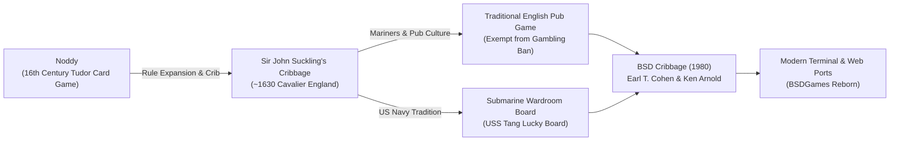

# About Cribbage

> *"Cribbage is an ancient and honourable pastime, invented by Sir John Suckling,
> wherein mathematical precision dances with the turn of a single card."*

---

## 1. Game Overview

**Cribbage** is a classic two-player card game played with a standard 52-card deck and
tracked on a dedicated pegboard. Players compete to be the first to reach a target score
(traditionally **121 points** in a standard "long game", or **61 points** in a "short game")
through a combination of tactical pegging plays and hand combinations including fifteens,
pairs, runs, flushes, and Jacks ("his nobs" and "his heels").

The BSD version of Cribbage, authored in **1980** by **Earl T. Cohen** and **Ken Arnold**
at the University of California, Berkeley, holds a unique place in computing history: it
was one of the very first interactive games engineered to showcase Ken Arnold's newly
minted `curses` terminal management library.

---

## 2. Historical & Cultural Context

### The Cavalier Poet & Gambler
The game was invented around **1630** by the English Cavalier poet, playwright, and notorious
gambler **Sir John Suckling** (1609–1642). Suckling took the older Tudor-era game of *Noddy*
(which also scored 15s and 31s with a scoring board) and introduced the revolutionary concept
of the **"crib"** — an extra four-card hand formed by discards from both players and scored
by the dealer, fundamentally altering the risk-reward calculus of every deal. Suckling reportedly
distributed marked decks across England to win vast sums from aristocratic peers before funding
a lavish troop of 100 horsemen for King Charles I.

### The Only Game Legal in English Pubs
In the United Kingdom, Cribbage carries special statutory status: under the Licensing Act,
it was long one of the very few games of skill permitted to be played for small stakes in
public houses and social clubs without requiring a special municipal gaming license.

### Submarine Wardroom Legend
Cribbage has a revered status within the United States Navy submarine force. The personal
cribbage board of legendary World War II submarine commander Rear Admiral Richard O'Kane
(aboard the *USS Tang*) is ceremoniously passed down to the oldest active fast-attack
submarine in the Pacific Fleet, currently serving aboard the *USS Chicago* or *USS Key West*.

---

## 3. Visual Tour

Below are captures of BSD Cribbage running in its authentic terminal `curses` environment.

### Opening Board Setup
The game initializes with a two-track 60-hole pegboard, status headers, and card prompts:

*Figure 1: Initial state of the standard 121-point pegboard rendered via Ken Arnold's curses interface.*

### Mid-Game Pegging and Scoring
Pegs advance along the dual tracks as players lay cards up to a count of 31:

*Figure 2: Active pegging sequence showing running total of 21, starter card cut, and hole progression.*

### Victory and Skunk Screen
A victory screen indicating final tally and whether the loser was caught behind the skunk line:

*Figure 3: Final score demonstration where the player pegs out at 121, delivering a skunk to the computer.*

---

## 4. Why It's Fun: The Core Loop

1. **The Discard Dilemma:** Every hand presents six cards from which two must be placed into
   the crib. If it is your crib, you want to seed it with synergistic pairs and fifteens. If it
   is your opponent's crib, you must discard "dead" cards (e.g. King-9 or 10-Ace) that minimize
   scoring potential without gutting your own hand.
2. **Tactical Pegging:** Playing cards alternately up to 31 requires quick mental math, trapping
   opponents into playing cards that set up 15s (2 pts), pairs (2 pts), or runs (3+ pts), while
   avoiding giving up "Go" (1 pt) or 31 (2 pts).
3. **The "Stink Hole" Dynamic:** Hole 120 on a 121-point board is known among players as the
   *stink hole*. Because pegging points are counted before hand scores, a player sitting in the
   stink hole needs only a single pegging point (such as a "Go" or a pair) to snatch victory
   instantly before the dealer counts a 24-point hand!

---

## 5. Making-of Stories: The Birth of Curses

In 1980, **Ken Arnold** was an undergraduate student at UC Berkeley working under Bill Joy.
Joy had developed `termcap` (the terminal capability database), and Arnold built `curses`
on top of it to abstract cursor positioning, screen refreshing, and character-cell windows.

While `rogue` (co-written by Arnold, Michael Toy, and Glenn Wichman) became the most famous
curses showpiece, Arnold collaborated with fellow Berkeley student **Earl T. Cohen** to create
`cribbage`. Cohen wrote the mathematical rules engine and rule-based heuristic AI, while
Arnold designed the visual pegboard layout in `curses` (`cribcur.h` and `io.c`). The resulting
program allowed users on Lear Siegler ADM-3A, DEC VT100, and Hazeltine terminals to play
cribbage with real-time ASCII pegs moving across an authentic board representation.

---

## 6. Difficulty & Progression

BSD Cribbage models the formal regulations of standard two-player Cribbage without synthetic
difficulty scaling. Progression is governed by match structure, board geometry, and tension ramps:

| Mode / Condition | Target Points | Skunk Line | Double Skunk Line | Strategic Progression |
|---|:---:|:---:|:---:|---|
| **Short Game (`s`)** | 61 points | 31 points | N/A | Fast 1-lap sprint; early pegging lead often insurmountable. |
| **Long Game (Default)** | 121 points | 90 points | 60 points | Full 2-lap marathon; dealer alternates, allowing tactical catch-up. |

### The Progression Curve within a Match
- **Laps 1 & 2 (0–90 points):** Maximum hand yield. Players discard aggressively to maximize
  hand points and crib synergy.
- **The Skunk Zone (90–120 points):** Defensive discarding. The trailing player must take
  drastic risks to pass 90 points and avoid the humiliation of a "skunk".
- **The Stink Hole (Hole 120 / Hole 60):** Ultimate tension. Hand potential becomes irrelevant;
  the entire game reduces to who can secure 1 pegging point first during the 31-count play.

---

## 7. Known Bugs and Historical Quirks

1. **Terminal Dimension Bounds:** The curses pegboard requires at least 24 lines and 80 columns.
   On narrow or short terminal windows, older BSD implementations could crash or scramble peg
   coordinates.
2. **Pedagogical Score Explanation Flag (`-e`):** Designed to teach beginners why their score
   was wrong. If a player claims 16 points when they only hold 14, `-e` prints the breakdown.
   In older versions, certain flush edge cases with the cut card occasionally reported ambiguous
   breakdowns.
3. **Cutting Index vs Card Name:** The original game allows users to cut by entering an integer
   index from `0` to `51` or using the `-r` flag to cut automatically. Users unfamiliar with the
   card array often found manual integer indexing unintuitive.
