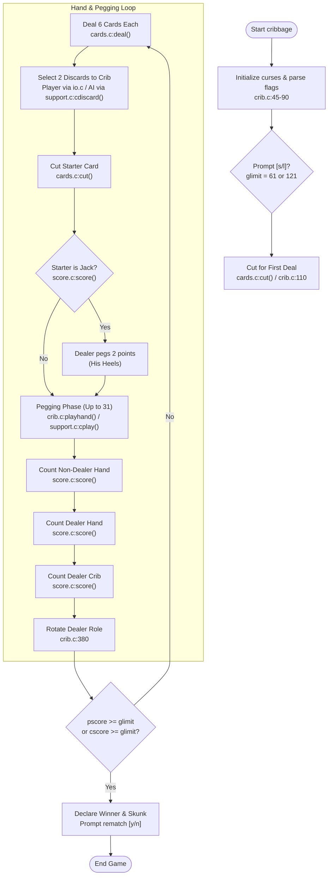
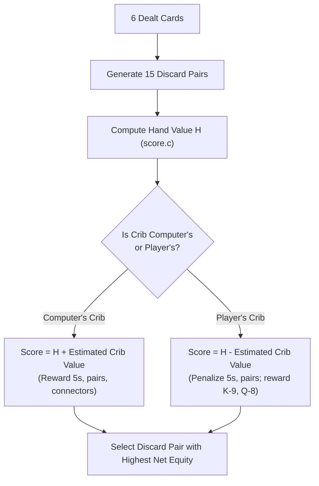

# Cribbage — Original Code Architecture

A technical deep-dive into the control flow, curses pegboard rendering engine,
and Earl T. Cohen's heuristic artificial intelligence in BSD `cribbage`.

---

## 1. Upstream Module Map

The original source code resides in [`vattam/BSDGames/tree/master/cribbage`](https://github.com/vattam/BSDGames/tree/master/cribbage):

```
vattam/BSDGames/tree/master/cribbage/
├── crib.c          # Main game loop, turn sequencing, cut for deal, deal-to-deal transition
├── cards.c         # 52-card deck generation, pseudo-random shuffling, cutting logic
├── score.c         # Combinatorial scoring: 15s, pairs, sequences, flushes, Jack rules
├── support.c       # Earl Cohen's AI decision engine (discard evaluation & pegging logic)
├── io.c            # Ken Arnold's curses pegboard renderer, peg coordinates, input parsing
├── cribcur.h       # Curses coordinate macros, board dimensions, global state structs
├── deck.h          # Card struct definition, rank/suit constants, macro accessors
├── extern.c        # Global variable instantiations
└── cribbage.6.in   # UNIX troff manual page source
```

---

## 2. Game Loop Control Flow



---

## 3. Earl Cohen's Heuristic AI (`support.c`)

The computer player does not use search trees (like Minimax) or machine learning; instead,
Earl T. Cohen constructed a sophisticated rule-based heuristic system split into two components:

### 1. The Discard Decision Engine (`cdiscard()`, [`support.c:45`](https://github.com/vattam/BSDGames/tree/master/cribbage/support.c#L45))
Given 6 dealt cards, there are $\binom{6}{2} = 15$ possible discard pairs leaving a 4-card hand.
Cohen's algorithm loops through all 15 permutations:


1. **Self-Crib Discards:** Prioritizes pairs, consecutive cards (e.g. 7-8), 5s, and cards summing to 15.
2. **Opponent-Crib Discards (Balking):** Severely penalizes discarding 5s, 2-3 combinations, or pairs.
   Heavily favors "balk cards" like King-Ace, King-9, or unsuited wide gaps.

### 2. The Pegging Decision Engine (`cplay()`, [`support.c:165`](https://github.com/vattam/BSDGames/tree/master/cribbage/support.c#L165))
During the 31-count play, the computer evaluates all legal cards remaining in its hand:
- **Instant Points:** Plays cards completing 15 (2 pts), 31 (2 pts), pair (2 pts), or runs.
- **Defensive Avoidance:** Avoids laying a card that brings the running total to:
  - **5:** High danger of opponent playing a 10-value card to make 15.
  - **21:** High danger of opponent playing a 10-value card to make 31.
- **Trap Setup:** Plays cards that bait the human player into playing into a trap (e.g., playing a 4 from a pair of 4s, waiting for the opponent to pair it so the computer can strike with a Pair Royal for 6 pts).

---

## 4. Ken Arnold's Curses Pegboard Architecture (`io.c` & `cribcur.h`)

Ken Arnold represented the classic physical cribbage board using curses coordinate offsets:

### Track Layout and Coordinates
In [`cribcur.h:40-75`](https://github.com/vattam/BSDGames/tree/master/cribbage/cribcur.h#L40), Arnold mapped
the 60 holes of each player track into 2D screen coordinates $(y, x)$:
- Each lap consists of 60 holes laid out in rows of 30, with visual grouping brackets `[ 5 ] [10] ... [30]`.
- As a player advances, two pegs per player are maintained: the **front peg** (current score)
  and the **back peg** (previous score). Advancing involves clearing the old back peg and placing
  it ahead of the front peg — precisely mimicking physical pegging!

```c
/* Upstream coordinate mapping concept in io.c:prpeg() */
void prpeg(int score, int player) {
    int y, x;
    peg_coords(score, player, &y, &x);
    move(y, x);
    addch(PEGMK);  /* '*' mark */
}
```

---

## 5. Randomness & Shuffling (`cards.c`)

The deck is represented as an array of 52 `CARD` structs.

- **`makedeck()`** ([`cards.c:30`](https://github.com/vattam/BSDGames/tree/master/cribbage/cards.c#L30)): Populates suits ($0..3$) and ranks ($0..12$).
- **`shuffle()`** ([`cards.c:55`](https://github.com/vattam/BSDGames/tree/master/cribbage/cards.c#L55)): Performs a pseudo-random in-place Fisher-Yates style transposition using `random()`.
- **`cut()`** ([`cards.c:95`](https://github.com/vattam/BSDGames/tree/master/cribbage/cards.c#L95)): If `-r` is active, randomly picks an integer $k \in [0, 51]$; otherwise, reads user index from stdin.

---

## 6. Runtime Progression & Setup Logic

- **Length Representation:** Stored in global `glimit` (`cribcur.h:28`). When initialized to `61`,
  the board renders a single 60-hole circuit. When initialized to `121`, the board tracks two laps.
- **Session Persistence:** When a game concludes, cumulative scores and match wins are retained in
  memory. If the user answers `y` to play again, the scores carry over without re-initializing curses.
