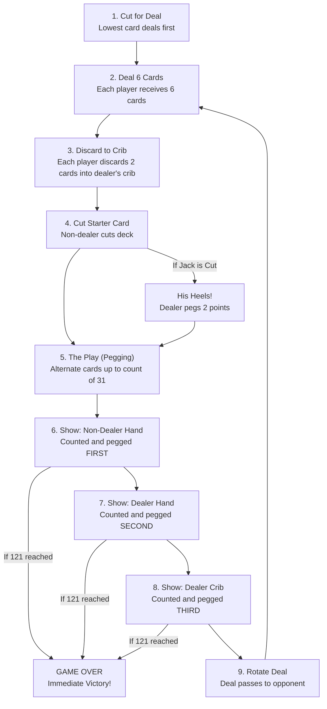

# How to Play Cribbage

A comprehensive tactical manual, scoring guide, and command reference for BSD Cribbage.

---

## 1. Objective of the Game

The objective of Cribbage is to be the first player to peg **121 points** (standard long game)
or **61 points** (short game). Points are accumulated during the **Play (Pegging)** phase and
the **Show (Hand Counting)** phase.

Because play stops the exact moment a player hits 121 (or 61), even in the middle of pegging,
turn order and pegging priority are critical.

---

## 2. Command Line Flags & Setup Configuration

When launching BSD Cribbage, several flags alter runtime behavior and difficulty feedback:

```bash
cribbage [-e] [-q] [-r]
```

| Flag | Name | Function & Purpose |
|---|---|---|
| `-e` | **Explain Mistakes** | Pedagogical mode. When you miscount your hand or pegging score, the computer explains the mathematical difference and shows every sub-combination. Highly recommended for learners. |
| `-q` | **Quiet Mode** | Disables explanatory messages and shortens prompts for experienced players. |
| `-r` | **Random Cut** | Skips the prompt asking you to manually enter a deck cut index (0–51), cutting automatically and pseudo-randomly instead. |

### Game Length Selection
At startup, the game prompts:
```text
Cribbage -- Version 2.17
Do you want a short game or a long game? [s/l]:
```
- **`s` (Short Game):** Played to **61 points** (once around the board). Fast-paced, high variance.
- **`l` (Long Game, Default):** Played to **121 points** (twice around the board). Standard tournament format allowing tactical swings.

---

## 3. Card Input Syntax

Ken Arnold engineered an extraordinarily forgiving card parser in `io.c` (`getcard()`):

| Input Style | Examples | Description |
|---|---|---|
| **Compact 2-char** | `kd`, `5s`, `th`, `ac` | Rank letter/digit followed by suit initial (`t` = 10, `a` = ace). |
| **Spaced 2-token** | `k d`, `5 s`, `10 h`, `a c` | Rank and suit separated by whitespace. |
| **Prepositional** | `k of d`, `king of diamonds` | Full English card name with preposition. |
| **Rank Only** | `k`, `5`, `10` | If only one card of that rank remains in hand, suit is auto-selected! |
| **Cut Index** | `0` through `51` | Integer index when cutting the deck (unless `-r` is active). |

Suits are denoted by:
- **`S`** = Spades, **`H`** = Hearts, **`D`** = Diamonds, **`C`** = Clubs.

---

## 4. Game Structure & Flow



---

## 5. Phase-by-Phase Rules

### Phase 1: Cut for Deal
Both players cut a card from the deck. The player with the lowest card rank deals first (Ace is lowest, King is highest).

### Phase 2: Deal & Discard
Each player is dealt 6 cards. Both players must choose **2 cards** to discard face down into the **crib** (an auxiliary 4-card hand belonging to the dealer). Each player retains 4 cards in hand.

### Phase 3: The Starter Card (Cut)
The non-dealer cuts the remaining deck, revealing the **starter card** (or "cut card").
- **His Heels (Nibbs):** If the starter card is a **Jack**, the dealer immediately yells *"Two for his heels!"* and pegs **2 points**.

### Phase 4: The Play (Pegging)
Players alternate laying one card face up in front of them, announcing the cumulative running total:
- Card point values: **Aces = 1**, **2–9 = face value**, **10, Jack, Queen, King = 10**.
- The cumulative total cannot exceed **31**.
- If a player cannot play a card without exceeding 31, they call **"Go"**. The opponent must play as many cards as legally possible without exceeding 31, scoring **1 point** for the Go (or **2 points** if they land exactly on 31).
- Once 31 is reached or both call Go, the count resets to **0**, and the player who did not play the last card leads.

**Pegging Scoring Table:**
| Combination | Condition | Points |
|---|---|:---:|
| **Fifteen** | Making running count exactly 15 | **2** |
| **Thirty-One** | Making running count exactly 31 | **2** |
| **Pair** | Playing a card of the same rank as the previous card | **2** |
| **Pair Royal** | Third card of same rank | **6** |
| **Double Pair Royal** | Fourth card of same rank | **12** |
| **Run of 3+** | 3 or more consecutive ranks played in any order (e.g. 7-5-6) | **1 per card** |
| **Go** | Playing last card before count reset (< 31) | **1** |

### Phase 5: The Show (Counting Hands)
After all 8 cards are played, hands are scored using the 4 hand cards plus the starter card (5 cards total).
**Scoring order is strictly enforced:**
1. **Non-dealer's hand** (Pone) is counted first.
2. **Dealer's hand** is counted second.
3. **Dealer's crib** is counted third.

---

## 6. Complete Hand Scoring Reference

| Category | Description | Points |
|---|---|:---:|
| **Fifteen** | Each separate combination of cards that sums to 15 | **2** |
| **Pair** | Each combination of 2 cards of identical rank | **2** |
| **Run of 3+** | Each sequence of 3 or more consecutive ranks | **1 per card** |
| **Four-card Flush** | All 4 cards in hand of the same suit (hand only, NOT crib) | **4** |
| **Five-card Flush** | All 4 cards in hand/crib match the suit of the starter card | **5** |
| **His Nobs** | Holding the Jack of the same suit as the starter card | **1** |

> **Crucial Rule on Crib Flushes:** A flush in the crib **must** be a 5-card flush (all 4 crib cards and the starter card of identical suit) to score 5 points. A 4-card crib flush scores 0 points!

---

## 7. Strategy & Tactical Tips

### 1. Discarding: Own Crib vs Opponent's Crib
- **To Your Own Crib:** Discard 5s, connected cards (7-8, 4-5), pairs, or matching suits. A 5 in the crib provides immense scoring potential with 10-value face cards.
- **To Opponent's Crib (Balking the Crib):** Discard uncomplimentary cards with low synergy: **King and 9**, **King and Ace**, **Queen and 8**, or **10 and 2**. Never discard a 5, pair, or 7-8 to your opponent's crib!

### 2. Pegging Tactics
- **Avoid Leading a 5:** Leading a 5 invites the opponent to play a 10-value card for an immediate 15-2.
- **Lead from Pairs:** Leading a 4 or 3 is safe; if the opponent pairs it (4-4), you can play the third card for a Pair Royal (6 points).
- **Beware of 21:** Playing a card to make 21 gives the opponent a clean shot at a 10-value card to make 31 for 2 points.

---

## 8. The Holy Grail: The 29-Point Hand

The highest possible hand in Cribbage is worth **29 points**. It requires holding three 5s and the Jack of the fourth suit, with the fourth 5 cut as the starter card!
- Four 5s + Jack:
  - Eight combinations of Jack + 5 = 15 (16 points).
  - Four combinations of 5 + 5 + 5 = 15 (8 points).
  - A double pair royal of four 5s (6 pairs × 2 = 12 points? No, 6 pairs = 12 pts, total pairs = 12? Wait: $\binom{4}{2} = 6$ pairs = 12 pts).
  - His nobs (Jack of starter suit = 1 pt).
  - Total: $16 + 8 + 12? \text{ Wait: } 16 \text{ (from 5s+J)} + 8 \text{ (from 5+5+5)} = 24 \text{ pts of 15s} + 12 \text{ pts of pairs}?$
  - Hoyle exact 29: $16 \text{ (fifteens with J)} + 8 \text{ (fifteens of 5s)} = 24 \text{ pts of 15s} + 6 \text{ pairs} \times 2 = 12? \text{ Wait!}$
  - Let's check math: 5s are three in hand + one cut. There are four 5s ($5_1, 5_2, 5_3, 5_4$). Any three 5s sum to 15: $\binom{4}{3} = 4$ ways $\times 2 = 8$ points. Jack (10) + any single 5 (5) sums to 15: 4 ways $\times 2 = 8$ points. Wait! What about Jack + pairs? Jack + two 5s = 20 (not 15). So Jack + 5 is 4 ways $\times 2 = 8$ points. Then $8 + 8 = 16$ points of fifteens! Plus 6 pairs of 5s ($\binom{4}{2} = 6 \times 2 = 12$ points). Plus 1 point for his nobs: $16 + 12 + 1 = 29$ points! Exactly 29!

---

## 9. Easter Eggs & Quirks

- **"Muggins" Absence:** In traditional bar cribbage, if a player fails to claim points, their opponent can shout "Muggins!" and steal the uncounted points. BSD Cribbage intentionally omits Muggins to prevent terminal latency frustration.
- **Rematch Loop:** After completing a game, typing `y` to the prompt preserves your win/loss statistics for the active terminal session.
