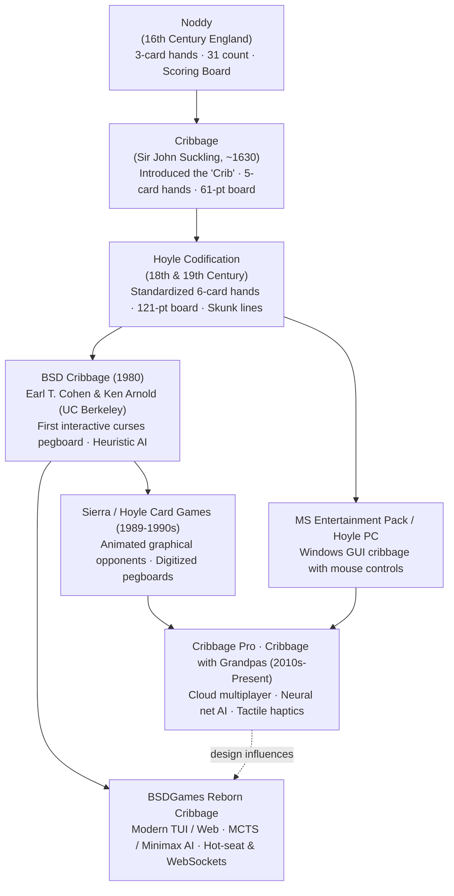

# Cribbage — Lineage & Heritage

A historical and technical lineage of Cribbage, tracing its evolution from Tudor-era card
parlors to Ken Arnold's early curses terminal interface and modern digital card engines.

---

## 1. The Evolutionary Tree

---

## 2. Comparative Mechanic Evolution Across Eras

| Era / Title | Hand Size | Board Target | The Crib Mechanic | Pegging Limit | User Interface |
|---|:---:|:---:|:---:|:---:|---|
| **Noddy (1500s)** | 3 cards | 31 points | **None** | Up to 31 | Chalk board or wood track |
| **Suckling's Cribbage (1630s)** | 5 cards (deal 5, discard 1) | 61 points | 2 discards + 1 dead card | Up to 31 | Physical wood pegboard with ivory pegs |
| **Standard Modern Cribbage (1800s+)** | 6 cards (deal 6, discard 2) | 121 points | 4 discards (2 from each player) | Up to 31 | Physical 3-track or 2-track pegboard |
| **BSD Unix Cribbage (1980)** | 6 cards (deal 6, discard 2) | 61 or 121 points | Standard 4-card crib | Up to 31 | Curses 80x24 terminal screen (`io.c`) |
| **Cribbage Pro / Modern Apps (2010s+)** | 6 cards | 121 points | Standard 4-card crib | Up to 31 | Touchscreen tap & drag, online matchmaking |

---

## 3. Cultural & Genre Siblings

- **Pinochle:** Another classic trick/meld card game with distinct combination scoring phases.
- **Rummy:** Shares the concept of forming sets (pairs/trips) and sequences (runs).
- **Fifteen-Based Games:** Cribbage's unique focus on combinations that sum to 15 is virtually
  unmatched in European card gaming, originating from late medieval arithmetic gambling games.
