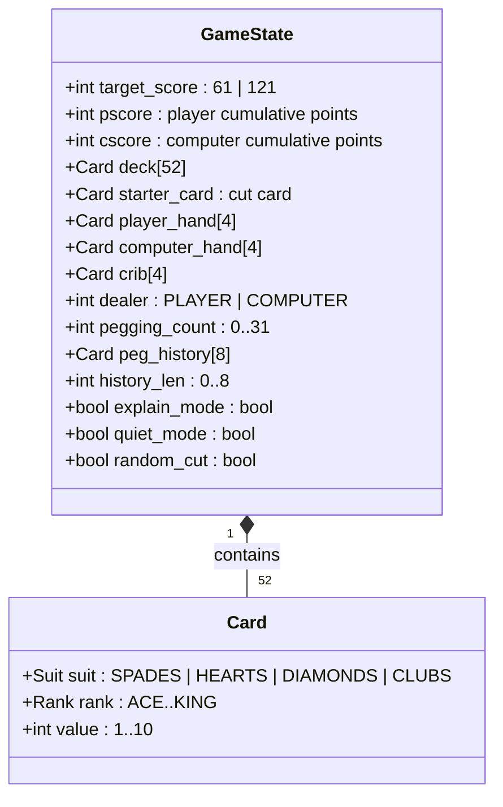

# Cribbage — Reverse Specification

Formal mechanical specification, state variables, 52-card entity inventory, scoring logic,
and termination invariants reverse-engineered from BSD `cribbage` (Earl T. Cohen & Ken Arnold, 1980).

---

## 1. Mathematical Objective

Be the first player whose cumulative score reaches or exceeds the target score:
$$\text{Score}_{\text{player}} \ge S_{\text{target}}$$
where $S_{\text{target}} = 121$ for standard long game, or $S_{\text{target}} = 61$ for short game.
The game terminates immediately upon reaching $S_{\text{target}}$, aborting subsequent phases.

---

## 2. Formal State Variables

| Variable | Type / Domain | Meaning | Upstream C Identifier |
|---|---|---|---|
| `glimit` | `int` $\in \{61, 121\}$ | Winning target score | `glimit` (`cribcur.h`) |
| `pscore` | `int` $\in [0, 121]$ | Player's score | `pscore` (`cribcur.h`) |
| `cscore` | `int` $\in [0, 121]$ | Computer's score | `cscore` (`cribcur.h`) |
| `deck` | `CARD[52]` | Shuffled card deck array | `deck` (`deck.h`, `cards.c`) |
| `starter` | `CARD` | Cut card for active deal | `starter` (`crib.c`) |
| `phand` | `CARD[4]` | Player's active hand | `phand` (`crib.c`) |
| `chand` | `CARD[4]` | Computer's active hand | `chand` (`crib.c`) |
| `crib` | `CARD[4]` | Crib (2 player discards + 2 computer discards) | `crib` (`crib.c`) |
| `curplayer` | `enum { PLAYER, COMP }` | Current active dealer / pegger | `curplayer` (`crib.c`) |
| `sum` | `int` $\in [0, 31]$ | Running pegging total | `sum` (`crib.c`) |
| `explain` | `BOOLEAN` | `-e` flag active | `explain` (`cribcur.h`) |
| `quiet` | `BOOLEAN` | `-q` flag active | `quiet` (`cribcur.h`) |
| `rflag` | `BOOLEAN` | `-r` flag active (auto cut) | `rflag` (`cribcur.h`) |

---

## 3. Complete 52-Card Entity Inventory

A standard French-suited 52-card deck with 4 suits and 13 ranks:

### Suit Definitions (`deck.h`)
- `SPADES` ($0$ / $\spadesuit$)
- `HEARTS` ($1$ / $\heartsuit$)
- `DIAMONDS` ($2$ / $\diamondsuit$)
- `CLUBS` ($3$ / $\clubsuit$)

### Rank, Pegging Value, and Strategic Role Directory

| Rank | Symbol | Value ($v$) | Rank Index ($r$) | Count in Deck | Strategic & Scoring Role |
|---|:---:|:---:|:---:|:---:|---|
| **Ace** | `A` | 1 | 0 | 4 | Essential for pegging Go's, low-risk leads, 15 combinations with 14s. |
| **Two** | `2` | 2 | 1 | 4 | Excellent defensive card, combines with 3-4-5-6 runs. |
| **Three** | `3` | 3 | 2 | 4 | Combines with 2 and 4; sums with 2 to form 5 for 15 combinations. |
| **Four** | `4` | 4 | 3 | 4 | Safe lead against face cards (cannot make 15). |
| **Five** | `5` | 5 | 4 | 4 | **Highest equity card in game.** Combines with 16 face cards to make 15. |
| **Six** | `6` | 6 | 5 | 4 | Combines with 9 to make 15; run connector (4-5-6, 6-7-8, 7-8-6). |
| **Seven** | `7` | 7 | 6 | 4 | Premier run connector (7-8); pairs with 8 to make 15-2. |
| **Eight** | `8` | 8 | 7 | 4 | Premier run connector (7-8); pairs with 7 to make 15-2. |
| **Nine** | `9` | 9 | 8 | 4 | Combines with 6 to make 15; safe pegging lead (opponent cannot 15 with 10). |
| **Ten** | `10` / `T` | 10 | 9 | 4 | High pegging weight; forms 15 with 5; vulnerable to being paired. |
| **Jack** | `J` | 10 | 10 | 4 | **Dual bonus card:** 2 pts for "His Heels" if cut; 1 pt for "His Nobs" in hand. |
| **Queen** | `Q` | 10 | 11 | 4 | High pegging weight; forms 15 with 5; connects with J and K. |
| **King** | `K` | 10 | 12 | 4 | High pegging weight; best balk card to opponent crib (King-9 or King-Ace). |

*Full 52-card state space:* $4 \text{ suits} \times 13 \text{ ranks} = 52$ unique cards, uniformly indexed $0 \dots 51$.

---

## 4. Formal Scoring Mathematics

Let $H = \{c_1, c_2, c_3, c_4, c_s\}$ be the set of four hand cards plus the starter card $c_s$.
Let $v(c)$ denote the counting value of card $c$ ($A=1, 2..10, J=10, Q=10, K=10$), and $r(c)$ denote rank ($0..12$).

### 1. Fifteens ($S_{15}$)
$$S_{15} = 2 \times \sum_{k=2}^5 \sum_{\substack{S \subseteq H \\ |S|=k}} \mathbb{I}\left( \sum_{c \in S} v(c) = 15 \right)$$

### 2. Pairs ($S_{\text{pairs}}$)
$$S_{\text{pairs}} = 2 \times \sum_{\substack{\{c_i, c_j\} \subseteq H \\ i < j}} \mathbb{I}\left( r(c_i) = r(c_j) \right)$$
*(3-of-a-kind = 3 pairs = 6 pts; 4-of-a-kind = 6 pairs = 12 pts).*

### 3. Runs / Sequences ($S_{\text{runs}}$)
Identify all subsets $R \subseteq H$ of size $|R| \ge 3$ whose ranks form a consecutive numerical sequence with no gaps:
$$S_{\text{runs}} = \sum_{R \in \text{MaximalRuns}} |R|$$

### 4. Flushes ($S_{\text{flush}}$)
Let $H_{\text{hand}} = \{c_1, c_2, c_3, c_4\}$ and $c_s$ be starter card:
- If hand is a player/computer hand:
  - If $\forall c \in H_{\text{hand}}, \text{suit}(c) = \text{suit}(c_s) \implies S_{\text{flush}} = 5$.
  - Else if $\forall c \in H_{\text{hand}}, \text{suit}(c) = \text{suit}(c_1) \implies S_{\text{flush}} = 4$.
- If hand is the **crib**:
  - If $\forall c \in H, \text{suit}(c) = \text{suit}(c_s) \implies S_{\text{flush}} = 5$.
  - Otherwise $\implies S_{\text{flush}} = 0$ (no 4-card flushes in crib).

### 5. His Nobs ($S_{\text{nobs}}$)
$$S_{\text{nobs}} = 1 \iff \exists c \in H_{\text{hand}} : r(c) = \text{JACK} \land \text{suit}(c) = \text{suit}(c_s)$$

---

## 5. Pegging (The Play) Formal Invariants

Let running sum be $S_t = \sum_{i=1}^t v(c_i)$.
1. **Capacity Invariant:** At all steps $t$, $S_t \le 31$.
2. **Go Condition:** A player must declare "Go" if and only if $\forall c \in \text{Hand}_{\text{player}}, S_t + v(c) > 31$.
3. **Reset Invariant:** When neither player can play (or $S_t = 31$), $S_t$ resets to $0$, and pegging continues with remaining unplayed cards.

---

## 6. Setup Configuration & Progression Constraints

| Parameter | Configuration Range | Default | Validation & Collapse Bounds |
|---|---|:---:|---|
| **Game Target** | $\{61, 121\}$ | $121$ | Must be selected via initial `[s/l]` prompt. Cannot be changed mid-game. |
| **Pedagogy Flag** | `{-e, none}` | `none` | Triggers detailed miscount explanation in `io.c`. |
| **Quiet Flag** | `{-q, none}` | `none` | Suppresses verbose curses banners. |
| **Random Cut Flag** | `{-r, none}` | `none` | Skips deck cut index prompt ($[0, 51]$). |
| **Rematch Semantics** | `y` / `n` prompt | N/A | Preserves cumulative session win-loss tally without restarting binary. |

---

## 7. Termination & Victory Conditions

1. **Peg Out:** If $\text{Score}_p \ge S_{\text{target}}$ at *any* moment during pegging or show, game halts immediately.
2. **Skunk Evaluation:**
   - Long Game ($S_{\text{target}} = 121$):
     - If $\text{Score}_{\text{loser}} < 90 \implies \textbf{Skunk}$ (counts as 2 match losses).
     - If $\text{Score}_{\text{loser}} < 60 \implies \textbf{Double Skunk}$ (counts as 3 or 4 match losses).
   - Short Game ($S_{\text{target}} = 61$):
     - If $\text{Score}_{\text{loser}} < 31 \implies \textbf{Skunk}$.
