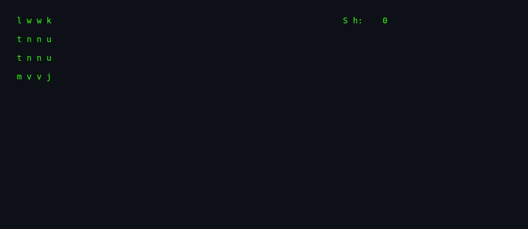
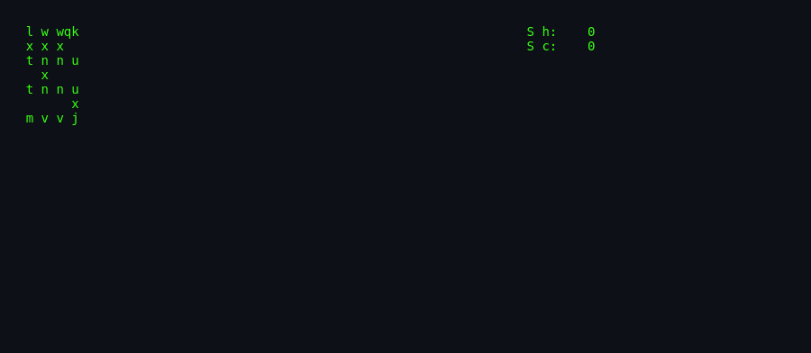
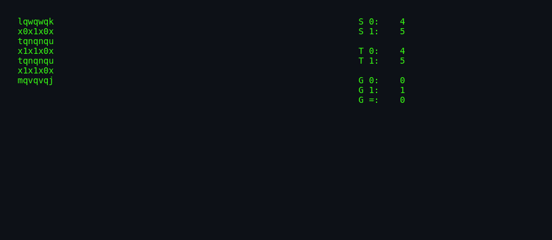

# About `dab`

> **`dab`** — Dots and Boxes on a terminal. Draw lines, close boxes,
> and try to finish with the higher score.

---

## What Is `dab`?

`dab` is the BSDGames implementation of the classic paper-and-pencil
game *Dots and Boxes*. Players take turns drawing a single horizontal
or vertical line between two adjacent dots. If a move completes the
fourth side of a box, the player claims that box and gets another
turn. The game ends when every box has an owner; whoever owns the most
boxes wins.

The terminal version adds a computer opponent, configurable board
sizes, and support for human-vs-human play.

## Screenshots

*A new 3x3 game: empty dots waiting for the first line.*

*The cursor is on an edge; some boxes have already been claimed.*

*The final score and winner are displayed once the board is full.*

## Authors & Publisher

- **Author(s):** Christos Zoulas — NetBSD.
- **Publisher / distributor:** NetBSD / BSDGames package.
- **Release year:** 2003.
- **Language:** C++.

## The Era

`dab` was added to NetBSD in 2003, long after the original BSDGames
collection was established. It represents a modern (for BSD) addition
to the classic lineup, written in C++ and taking advantage of ncurses
for terminal graphics.

## Why It's Interesting

- **Classic combinatorial game** with a clean terminal interface.
- **Simple but competent AI** that looks for closures and tries to
  minimise the opponent's gain.
- **Object-oriented design** using BOARD, BOX, PLAYER, HUMAN, ALGOR,
  and GAMESCREEN classes.

## Difficulty & Progression

`dab` has no explicit difficulty levels. The challenge scales with
board size (default 3x3) and opponent type (`-p cc` is harder than
`-p ch` because you are the only human). The AI does not have depth
settings; its strategy is fixed.

## Making-Of / Anecdotes

The man page references Elwyn R. Berlekamp's *The Dots and Boxes
Game: Sophisticated Child's Play*, signalling that the author treated
the AI seriously despite the simple rules.

## Cultural Impact

Dots and Boxes is one of the most widely known pencil-and-paper games.
`dab` joins a long line of digital implementations, from early BASIC
programs to modern mobile apps and online multiplayer sites.

## Known Bugs (Historical)

- The AI does not perform deep lookahead; it relies on local closure
  analysis and greedy minimisation.
- Large boards may not fit on small terminals.

## See Also

- [`how-to-play.md`](./how-to-play.md) — controls and rules.
- [`architecture.md`](./architecture.md) — board and AI design.
- [`lineage.md`](./lineage.md) — descendants.
- [`references.md`](./references.md) — sources.
