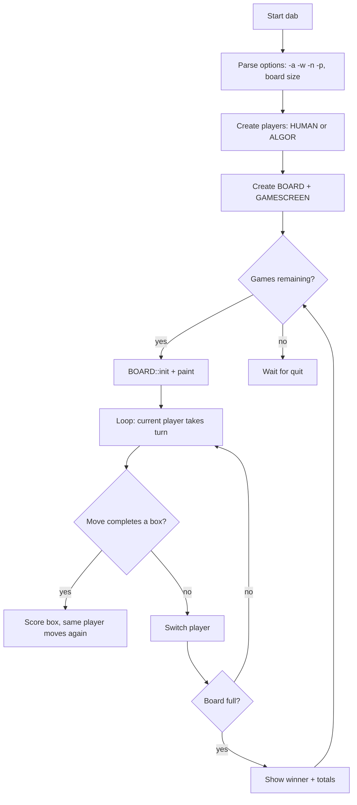

# `dab` — Architecture

`dab` is an object-oriented C++ program that models a Dots and Boxes
board, two player types (human and AI), and a curses-based screen.

---

## Control Flow



## Game Loop / Control Flow

The main loop in `main.cc:77-84` alternates turns until a player has
no valid move (the board is full). It calls `b.score()` before and
after each move to update the display.

## AI Logic

The computer player (`ALGOR`) follows a three-tier strategy defined in
`algor.cc:296-314`:

1. **Close the largest closure** (`find_max_closure`). A "closure" is
   a set of boxes that can all be completed in one turn by chaining
   forced moves. The AI greedily takes the biggest chain available.
2. **Play a safe edge** (`find_good_turn`). If no closure exists, the
   AI picks an edge that does not give the opponent a box on the next
   turn (i.e. it avoids boxes with two sides already drawn).
3. **Minimise damage** (`find_min_closure`). If every move gives the
   opponent boxes, the AI chooses the move that yields the smallest
   opponent closure.

The search uses random iteration order (`RANDOM`) so games vary.

## Random-Event System

`RANDOM` wraps `random()` and provides an iterator-like interface that
shuffles the board traversal order for the AI. The only source of
randomness is traversal order; the AI is otherwise deterministic.

## Difficulty Progression & Runtime Setup

- Board size defaults to 3x3 and is set by command-line arguments.
- Player types default to human-vs-computer (`ch`) and are set by
  `-p`.
- Number of games is set by `-n`.

There is no in-game difficulty ramp.

## Key Code Excerpts

### Main play loop (`main.cc:68-104`)

```cpp
static void play(BOARD& b, PLAYER* p[2]) {
    b.init();
    p[0]->init();
    p[1]->init();
    b.paint();

    for (size_t i = 0;; i = (i + 1) & 1) {
        b.score(i, *p[i]);
        if (!p[i]->domove(b))
            break;
        b.score(i, *p[i]);
    }

    p[0]->wl(p[1]->getScore());
    p[1]->wl(p[0]->getScore());
    b.score(0, *p[0]);
    b.score(1, *p[1]);
    b.total(0, *p[0]);
    b.total(1, *p[1]);
    b.games(0, *p[0]);
    b.games(1, *p[1]);
    b.ties(*p[0]);
}
```

### AI strategy (`algor.cc:296-314`)

```cpp
void ALGOR::play(const BOARD& b, size_t& y, size_t& x, int& dir) {
    if (find_max_closure(y, x, dir, b))
        return;
    if (find_good_turn(y, x, dir, b))
        return;
    if (find_min_closure(y, x, dir, b))
        return;
}
```

### Closure search (`algor.cc:63-81`)

```cpp
int ALGOR::find_closure(size_t& y, size_t& x, int& dir, BOARD& b) {
    RANDOM rdy(b.ny()), rdx(b.nx());
    for (y = rdy(); y < b.ny(); y = rdy()) {
        rdx.clear();
        for (x = rdx(); x < b.nx(); x = rdx()) {
            BOX box(y, x, b);
            if (box.count() == 3) {
                for (dir = BOX::first; dir < BOX::last; dir++)
                    if (!box.isset(dir))
                        return 1;
            }
        }
    }
    return 0;
}
```

## Data Format

No external data files. The board is stored as a 2D integer array in
`BOARD`; each `BOX` interprets the four edges from that array.

## See Also

- [`spec.md`](./spec.md) — formal rules.
- [`lessons.md`](./lessons.md) — teaching points.
- [`references.md`](./references.md) — sources.
