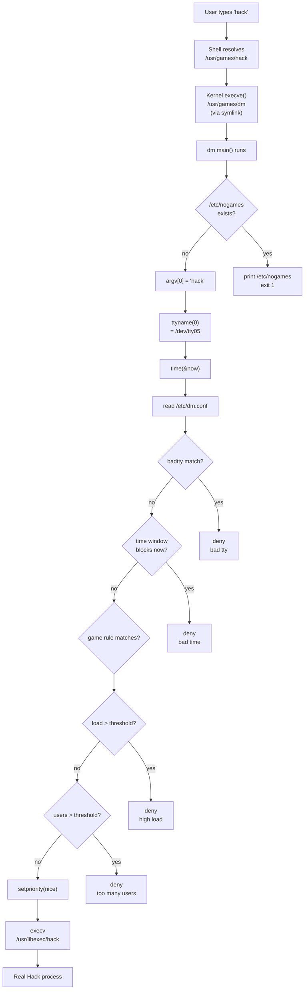

# `dm` — Architecture

> How 335 lines of 1987 C achieve declarative policy enforcement,
> load-aware scheduling, and access control — without any of the
> abstractions modern programmers reach for.

---

## Source tree

Upstream:
<https://github.com/vattam/BSDGames/tree/master/dm>

```text
dm/
├── dm.c            — 335 LOC: everything
├── dm.8.in         — man page (sysadmin section 8)
├── dm.conf.5.in    — config-file man page (section 5)
├── utmpentry.c     — helper for reading /var/run/utmp portably
├── utmpentry.h
├── pathnames.h.in  — compile-time paths (config, log, nogames)
├── Makefile.bsd
└── Makefrag
```

Everything of substance is in `dm.c`. It fits on your screen.
Read it top to bottom before anything else.

## The seven-line startup

```c
int main(int argc, char *argv[]) {
    nogamefile();                       /* [1] kill switch */
    game = (cp = strrchr(*argv, '/'))   /* [2] argv[0] dispatch */
         ? ++cp : *argv;
    if (!strcmp(game, "dm")) exit(0);   /* [3] identity check */
    gametty = ttyname(0);               /* [4] which terminal? */
    unsetenv("TZ");                     /* [5] force system TZ */
    (void)time(&now);                   /* [6] freeze "now"    */
    read_config();                      /* [7] apply policy    */
    play(argv);                         /*     exec real bin   */
}
```

Seven lines of logic. Every one earns its keep. Let me unpack.

## [1] The `/etc/nogames` kill switch

```c
if ((fd = open(_PATH_NOGAMES, O_RDONLY, 0)) >= 0) {
    write(2, "Sorry, no games right now.\n\n", 28);
    while ((n = read(fd, buf, sizeof(buf))) > 0)
        write(2, buf, n);
    exit(1);
}
```

A **file's mere presence** kills game playing entirely. The
file's *contents* are printed as the reason. This is:

- The dead-simplest **feature flag** you can build.
- Analogous to Kubernetes' `PodDisruptionBudget` at scale of 0.
- Analogous to `systemctl mask <service>`.
- Analogous to modern "maintenance mode" pages served by CDNs.

Modern equivalents involve a control plane. `dm`'s equivalent is
`touch /etc/nogames && echo "Reboot at 6 PM" > /etc/nogames`. No
service, no daemon, no state. The kernel filesystem *is* the
control plane.

## [2] `argv[0]` dispatch — one binary, N faces

```c
game = (cp = strrchr(*argv, '/')) ? ++cp : *argv;
```

Given the current process was invoked as `/usr/games/hack`, the
strrchr finds the last `/`, and `game` becomes `"hack"`.

Why does this work? Because the sysadmin has done:

```sh
ln -s /usr/games/dm /usr/games/hack
ln -s /usr/games/dm /usr/games/robots
ln -s /usr/games/dm /usr/games/adventure
# ... one symlink per game
```

Every game symlinks to the same `dm` binary. When the user types
`hack`, the shell resolves the path, finds it's really `dm`, and
runs it. `dm` reads `argv[0]` to discover which game was actually
requested.

**This trick is why BusyBox exists.** BusyBox (1996) uses exactly
this idiom to pack `ls`, `cp`, `mv`, `tar`, and 100 other
commands into one static binary. Symlinks give them separate
names; `argv[0]` dispatches.

**Perl uses it too:** `perl` and `perl5.34` are typically the same
binary, differentiated by argv[0].

**Git uses it too:** `/usr/lib/git-core/git-checkout` and its
siblings are hardlinks, dispatching by name.

`dm` was doing this **nine years before BusyBox**.

### The self-invocation guard

```c
if (!strcmp(game, "dm")) exit(0);
```

If someone types `dm` directly (not through a symlink), just
exit. This prevents an infinite recursion or accidental use, and
is a nice hint that dm is meant to be invoked *only* through its
symlinks.

## [3] TTY awareness

```c
gametty = ttyname(0);
```

`ttyname(0)` returns the pathname of the tty on file descriptor 0
(stdin). Might return `/dev/tty01` or `/dev/pts/3` etc. `dm` uses
this later to enforce `badtty` policy.

Why does this matter? Because in 1987 many terminal lines had
purposes:

- **Dialout modems** on `/dev/tty19` — reserved for outgoing
  uucp email. If a student played `hack` on this line, mail
  couldn't leave the machine.
- **Console** on `/dev/console` — reserved for the sysadmin.
- **Printer** on `/dev/tty0`.

Marking these `badtty` prevented misuse.

The modern equivalent is **conditional access based on device
posture** — Okta or Duo checking "is this session from a
company laptop or a personal phone?".

## [4] Freezing time

```c
unsetenv("TZ");
time(&now);
```

`unsetenv("TZ")` forces `localtime()` to use the *system's*
configured time zone, not the user's `TZ` environment. This
matters because users on remote terminals often had exotic `TZ`
values from where they were dialing in from. A student in London
`ssh`-ing into a Berkeley VAX might have `TZ=Europe/London`
inherited; without the unsetenv, "Monday 8-17" would apply on
London time, not Berkeley time. `dm` normalizes.

`time(&now)` freezes the current time so all subsequent checks
(day, hour) refer to the same instant, even if config parsing is
slow.

Modern equivalent: **explicit timezone handling in scheduling
policies**. Every calendar system today defaults to the server's
TZ, but `dm` had to do it manually.

## [5] The policy parser

```c
while (fgets(lbuf, sizeof(lbuf), cfp))
    switch (*lbuf) {
    case 'b': /* badtty */
    case 'g': /* game */
    case 't': /* time */
    }
```

The parser is **keyword-triggered on the first character**.
Reading anything other than `b/g/t` is silently ignored. This
means:

- Comments are just lines starting with `#` or any other
  non-b/g/t char. Free comments!
- Malformed lines skip harmlessly.
- Order matters: game rules match first-hit ("if game found").

The **default rule** must be last, because as soon as a matching
`game` line is found (or the `default` catch-all), the parser
stops applying game rules. The `found` static in `c_game()`
enforces this.

This is 15 lines of policy engine that a modern equivalent
(Rego? YAML with a jsonschema?) would take 100+ to reproduce —
partly because modern engines have to worry about schema
migration and validation, but partly because the 1987 approach
is elegantly minimalist.

### Config example, re-annotated

```
badtty  /dev/tty19            # never games on this line
time    Monday    8    17     # no games Mon 8am-5pm
game    hack      5    10  *  # hack: load<=5, users<=10, prio *
game    default   *    15  *  # default: no load limit, users<=15
```

The 4th field on `game` lines is priority — passed to
`setpriority(2)` to `nice`-ify CPU-hungry games. This means the
sysadmin could say "let hack run, but at nice+10 so it can't
starve real workloads."

Modern equivalent: `systemctl set-property <service>
CPUWeight=50`. `dm` does the same with `setpriority(PRIO_PROCESS,
0, priority)`.

## [6] Load-average awareness

```c
double load(void) {
    double avenrun[3];
    getloadavg(avenrun, 3);
    return avenrun[2];      /* 15-minute avg */
}
```

`getloadavg()` reads the kernel's smoothed load average — the
number of runnable processes averaged over 1/5/15 minutes. `dm`
uses the **15-minute** figure specifically, because:

- 1-minute is noisy (a single compile spike blocks a game).
- 5-minute is still jittery.
- 15-minute captures "sustained pressure".

A one-line design decision that reflects deep understanding of
signal-noise trade-offs in scheduling.

Modern equivalent: **Kubernetes horizontal pod autoscaler**
uses a similar smoothing window before triggering scale-up.
Prometheus alerts commonly use 5-minute or 15-minute windows for
the same reason.

## [7] User counting via utmp

```c
int users(void) {
    struct utmpentry *ep;
    return getutentries(NULL, &ep);
}
```

`utmp` is the kernel's log of currently-logged-in users. `dm`
counts entries — very simple.

Note the TODO in the source:

```c
 *   todo: check idle time; if idle more than X minutes, don't
 *   count them.
```

Left as an exercise in 1987. Never done in the upstream code.
Modern observability (`w`, `who`, `last`, `prometheus-node-
exporter`) still relies on utmp; the idle-check TODO is still
"todo" 39 years later.

## The dispatch: `play()` and `execv()`

```c
void play(char **args) {
    char pbuf[MAXPATHLEN];
    snprintf(pbuf, sizeof(pbuf), "%s%s", _PATH_HIDE, game);
    if (priority > 0)
        setpriority(PRIO_PROCESS, 0, priority);
    execv(pbuf, args);
    err(1, "%s", pbuf);   /* only reached if execv fails */
}
```

Where `_PATH_HIDE` is typically `/usr/libexec/`.

The **hidden binary** trick is beautiful:

1. `/usr/games/hack` is a symlink to `/usr/games/dm` — user has
   `x` on the game directory.
2. `/usr/games/dm` is a setgid `games` binary owned by root — user
   can read it.
3. `/usr/libexec/hack` is the *real* Hack binary, in a directory
   with mode `750`, owner root, group `games`.
4. Users cannot read `/usr/libexec/`, so they cannot invoke
   Hack directly, bypassing `dm`.
5. `dm` — running setgid `games` — *can* read `/usr/libexec/`, and
   `execv()`s the real binary.

**This is a bind mount + namespace + capabilities all rolled into
one Unix filesystem-permission maneuver.** Modern container
runtimes achieve the same isolation with dozens of moving parts
(mount namespace, PID namespace, seccomp, apparmor). In 1987 the
answer was: setgid + `chmod 750`.

The `err()` at the end is called only if `execv` fails (e.g.
the real binary is missing or corrupt). In the happy path, the
process has already transformed into Hack; there's nothing to
return to.

## The optional logging

```c
#ifdef LOG
static void logfile(void) {
    /* flock() the /var/log/dm.log file */
    /* write "user\tgame\ttty\tctime\n" */
}
#endif
```

Note it's **behind an `#ifdef LOG`** — meaning many builds
omitted this entirely. Some sysadmins wanted logging; others
didn't. The 1987 answer to "should we log?" was a compile-time
flag, not a runtime toggle.

The flock is worth studying: it retries up to 5 times with
1-second sleeps, giving up if it can't get the lock. This
prevents dm from blocking indefinitely if the log file is
contended (which it wouldn't be, but defensive programming).

Modern equivalent: **audit logging via `auditd`, structured logs
via `journald`, or SIEM ingestion via Splunk/ELK**. `dm`'s answer:
tab-separated ASCII appended to `/var/log/dm.log`, one line per
run.

## The complete flow



## Portability notes for the historically curious

- **`getloadavg()`** is not POSIX. `dm` assumed the BSD extension.
  Linux added it in glibc 2.2 (2000). Solaris got it later.
- **`utmp` layout** changed between systems, which is why
  `utmpentry.c` exists — to abstract over BSD's `utmp`, Linux's
  `utmp`/`utmpx`, and Solaris variants.
- **`setpriority()`** is old (V7 UNIX). Portable.
- **`flock()`** is BSD; some systems use `fcntl()` instead.
- **The `/etc/nogames` convention** never made it into any POSIX
  standard. It stayed a BSD-ism.

## What a modern engineer notices reading this code

- **No error handling on the config parser.** Malformed lines
  just get skipped. This is *fine* for a sysadmin-authored file
  but would horrify a modern security auditor.
- **Silent failure on missing config.** If `/etc/dm.conf` doesn't
  exist, `read_config()` just returns and every game is allowed.
  Deliberately permissive.
- **Hardcoded config paths.** Path baked in at compile time via
  `pathnames.h.in`. Modern: env vars or `-c` flags.
- **No structured errors.** All denials are prose `errx()` strings
  intended for humans. Modern: exit codes + machine-parseable
  reasons.
- **No dry-run or explain mode.** You can't ask `dm` "would this
  game be allowed if I tried?". Modern policy engines (OPA)
  support test/explain out of the box.

None of these are bugs — they're the 1987 aesthetic. It's an
educational contrast.

## See also

- What each trick maps to in 2026:
  [`lessons.md`](./lessons.md).
- Genealogy of these ideas: [`lineage.md`](./lineage.md).
- The ADR skipping the port:
  [`decisions/dm-001-skip-port.md`](./decisions/dm-001-skip-port.md).
