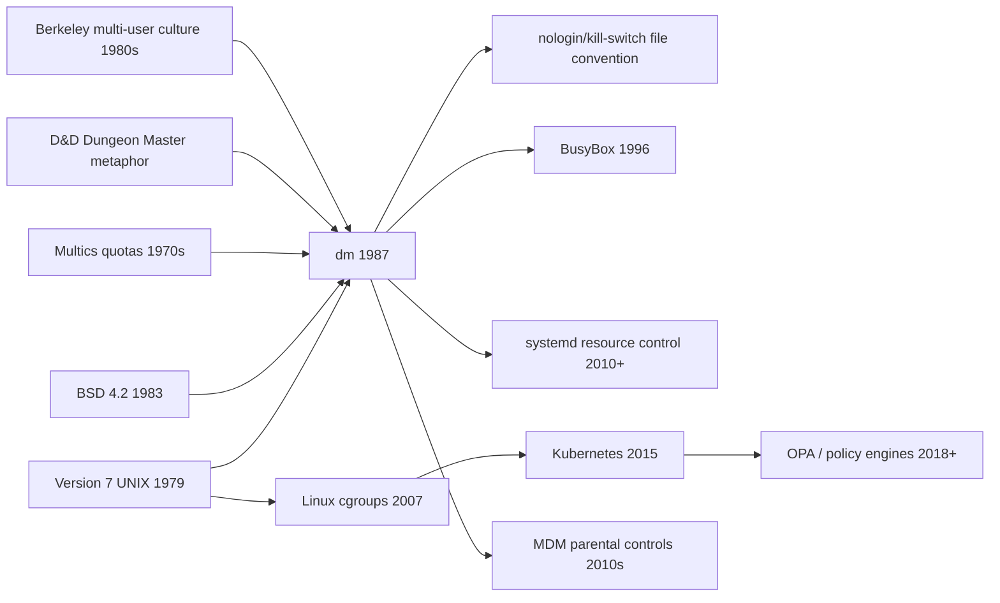

# `dm` — Lineage

> Where dm's ideas came from, and where each of them lives now.

---

## Direct Ancestors

- **Version 7 UNIX (1979)** — provided `execv`, `setpriority`,
  `flock`, `utmp`.
- **BSD 4.2 (1983)** — added `getloadavg()`, the load-average
  system call `dm` depends on.
- **Multics-era resource metering** — the general concept of
  "shared machine + user quotas" was well-established by the
  1970s. `dm` is the BSD-flavored, filesystem-native take on it.
- **Dungeons & Dragons** — the "Dungeon Master" naming convention.
  The DM is the referee; the human who decides what happens.
- **1980s Berkeley sysadmin culture** — chaotic multi-user
  research environment where students had access to the same
  machines as grad students and faculty. `dm` was written to
  keep the peace.

## Direct Descendants

- **NetBSD `dm(8)`** — the direct maintenance line, still present
  in NetBSD 10 (2024).
- **`nogames(5)` convention** — the file-based kill switch pattern
  spread to `/etc/nologin`, `/etc/shutdown.pending`, and similar
  system files.
- **BusyBox (1996)** — `argv[0]` dispatch became the standard
  idiom for multiplexed binaries.
- **Sudoers, doas** — later privilege-gated command execution,
  though these are more general than `dm`.

## Genre Family

## Where each idea lives now

Cross-reference for the curious:

- **`argv[0]` dispatch** → **BusyBox** (1996 onwards),
  **Git** (`git-checkout`, `git-status` — historically hardlinks,
  now dispatched), **Perl** (`perl` == `perl5.34.0`),
  **cross-compilers** (`x86_64-linux-gnu-gcc` etc.).
- **Setgid + hidden binaries** → **Docker** (2013), **snap**
  (2014), **flatpak** (2015), **macOS `/usr/libexec/`**,
  **systemd `PrivateBin=`**.
- **Config-file policy** → **Puppet** (2005), **Chef** (2009),
  **Ansible** (2012), **Terraform** (2014), **Kubernetes**
  (2015), **Open Policy Agent** (2016).
- **Resource quotas per app** → **cgroups v1** (2007), **cgroups
  v2** (2016), **Kubernetes ResourceQuota** (2015), **systemd
  slices** (2010).
- **Load-average gating** → **HPA custom metrics** (2016),
  **Prometheus alerts** (2012), **any load-shedding proxy**
  (Envoy, HAProxy).
- **Time-window enforcement** → **`cron`** (older than dm),
  **`at`**, **`systemd.timer`**, **Okta/Duo conditional access**
  (2015 onwards), **MDM app-scheduling policies**.
- **utmp user counting** → **`prometheus-node-exporter`** still
  reads utmp; **`w(1)`**, **`who(1)`** unchanged since 1979.
- **File-based kill switch** → **feature flag SaaS** (LaunchDarkly
  2014, Unleash 2017, GrowthBook 2020), **`systemctl mask`**,
  **CDN maintenance pages**.
- **Session logging** → **auditd** (2005), **journald** (2011),
  **SIEM ingestion**.

## Dungeon Master naming

The name is a nod to **Dungeons & Dragons**. The DM is the
referee — the person who decides what your character can do,
based on rules and circumstance. `dm(8)` is doing the same job:
looking at the rules (config) and circumstance (load, time, tty)
to decide what the user can do.

There's a separate, unrelated 1987 game **Dungeon Master** by FTL
Games (real-time dungeon crawler for the Atari ST and Amiga).
Same era, same name, no connection. An amusing coincidence.

## If you like `dm`'s ideas, look at...

**Modern tools built on the same principles:**

- **Kubernetes** — for the "declarative policy at scale" evolution
  of `dm.conf`.
- **Open Policy Agent (OPA)** — for a modern general-purpose
  policy engine.
- **systemd resource control** — for a Linux-native modernization
  of `setpriority`+quotas.
- **BusyBox** — for the mature form of `argv[0]` multiplexing.
- **Rate-limiting proxies** (Envoy, HAProxy, nginx `limit_req`) —
  for load-shedding as a first-class feature.

**Modern tools built for the same use cases:**

- **SLURM, PBS Pro, LSF** — job scheduling on shared HPC clusters.
  The direct descendants of "big shared VAX + `dm`".
- **Kubernetes namespaces + ResourceQuota** — multi-tenant fair
  share.
- **Google Workspace scheduled apps** — corporate "no games
  during work hours".
- **Screen Time, Family Safety, Digital Wellbeing** — home
  parental controls.
- **Microsoft Intune, Jamf** — enterprise MDM with time-based
  policies.

**Historical reading:**

- "The UNIX Time-Sharing System" — Ritchie & Thompson (1974).
  The environment `dm` was written for.
- BSD 4.3 Tahoe release notes (1988) — when `dm` first shipped.
- *Advanced Programming in the UNIX Environment* — Stevens.
  For `execv`, `setpriority`, `utmp` idiom deep-dive.
- The Linux `cgroups` design documents — for the direct
  descendant.

## References

See [`references.md`](./references.md).
