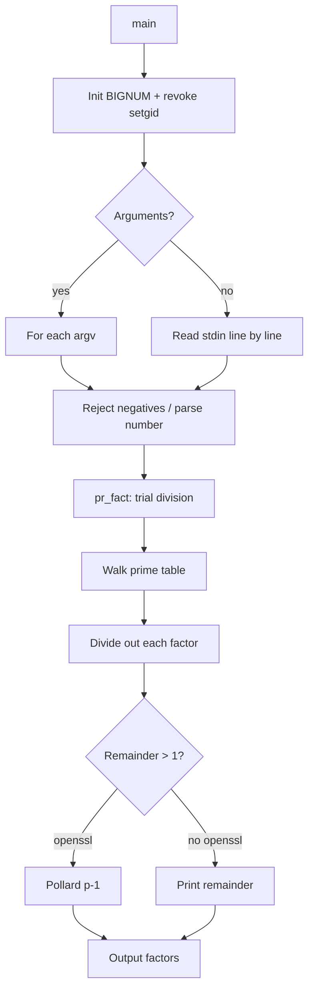

# `factor` — Original Architecture

> Deep analysis of the original C source. What did the programmer build, and how?

Cite upstream file:line references only (never local paths). Upstream tree: <https://github.com/vattam/BSDGames/tree/master/factor>.

---

## Files & Roles

| File | Purpose | Approx. LoC |
|---|---|---:|
| `factor.c` | Entry point, argument/stdin parsing, factorisation driver | 359 |
| `primes.h` | Pre-computed prime table (sieved at build time) | — |
| `factor.6` | Man page | — |

## High-Level Flow



## Game Loop Detail

`factor` is not interactive in the game sense. Its "loop" is a data-processing loop over inputs:

- With command-line arguments, it iterates over `argv` (`factor.c:178-185`).
- Without arguments, it reads lines from `stdin` forever (`factor.c:161-176`).

Each valid input is passed to `pr_fact()` for factorisation.

## Data Structures

The program uses a tiny abstraction layer around bignums:

```c
// factor.c:76-89
#ifdef HAVE_OPENSSL
#include <openssl/bn.h>
#else
typedef long    BIGNUM;
typedef u_long  BN_ULONG;
// compatibility macros for trial division on native longs
#endif
```

The actual prime table lives in `primes.h`, generated by a sieve at build time. It contains every prime up to `65537`, which is sufficient because `65537^2 > 2^32 - 1` (`factor.c:96-98`).

## AI Logic

Not applicable — `factor` is a deterministic mathematical utility.

## Random Events

Not applicable — no randomness is used.

## Difficulty Progression Logic

There is no explicit difficulty system. Runtime behaviour is driven entirely by the input magnitude:

- Small composites are resolved quickly by trial division.
- Large primes force the loop to walk the entire prime table.
- In the OpenSSL build, any remainder surviving trial division is tested for primality; if composite, `pollard_pminus1()` is invoked recursively (`factor.c:227-244`).

## What Was Clever for Its Era

- **Prime-table sizing:** Choosing `65537` as the table limit guarantees complete 32-bit factorisation without any primality testing in the non-OpenSSL build.
- **Bignum abstraction macros:** The same source compiles with OpenSSL bignums or native `long` values, controlled by a single `HAVE_OPENSSL` flag.
- **Pollard p−1 fallback:** When OpenSSL is available, the program can attack much larger composite remainders than trial division alone could handle.

## Constraints the Original Had To Handle

- **Memory:** The program allocates one bignum and reuses it; the prime table is static.
- **Terminal size:** Output is plain text, one line per input, with no screen manipulation.
- **CPU:** Trial division is O(π(√n)) per input — acceptable for 32-bit values but slow for cryptography-sized numbers.
- **Persistence:** None; the utility is stateless.

## What This Code Would Look Like Today

A modern port might expose a web form, a library API, or a progress-bar CLI for large inputs. It could also visualise the factor tree or animate the trial-division sieve. See [`port-ideas.md`](./port-ideas.md) for more.

## See Also

- [`lessons.md`](./lessons.md) — beginner-friendly extraction of techniques.
- [`spec.md`](./spec.md) — implementation-independent specification.
- [`references.md`](./references.md) — sources & citations.
