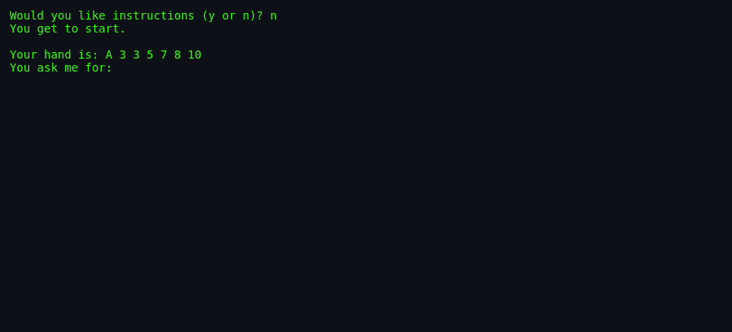
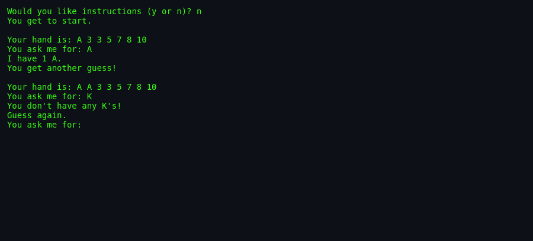
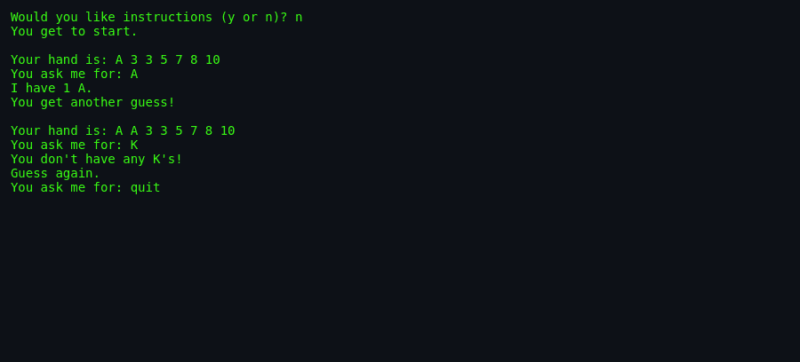

# About `fish`

> **`fish`** — the BSDGames version of Go Fish. Bluff, remember, and
> hope the deck is kind.

---

## What Is `fish`?

`fish` is a command-line implementation of the classic children's card
game *Go Fish*. The computer deals seven cards to itself and seven to
you; the rest form a draw pool. Players take turns asking each other
for cards of a particular rank. If the opponent has any, they must
hand them over and the asker gets another turn. If not, the asker
"goes fish" by drawing a card. The first player to collect the most
"books" (all four cards of a rank) wins.

The program is notable for its dry humour and a computer opponent that
"cheats only rarely".

## Screenshots

*The game starts after dealing seven cards to each player.*

*The player asks for a rank the computer holds, winning extra turns.*

*The final book count decides the winner.*

## Authors & Publisher

- **Author(s):** Muffy Barkocy.
- **Publisher / distributor:** University of California / BSDGames
  package.
- **Release year:** 1990 / 1993 (BSD 4.3).
- **Language:** C.

## The Era

`fish` was written in the early 1990s, when BSD Unix shipped a small
arsenal of simple games and utilities. It is a faithful, text-only
implementation of a social card game, intended for a single player
against the computer.

## Why It's Interesting

- **Classic card game logic** in under 500 lines of C.
- **Two AI modes:** a predictable normal mode and a smarter pro mode.
- **Personality:** playful messages like "Cheater, cheater, pumpkin
  eater!" and "Hah! Stupid peasant!".

## Difficulty & Progression

The only difficulty knob is `-p` (professional mode). In normal mode
the computer cycles through ranks in order; in pro mode it remembers
what you have asked for, targets ranks it holds more copies of, and
very occasionally peeks at your hand.

## Making-Of / Anecdotes

The man page's "BUGS" section deadpans: *"The computer cheats only
rarely."* This is implemented literally in `promove()`: a 1-in-1024
chance returns a rank that the computer knows is in your hand.

## Cultural Impact

Go Fish is one of the most widely known card games for children. The
BSD version preserves the social mechanics and adds a single-player
opponent, predating countless mobile and web adaptations.

## Known Bugs (Historical)

- The computer cheats only rarely (documented as a feature).
- Pro mode peeks at the user's hand with probability 1/1024.

## See Also

- [`how-to-play.md`](./how-to-play.md) — rules and controls.
- [`architecture.md`](./architecture.md) — the AI and game loop.
- [`lineage.md`](./lineage.md) — descendants.
- [`references.md`](./references.md) — sources.
