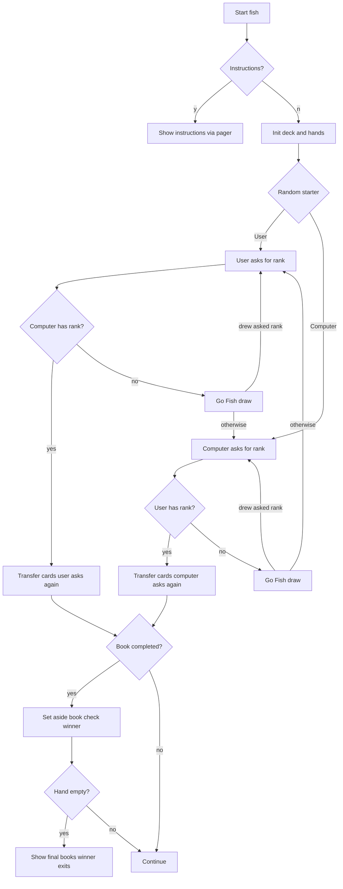

# `fish` — Architecture

`fish` is a turn-based card game in C. It tracks two hands, a draw
deck, books, and a simple AI.

---

## Control Flow



## Game Loop / Control Flow

The main loop in `main.cc:130-148` alternates between the user and the
computer. Each player asks for a rank; if the opponent lacks it, the
asker draws. Drawing the asked rank grants another turn.

## AI Logic

### Normal Mode

`compmove()` (line 208-223) cycles through ranks in order, skipping
ranks the computer does not hold or has already completed into books.
Because the order is fixed and predictable, the human can exploit it.

### Professional Mode

`promove()` (line 225-262) does three things:

1. **Memory:** If the user previously asked for a rank and the
   computer still holds some of that rank, ask for it.
2. **Hand-size heuristic:** One third of the time, ask for the rank
   the computer holds the most copies of.
3. **Rare cheat:** With probability 1/1024, ask for a rank that the
   computer knows is in the user's hand.
4. **Fresh asks:** Otherwise, ask for an unasked rank it holds.

## Random-Event System

`random()` is used for:

- Shuffling the deck (`init()`, line 419-438).
- Deciding who starts (`main()`, line 122).
- The computer's probabilistic decisions in `promove()`.
- The rare taunt messages in `chkwinner()`.

## Difficulty Progression & Runtime Setup

- `-p` enables pro mode at launch.
- Typing `p` during a normal game also enables pro mode.
- No other difficulty settings.

## Key Code Excerpts

### Main turn loop (`fish.c:130-148`)

```c
for (;;) {
    move = usermove();
    if (!comphand[move]) {
        if (gofish(move, USER, userhand))
            continue;
    } else {
        goodmove(USER, move, userhand, comphand);
        continue;
    }

istart: for (;;) {
        move = compmove();
        if (!userhand[move]) {
            if (!gofish(move, COMPUTER, comphand))
                break;
        } else
            goodmove(COMPUTER, move, comphand, userhand);
    }
}
```

### Pro-mode AI (`fish.c:225-262`)

```c
int promove() {
    int i, max;

    for (i = 0; i < RANKS; ++i)
        if (userasked[i] && comphand[i] > 0 && comphand[i] < CARDS) {
            userasked[i] = 0;
            return(i);
        }
    if (nrandom(3) == 1) {
        /* ask for rank with most copies */
    }
    if (nrandom(1024) == 0723) {
        /* rare cheat: ask for rank in user's hand */
    }
    /* ask an unasked rank */
}
```

### Book completion (`fish.c:303-324`)

```c
void goodmove(player, move, hand, opphand) {
    hand[move] += opphand[move];
    opphand[move] = 0;
    if (hand[move] == CARDS) {
        printplayer(player);
        printf("made a book of %s's!\n", cards[move]);
        chkwinner(player, hand);
    }
    chkwinner(OTHER(player), opphand);
    printplayer(player);
    printf("get another guess!\n");
}
```

## Data Format

No external data. Cards are represented by integer counts per rank in
`userhand[]` and `comphand[]`. The deck is an integer array of card
ranks.

## See Also

- [`spec.md`](./spec.md) — formal rules.
- [`lessons.md`](./lessons.md) — teaching points.
- [`references.md`](./references.md) — sources.
