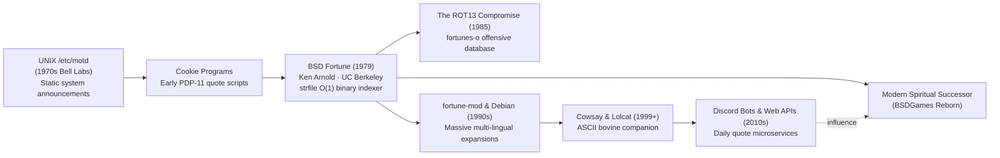

# About Fortune

> *"You will be recognized and honored as a fitting leader.
> -- Fortune Cookie"*

---

## 1. Program Overview

**Fortune** is one of the most famous and enduring text utilities in the history of computing.
Written in **1979** by **Ken Arnold** at the Computer Systems Research Group (CSRG), University of
California, Berkeley, `fortune` prints a random epigram, humorous adage, philosophical aphorism,
or literary quote upon invocation.

For over four decades, `fortune` served as the digital greeting card for millions of UNIX users,
typically placed inside `~/.login`, `~/.profile`, or `~/.bashrc` to deliver a spark of wisdom or wit
each time a programmer opened a terminal session.

Beneath its playful surface lies a masterclass in early systems engineering: to prevent slow disk
head seeks and heavy CPU loads on multi-user VAX and PDP-11 systems, Ken Arnold designed a tripartite
binary indexing architecture (`fortune`, `strfile`, `unstr`) capable of retrieving any quote from
multi-megabyte databases in **constant $O(1)$ time**.

---

## 2. Historical & Cultural Context

### The Message of the Day Evolution
In the early days of UNIX at Bell Labs, system administrators communicated maintenance schedules
and news via `/etc/motd` (Message of the Day). Students and researchers at UC Berkeley soon began
adding humorous fortune-cookie slips to their login scripts. Recognizing that dozens of concurrent
users opening sequential text files simultaneously bogged down time-sharing disks, Ken Arnold built
a dedicated utility backed by a pre-compiled binary offset index: **`strfile`**.

### The Great ROT13 Compromise
During the mid-1980s, as universities opened their computer labs to diverse undergraduate populations,
certain bawdy, cynical, or politically sharp quotes in the database generated administrative friction.
Rather than censoring the collection, Ken Arnold and the Berkeley team implemented a brilliant
cultural compromise:
- Fortunes were partitioned into two files: standard family-friendly maxims (`fortunes`) and
  potentially offensive quotes (`fortunes-o`).
- The contents of `fortunes-o` were stored on disk **obfuscated with the Caesar cipher ROT13**.
  Anyone browsing the raw files on disk could not read them casually.
- To display offensive fortunes, a user was required to pass explicit opt-in flags: `-o` (offensive only)
  or `-a` (all fortunes). The client decoded the text on-the-fly into terminal memory.

---

## 3. Visual Tour

Below are text captures demonstrating the primary operational modes of BSD Fortune.

### Standard and Length-Filtered Invocations
Executing standard random selection, short adages (`-s`), and multi-line long dictums (`-l`):

*Figure 1: Invocations showing default selection, short filter (< 160 chars), and long FORTRAN dictum (>= 160 chars).*

### ROT13 Obfuscation & Decoding
Demonstration of the offensive database stored obfuscated on disk and rendered in cleartext via `-o`:

*Figure 2: Comparing raw disk-level ROT13 cipher in fortunes-o with real-time on-the-fly terminal decoding.*

### Regular Expression Pattern Query
Utilizing `-m pattern` to search for specific authors or topics across all indexed databases:

*Figure 3: Searching for "Ken Thompson" quotes using the built-in regex query engine.*

---

## 4. Why It's Fun & Cultural Impact

1. **Serendipitous Discovery:** In an era before endless social media feeds, running `fortune` was
   a miniature moment of serendipity. You might encounter a Zen koan, an excerpt from Ambrose Bierce's
   *Devil's Dictionary*, or a classic programming law (like Murphy's Law or Brooks' Law).
2. **Cowsay Synergy:** In the late 1990s, Tony Monroe created `cowsay`, which famously piped `fortune`
   output into an ASCII cow speech bubble (`fortune | cowsay`), becoming an enduring meme of hacker
   culture and Linux desktop configuration.
3. **The Hacker Ethos:** The database served as a living oral history of early computing culture,
   preserving legendary one-liners from Ken Thompson, Dennis Ritchie, Bill Joy, and Edsger Dijkstra.

---

## 5. Content Categorization & Progression

While not a game with levels, `fortune` provides a rich categorization and probability weighting
hierarchy:

| Categorization Mode | Flag / Syntax | Selection Behavior |
|---|---|---|
| **Clean / Standard** | Default | Selects uniformly from non-offensive databases (`fortunes`, `fortunes2`). |
| **Offensive Only** | `-o` | Selects strictly from ROT13-obfuscated databases (`fortunes-o`). |
| **All Fortunes** | `-a` | Blends clean and offensive databases into a single unified pool. |
| **Short Maxims** | `-s` | Filters for dictums strictly shorter than **160 characters**. |
| **Long Dictums** | `-l` | Filters for dictums of **160 characters or longer**. |
| **Weighted Probabilities** | `N% file` | Allows users to allocate explicit probabilities (e.g. `40% humor 60% science`). |
| **Equal File Weight** | `-e` | Treats all database files as having equal probability, regardless of item count. |

---

## 6. Known Bugs and Historical Quirks

1. **Host Endianness in Binary `.dat` Files:**
   The original `strfile` wrote 32-bit integers (`int32_t`) in host byte order. A `.dat` index
   generated on a big-endian architecture (such as Motorola 68000 or SPARC) caused segmentation faults
   or garbage text when read by an x86 little-endian CPU. (Modern versions resolve this via `htonl`/`ntohl`).
2. **Single-Byte ASCII Assumptions:**
   In 1979, the ROT13 implementation assumed standard 7-bit ASCII characters (`'a'`–`'z'`, `'A'`–`'Z'`).
   Applying ROT13 to multi-byte UTF-8 sequences corrupted high-order byte characters.
3. **Delimiter Clashes:**
   The default quote delimiter is a single percent sign (`%`) on a line by itself. If a quotation
   unintentionally contained `%` at column 0, `strfile` fractured the quotation into two separate entries.
