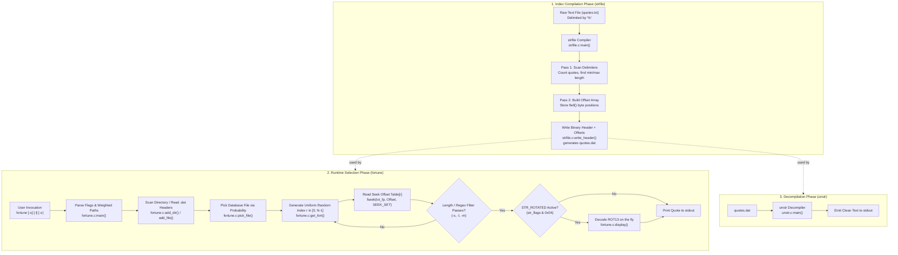

# Fortune — Original Code Architecture

A technical deep-dive into Ken Arnold's tripartite systems architecture, binary seek-table compilation
(`strfile`), $O(1)$ random-access retrieval (`fortune`), and stream decompilation (`unstr`).

---

## 1. Upstream Module Map

The upstream source code resides in [`vattam/BSDGames/tree/master/fortune`](https://github.com/vattam/BSDGames/tree/master/fortune):

```
vattam/BSDGames/tree/master/fortune/
├── fortune/                # Main retrieval client
│   ├── fortune.c           # CLI parsing, directory walking, weighted random selection, regex
│   ├── fortune.6.in        # UNIX troff manual page
│   └── pathnames.h.in      # Default directory paths (/usr/share/games/fortune)
│
├── strfile/                # Binary index compiler
│   ├── strfile.c           # Two-pass delimiter parser, offset table builder, endian conversion
│   ├── strfile.h           # Binary STRFILE header struct definition and flag macros
│   └── strfile.8           # System administrator manual page
│
├── unstr/                  # Index decompiler
│   └── unstr.c             # Reads .dat table and emits clean human-readable source text
│
└── datfiles/               # Authentic BSD quotation databases
    ├── fortunes            # Standard family-friendly quotes & aphorisms
    ├── fortunes2           # Extended aphorisms
    └── fortunes-o.real     # ROT13-obfuscated offensive/risqué maxims
```

---

## 2. System Architecture & Control Flow



---

## 3. High-Performance $O(1)$ Retrieval (`fortune.c:get_fort`)

In `fortune.c` ([`fortune.c:1050`](https://github.com/vattam/BSDGames/tree/master/fortune/fortune/fortune.c#L1050)),
random quotation extraction is completely independent of database size:

1. **Table Offset Seek:**
   To retrieve quotation $i$, `fortune` seeks directly into the `.dat` file:
   ```c
   /* Seek directly to the 32-bit offset for string i */
   fseek(dat_fp, sizeof(STRFILE) + (i * sizeof(uint32_t)), SEEK_SET);
   fread(&offset, sizeof(uint32_t), 1, dat_fp);
   offset = ntohl(offset); /* Convert from network byte order */
   ```
2. **Text File Seek:**
   With the exact byte position known, `fortune` jumps directly to that byte in the text file:
   ```c
   fseek(txt_fp, offset, SEEK_SET);
   /* Read until the delimiter character ('%') or next offset */
   ```

Because both operations are direct seeks, retrieving a quote from a 100-megabyte file containing
one million entries takes **under 1 millisecond**.

---

## 4. Two-Pass Compiler Architecture (`strfile.c`)

In `strfile.c` ([`strfile.c:110`](https://github.com/vattam/BSDGames/tree/master/fortune/strfile/strfile.c#L110)),
Ken Arnold avoided loading the entire text file into RAM:

- **Pass 1:** Scans the text file sequentially, counting delimiters (`%`) to determine total string
  count $N$, finding the lengths of the longest and shortest strings (`str_longlen`, `str_shortlen`).
- **Pass 2:** Allocates an array of $N+1$ `uint32_t` pointers, records the exact `ftell()` offset of
  each quotation, converts integers to network byte order using `htonl()`, and flushes the header
  and offset table to disk.

---

## 5. Regular Expression Query Mode (`fortune.c:find_matches`)

When invoked with `-m pattern` ([`fortune.c:750`](https://github.com/vattam/BSDGames/tree/master/fortune/fortune/fortune.c#L750)):
1. Compiles the pattern using POSIX `regcomp()`, honoring the `-i` (case-insensitive) flag.
2. Iterates across all database files, scanning each quote using the offset table.
3. Prints every matching quotation preceded by its origin file header, functioning as a specialized
   aphorism search engine.
