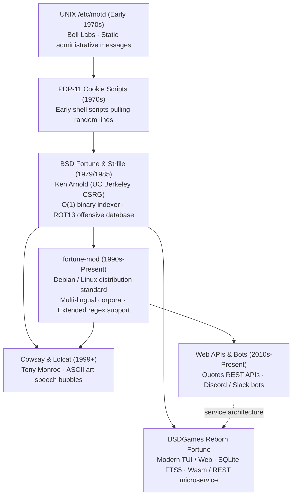

# Fortune — Lineage & Heritage

A historical and mechanical genealogy of Fortune, tracing its journey from early Bell Labs
login announcements to Ken Arnold's BSD binary indexer, Linux Cowsay memes, and modern quote APIs.

---

## 1. The Evolutionary Tree

---

## 2. Comparative Evolution Across Historic Eras

| Era / Utility | Storage Engine | Query Speed | Length Filtering | Obfuscation | Delivery Platform |
|---|---|:---:|:---:|:---:|---|
| **Early Cookie Scripts (1970s)** | Plain text lines | $O(N)$ sequential | None | None | Teletype / Shell script |
| **BSD Fortune (1979/1985)** | **`.dat` Binary Offset Index** | **$O(1)$ constant seek** | **`-s` ($<160$) / `-l` ($\ge 160$)** | **ROT13 (`-o`, `-a`)** | VAX / BSD Terminal login |
| **fortune-mod (1990s)** | Extended `.dat` files | $O(1)$ constant seek | `-s` / `-l` filters | ROT13 | Linux packages (APT/RPM) |
| **Cowsay Integration (1999+)** | Shell pipeline | $O(1)$ | Inherited | Inherited | Terminal ANSI art |
| **Modern Quote APIs (2010s)** | PostgreSQL / Cloud DB | $O(\log N)$ | Query parameters | Content tags | JSON REST / GraphQL |

---

## 3. Cultural & Hacker Significance

- **The Soul of the Terminal:** For generations of software engineers, `fortune` was the very first
  program executed when connecting to a remote server. It humanized the austere command-line
  interface, offering humor and encouragement during grueling late-night debugging sessions.
- **The Jargon File:** Eric S. Raymond's *Jargon File* lists "fortune cookie" as a fundamental term
  of hacker slang, citing Ken Arnold's implementation as the definitive canon that popularized the
  practice throughout academia and industry.
