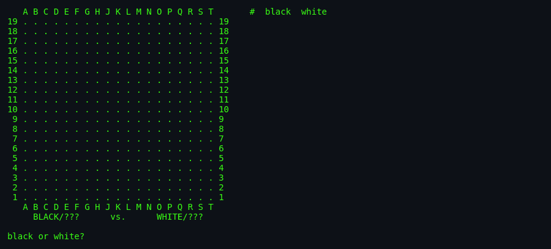
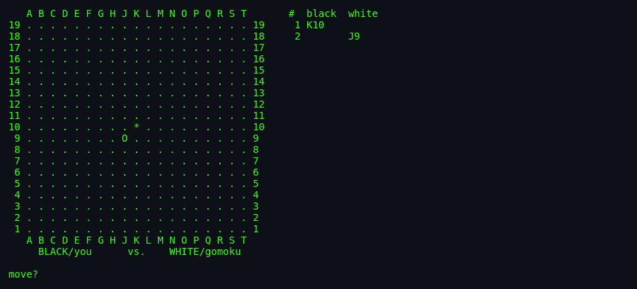
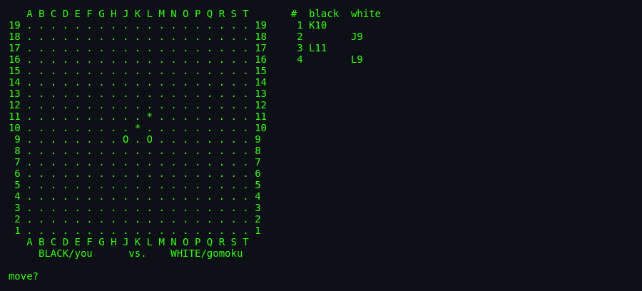

# About `gomoku`

> A stone-and-line game as old as *Go*, refined for computers by a
> Berkeley programmer who taught the machine to hunt for
> five-in-a-row on a 19×19 board. Deceptively simple rules. A
> genuine algorithmic challenge underneath.

---

## What Is `gomoku`?

Gomoku (五目並べ, "five in a row") is a two-player abstract strategy
board game. Players alternate placing stones on a 19×19 grid. The
first to form an unbroken line of five stones — horizontal,
vertical, or diagonal — wins.

The BSDGames `gomoku` implementation gives you a decent computer
opponent, a nicely-rendered ASCII board, save/load, and a
tournament-friendly background mode for pitting programs against
each other. All in about 3,000 lines of C.

## Screenshots

*Launch: the 19×19 board renders on screen, and the game asks whether
you'll play Black or White. Black moves first by convention.*

*You play K10 (`*`, the black stone) — the traditional centre opening.
White (the AI) responds with J9 (`O`, the white stone). The move log is
visible on the right.*

*A few moves in — the AI is already probing for combos while you build
your own line.*

## Authors & Publisher

- **Author:** **Ralph Campbell** — Berkeley Unix veteran, later at
  Sun Microsystems and elsewhere; contributor to many BSD games
  and utilities.
- **Board display:** based on the `goref` program by
  **Peter Langston** — musician, programmer, and pioneer of
  early computer music at Bell Labs and Lucasfilm.
- **Publisher / distributor:** BSD (then NetBSD, then the
  Linux `bsd-games` port by Joseph S. Myers).
- **First shipped:** SCCS tag `@(#)gomoku.6 8.2 (Berkeley) 8/4/94` —
  4.4BSD-era, mid-1994.
- **Language:** C using `curses` for interactive mode.

## The Era

Mid-1990s Berkeley Unix was still a hub for algorithm-heavy student
and staff projects. Board-game AI was a favourite topic: writing
a good move-picker forced you to think about search, evaluation
functions, pattern recognition. `gomoku` sits in that tradition —
not the deepest AI ever written, but a very readable one, and a
solid learning example for anyone curious about game trees.

## Why It's Fun

- **The rules are trivial.** You can teach a five-year-old.
- **The strategy is deep.** Five-in-a-row on a big board has more
  positions than chess, and the "double-three" and "open four"
  threats create real tension.
- **The AI is a real opponent.** Not a scripted difficulty ramp —
  a genuine tactical player that recognises threats, blocks
  forcing lines, and hunts for its own combos.
- **It's fast.** A game finishes in 20–50 moves; there is no
  50-move endgame to grind through.
- **User-vs-user mode (`-u`)** turns it into a great hot-seat game
  for a lab, a couch, or a lecture break.
- **Computer-vs-computer mode (`-c`)** is fascinating to watch,
  and was designed for tournament-style algorithm competitions.

## Difficulty & Progression

`gomoku` has **no explicit levels**. One game, one 19×19 board, one
opponent. Every game is played on identical rules.

What *does* scale as the game progresses:

- **The AI thinks deeper.** The heuristic evaluator's search depth
  is bounded by `curlevel ≤ (movenum + 1) / 2`. Early in the game
  (few moves played), the AI evaluates shallow combinations. As
  moves accumulate, deeper multi-frame combos come into play. See
  [`architecture.md`](./architecture.md).
- **The board fills up.** Empty squares are the currency of
  gomoku; every stone placed changes the tactical landscape.
- **Threats compound.** A single stone rarely matters; a
  three-stone pattern almost always does. So the mid-to-late game
  is where forcing lines emerge.

Because there is no difficulty setting, the port will need to add
one — see [`port-ideas.md`](./port-ideas.md) §1 (AI: Classic /
MCTS / Neural difficulty tiers).

## Making-Of Notes

Ralph Campbell's implementation uses a technique called **frames**
— every possible 5-in-a-row line on the board (horizontal, vertical,
both diagonals) is enumerated once at initialisation. As stones are
placed, each frame is quickly re-evaluated. This is orders of
magnitude faster than looking for lines from scratch every move.

The AI then computes **combo values** for every empty cell: an
integer summary of how many independent frames pass through that
cell and how "developed" each is. Combos can chain across multiple
frames — a *combo of level 3* is one that uses three intersecting
frames. This is genuinely clever code for its era, and repays
careful reading. See [`architecture.md`](./architecture.md).

## Cultural Impact

Gomoku itself is ancient — the Japanese name dates from the Meiji
era; the game is much older in China (as *wǔ zǐ qí*) and Korea. On
computers, it has been a staple of AI textbooks since the 1970s,
and modern deep-learning research (like Google's AlphaZero) has
tackled it as a proving ground for game-agnostic learning.

The BSDGames `gomoku` is a nice midpoint: not the toy 2-line AI of
`robots`, not a modern deep-learning behemoth, but a hand-crafted
heuristic that gives a real game.

See [`lineage.md`](./lineage.md) for the family tree.

## Known Bugs (Historical)

- The AI is *deterministic* except for one `rand()` call that
  tie-breaks equally-valued moves (`pickmove.c:214-218`). Two
  invocations with the same seed and same input play identically.
- The save format is a raw list of moves — human-readable but
  fragile if the game version changes.
- The board display is `curses`-only in interactive mode; the
  `-b` background mode uses stdin/stdout without a display.

## See Also

- [`how-to-play.md`](./how-to-play.md) — actually playing.
- [`architecture.md`](./architecture.md) — the AI internals.
- [`lineage.md`](./lineage.md) — genre siblings.
- [`references.md`](./references.md) — source citations.
