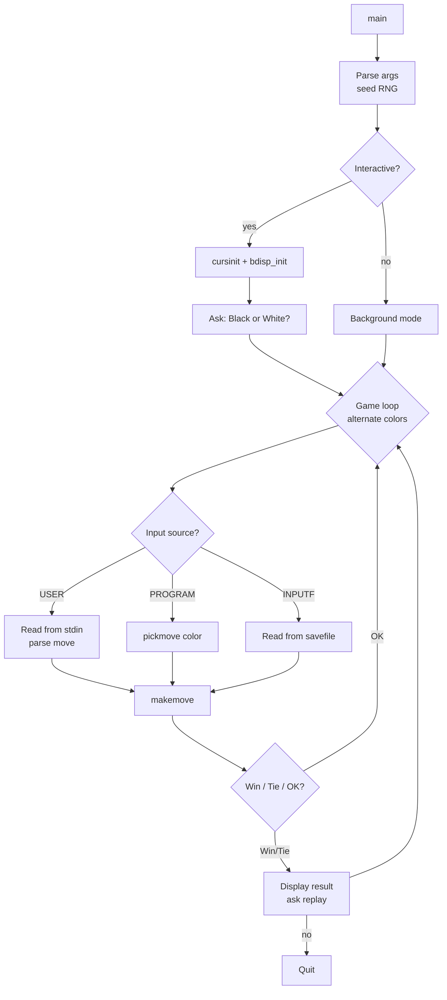
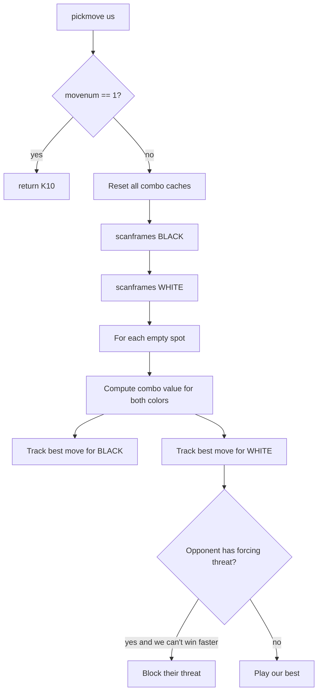

# `gomoku` — Original Architecture

> Deep analysis of the original C source. This is a substantial
> AI — worth understanding well.

Upstream source (not redistributed in this repo):
<https://github.com/vattam/BSDGames/tree/master/gomoku>

---

## Files & Roles

| File | Purpose | Approx. LoC |
|---|---|---:|
| `main.c` | Entry point, CLI parsing, top-level game loop, debug shell | 550 |
| `gomoku.h` | Constants, structs, prototypes | ~200 |
| `bdinit.c` | Board initialisation — sets up all frames | ~150 |
| `bdisp.c` | Board display (`curses`) — based on `goref` | ~250 |
| `pickmove.c` | **The AI** — combo evaluation, spot ranking, move selection | 1500 |
| `makemove.c` | Applies a chosen move to the board, checks win/tie | ~200 |
| `stoc.c` | Coordinate conversion (`"K10"` ↔ integer spot) | ~50 |

Total: ~3000 LoC. Small for the AI depth achieved.

## High-Level Flow



Reference: `main.c:215-334`.

## Data Structures

The board is represented as an array of 400 `spotstr` structs (20×20
including borders). Each empty spot maintains cached "combo values"
for both colours, so evaluation is a lookup at move time.

```c
// gomoku.h (approx.)
struct spotstr {
    short      s_occ;                 // EMPTY / BLACK / WHITE / BORDER
    short      s_wval;                // static weight (usually distance from center)
    int        s_flg;                 // flags for search
    struct combostr *s_frame[4];      // frames going through this spot
    union comboval s_fval[2][4];      // per-color, per-direction 5-in-line value
    union comboval s_combo[2];        // per-color best combo value
    u_char     s_level[2];            // combo depth for each color
    u_char     s_nforce[2];           // count of forcing frames per color
    struct elist *s_empty, *s_nempty; // completion spots for combos
};
```

Frames — every possible 5-in-a-row line — are pre-generated in
`bdinit.c`. There are `FAREA` frames total, each direction:

- Horizontals: 19 rows × 15 starting columns = 285
- Verticals: 15 × 19 = 285
- Diagonal `\`: 15 × 15 = 225
- Diagonal `/`: 15 × 15 = 225

Total: ~1020 frames.

## The AI — `pickmove()`

Reference: `pickmove.c:68-163`.

The strategy is *not* minimax. It is a heuristic evaluation:

1. For every empty spot, compute a **combo value** representing how
   strong a move to that spot would be, for both colours.
2. Pick the spot that is best for the current player *unless* the
   opponent has an unblockable threat requiring immediate defence.



### Combo Values

A combo value is stored as a 16-bit `union comboval`:

- `c.a` — high byte: something like "moves-to-completion" (lower is
  better).
- `c.b` — low byte: refinement.

The AI wants the *smallest* combo value (fewer moves to win).
Special value `0x0101` means "one move from winning" — an unblockable
threat if left alone.

### `scanframes()` — Populate Combo Values

Reference: `pickmove.c:229-408`.

For each active frame (a 5-line with at least one stone of the
current colour, no stones of the opposite colour):

1. Read the frame's raw value (already computed by `makemove`
   updates).
2. For each empty cell in the frame, update `spot.s_combo[color]`
   if this frame offers a better (smaller) value.
3. Try to **compose combos**: if two frames intersect at an empty
   cell, playing that cell activates both frames simultaneously.
   This is a "level 2" combo.
4. `addframes()` extends this to level 3, level 4, up to a depth
   limited by `(movenum + 1) >> 1` — meaning search depth grows
   as the game progresses.

The composition is the interesting bit. `makecombo2()` tries pairs
of frames intersecting at the current spot. `makecombo()` (called
by `addframes`) extends previously-found combos with a new frame
if the intersection forms a valid tree (or a valid loop —
`checkframes()` detects both).

### `better()` — Move Comparison

Reference: `pickmove.c:168-219`.

Compares two spots for a given colour. The precedence is roughly:

1. Lower combo value for **us** (better for us).
2. Lower level (fewer frames to compose — simpler win).
3. More forcing frames for us.
4. Whether it's already flagged as blocking an opponent force.
5. Symmetric preferences for the opponent (block their best too).
6. Higher static weight (`s_wval` — closer to centre wins ties).
7. **Random coin flip** (`rand() & 1`) — final tie-break.

This is where randomness enters the AI. It doesn't change
strategy, just tie-breaks.

## Random Events

**There are no random events in gameplay.**

The AI has one `rand()` call at `pickmove.c:215-218` used purely to
break ties between equally-valued moves. If the ties are broken by a
seed-dependent choice, the game can play slightly differently on
different runs even against the same opponent — but no move
selection is genuinely random.

Seed:

```c
// main.c:135-140
if (!debug)
#ifdef SVR4
    srand(time(0));
#else
    srandom(time(0));
#endif
```

Seed is the current time in seconds. With `-d` (debug), the seed
is not set, so the tie-break becomes deterministic — useful for
regression testing.

## Game Loop

The game alternates colours (`main.c:215-290`), for each colour:

1. Determine input source (USER / PROGRAM / INPUTF).
2. Read/compute the move.
3. Log it.
4. `makemove(color, curmove)` — apply it. Returns `MOVEOK` / `WIN` /
   `TIE` / `ILLEGAL` / `RESIGN`.
5. Redraw board.
6. If terminal state (win/tie/illegal/resign), break loop.

## Difficulty Progression Logic

There is **no explicit level system**. `gomoku` is a fixed-rules,
fixed-board, single-difficulty game.

The only implicit scaling is the AI's **search depth**:

```c
// pickmove.c:334-335
d = 2;
while (d <= ((movenum + 1) >> 1) && combolen > n) {
    ...
    addframes(d);
    d++;
}
```

Interpretation:

- On move 1 (`movenum == 1`), the loop body doesn't execute (`d ≤ 1`
  fails). The AI plays K10 deterministically anyway
  (`pickmove.c:77-78`).
- On move 3, depth allowed = 2. Only two-frame combos considered.
- On move 5, depth allowed = 3. Three-frame chained combos start
  to appear in evaluation.
- On move 20+, depth is effectively unlimited (up to `combolen`
  and time).

### What Scales (Implicit)

- **Combo depth** — as above.
- **Combo count** — more stones placed → more active frames →
  more work per evaluation.

### What Does Not Scale

- **Rules** — five-in-a-row throughout.
- **Board size** — 19×19 always.
- **First-mover advantage** — Black always moves first.
- **AI evaluation weights** — the heuristic is fixed.
- **RNG usage** — same tie-break policy at every move.

### Why This Matters for the Port

The classical AI is *self-adjusting*: it plays weakly in openings
(low depth) and stronger in the middlegame (high depth). This is
plausible for a heuristic AI and matches how humans play too. But
it means the AI is *not tunable* — you can't set a "difficulty
slider" that maps cleanly to strength. Adding difficulty tiers is
a port design item (see [`port-ideas.md`](./port-ideas.md) §1).

## What Was Clever for Its Era

- **Pre-generating all 5-in-line frames.** Evaluation cost is
  amortised. Every move update is `O(frames_containing_spot)`, not
  `O(board_size)`.
- **Union type for combo values** — a 16-bit int with 8+8 bit
  halves. Efficient comparison as an integer, structured access
  via the union.
- **Depth-limited search.** `curlevel ≤ (movenum + 1) >> 1` prevents
  the AI from spending an eternity on move 3 while allowing deeper
  search when the position is complex.
- **Hash table for combo deduplication.** `hashcombos[FAREA]`
  and `sortcombo()` (`pickmove.c:1225-1332`) ensure the same
  frame-set doesn't get evaluated twice.
- **Bit-packed force map.** `forcemap[MAPSZ]` (~13 ints for the
  ~400-cell board) records which cells could block an opponent
  force. Set-intersection of forcemaps across multiple opponent
  threats gives us the *must-play* set — bit-wise `AND`. Very
  clean.
- **Debug shell** (`whatsup()` in `main.c:355-491`) — a mini
  interpreter accessible via SIGINT. Ships in the DEBUG build. This
  is genuinely useful for AI development.

## Constraints Handled

- **CPU:** early- to mid-90s workstations. The depth limit keeps
  per-move computation bounded.
- **Memory:** ~1020 frames × sizeof(combostr) ≈ 30–50 KB.
  Board array is ~14 KB. Total footprint well under 100 KB.
- **Terminal:** 24×80 minimum, `curses`-rendered board display.
- **Persistence:** save format is a plain-text list of moves
  (`main.c:264-267`). Human-readable, portable, easy to debug.

## What This Code Would Look Like Today

- The heuristic evaluator itself is timeless — it works.
- One would add **Monte Carlo Tree Search (MCTS)** on top,
  bootstrapped from the heuristic evaluations. Modern gomoku
  solvers (e.g. Yixin, Katagomo) use MCTS with a neural policy.
- Save format → JSON or SGF (the standard Go format extended for
  gomoku).
- Add opening books (like chess engines).
- Add a self-play trainer to auto-tune the combo weights.
- Provide an API for tournament use — the `-b` mode is a
  precursor to this.

See [`port-ideas.md`](./port-ideas.md).

## See Also

- [`lessons.md`](./lessons.md) — beginner-friendly extractions.
- [`spec.md`](./spec.md) — the mechanical contract.
- [`references.md`](./references.md) — citations.
