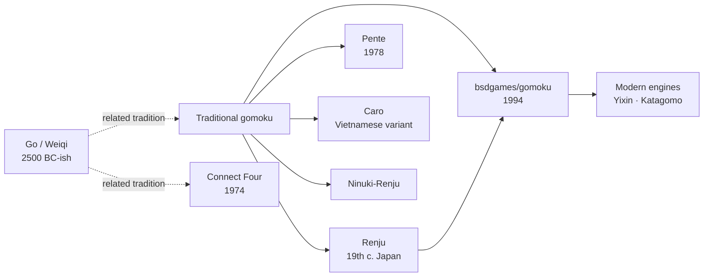

# `gomoku` — Lineage

---

## Direct Ancestors

- **Traditional gomoku** — the physical board game, played for
  centuries in East Asia. Called *五目並べ* (gomoku-narabe) in
  Japan, *wǔzǐqí* (五子棋) in China, *omok* in Korea.
- **Renju** — a competitive rule variant standardised in Japan in
  the late 19th century. Uses a 15×15 board and introduces
  forbidden-move rules for Black to correct the first-player
  advantage.
- **Early gomoku AI research** — 1970s–80s academic papers on
  five-in-a-row as an AI benchmark. Notable: L. Victor Allis's
  1994 PhD dissertation *Searching for Solutions in Games and
  Artificial Intelligence*, which proved gomoku is solved (first
  player wins with perfect play).
- **`goref`** — Peter Langston's earlier board-display program at
  Bell Labs / Lucasfilm, on which `gomoku`'s UI is based.

## Direct Descendants

- **Countless mobile and web gomoku apps** — most implement
  variants of Ralph Campbell's evaluation ideas (or Allis's proof
  techniques).
- **`gnu-go`** ecosystem (adjacent) — while `gnu-go` plays Go, it
  shares the "frame-based evaluation" family with gomoku engines.
- **Yixin** (2016) — modern strong gomoku engine, adapts AlphaZero
  techniques.
- **Katagomo** — a KataGo-derived gomoku engine using deep
  learning.

## Genre Family

## If You Like `gomoku`, Try…

**Faithful modern gomoku:**

- **Yixin** — strong AI opponent; downloadable Windows app.
- **Gomocup** — annual gomoku programming competition. Watch
  engines duel.
- Mobile apps: countless. Search "gomoku" or "five in a row".

**Related in genre:**

- **Connect Four** — pure Western simplification; solved in 1988
  (first player wins).
- **Pente** — five-in-a-row with capture. Adds tactical layer.
- **Renju** — the tournament standard; solved but interesting.
- **Go** — the deeper cousin. Rules are simple, strategy is
  legendary.

**Modern games with similar spirit:**

- **Hive** — pattern-building on a tile board.
- **Onitama** — small-grid tactical thinking, similar
  "predict-and-plan" appeal.

## Communities

- **Gomocup** — <https://gomocup.org/> (engine competition).
- **RenjuNet** — Renju community and rating.
- Board Game Geek's gomoku section.

## References

See [`references.md`](./references.md).
