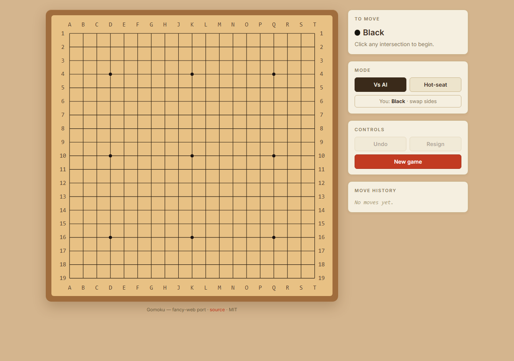
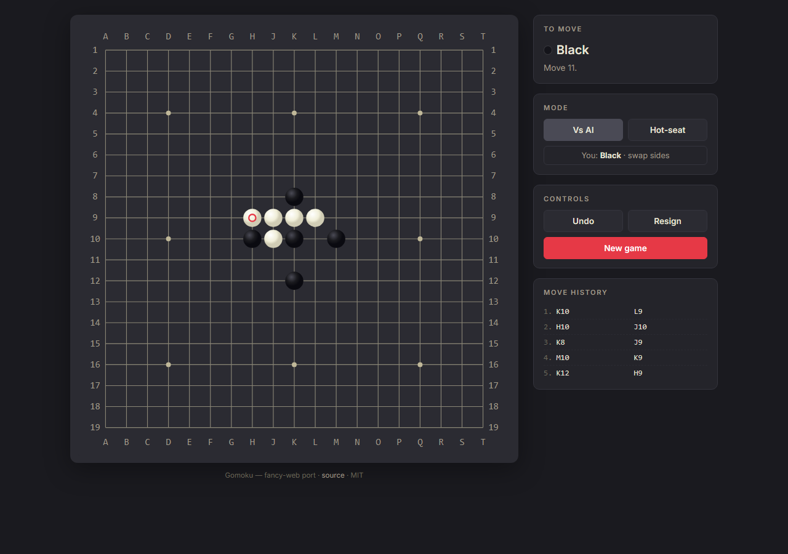
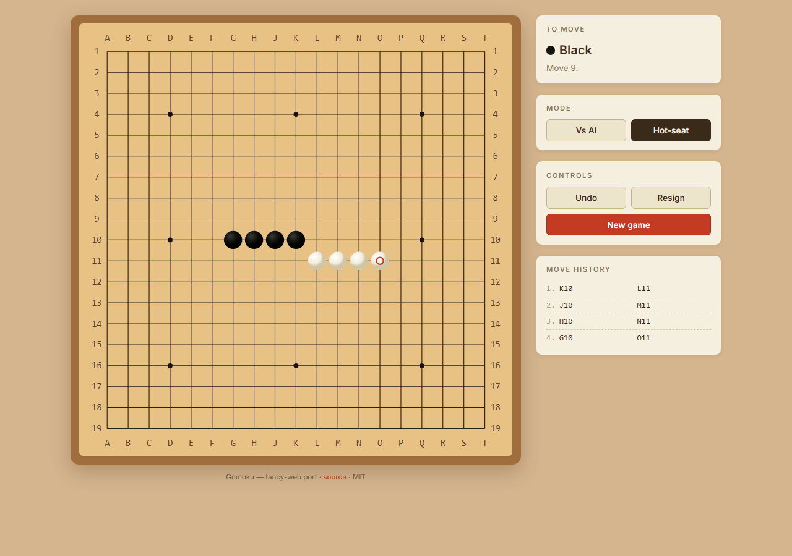
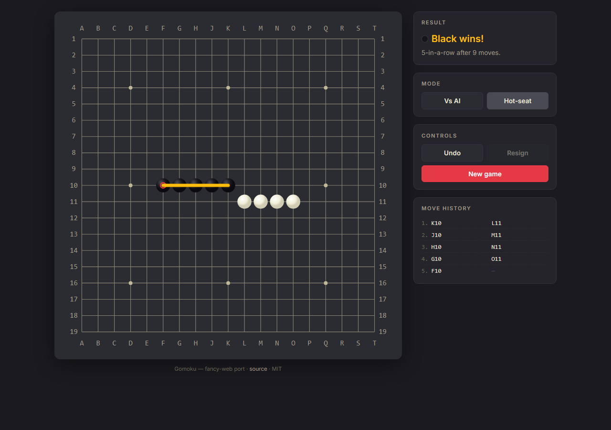

# `gomoku` — `fancy-web` port

> A browser reimplementation of BSDGames `gomoku` (five-in-a-row)
> styled after a **traditional Japanese gomoku board** — kaya-wood
> honey surface, black grid ink, slate + clamshell stones,
> vermillion (cinnabar seal) last-move mark. Faithful mechanics,
> crisp SVG rendering, heuristic AI, hot-seat 2-player. No WebGL
> required.


*Empty board at spawn. Vs-AI mode is the default; the human plays Black and moves first. Hoshi dots at 4-4, 10-10, 16-16, etc. mark the standard star points. The whole board is drawn in native SVG, framed by a darker-wood rim.*


*Midgame against the AI. The position has already tangled around the K10 opening. The vermillion ring highlights the most recent move — the classic cinnabar-seal accent from Japanese board tradition.*


*Hot-seat 2-player mode. Black has quietly built a four-in-a-row threat on row 10 while White defends on row 11. The Mode toggle in the sidebar switches between Vs-AI and Hot-seat mid-game.*


*Black completes five-in-a-row. The winning line pulses in vermillion; the result card announces the winner and the move count. Notice how the white clamshell stones sit softly on the kaya wood — a low-contrast pairing that mimics the real physical board.*

## Status

- **Status:** 🟢 Released 2026-09-17 (Universal Port Contract
  baseline satisfied). ✨ Complete pending deploy.
- **Author:** Agun Wijaya
- **License:** MIT (root default)
- **Live URL:** *(pending deploy — `dist/` builds cleanly)*

**Verified (last update 2026-09-18)**
- ✅ 47/47 Vitest tests pass (11 coords + 22 engine + 14 AI).
- ✅ TypeScript strict clean.
- ✅ Production bundle **49.66 KB gzipped** (target: 150 KB).
- ✅ 4 port-specific screenshots via Playwright.
- ✅ Traditional wooden-board palette in place (see
  [`docs/diff-log.md`](docs/diff-log.md) → *2026-09-17 palette
  update*).

## Pitch

BSDGames `gomoku`, but reimagined as a modern minimalist board
game for the browser. The board is drawn in SVG — crisp at any
zoom, works on every device from a phone to a desktop, no GPU
needed. The heuristic AI from the original 1994 source is ported
faithfully (frame + overlap scoring) and ships as the default
opponent alongside hot-seat 2-player mode.

For the game's history and rules see canonical
[`../../docs/about.md`](../../docs/about.md).

## Tech Stack

- **Language:** TypeScript 5.6
- **UI framework:** React 18 (functional components + hooks)
- **Rendering:** SVG (native browser vector graphics). No Canvas,
  no WebGL, no `three.js`. The board's grid + stones + win-line
  are all `<line>`, `<circle>`, and `<text>` elements.
- **Build:** Vite 5
- **Tests:** Vitest 2 + Testing Library
- **Target platform:** Any modern browser (desktop + mobile). No
  GPU needed. Bundle target ≤ 150 KB gzipped.
- **Multiplayer:** Hot-seat 2-player + vs AI. Online play
  deferred to v2.
- **Persistence:** `localStorage` — game-in-progress resume,
  optional winrate stats.

Full stack rationale: see
[`docs/decisions/001-tech-stack.md`](docs/decisions/001-tech-stack.md).

## Install & Build

```bash
# From this port folder:
npm install
npm run dev         # dev server (http://localhost:5173)
npm run build       # production build → dist/
npm run preview     # preview production build
npm test            # watch-mode tests
npm run test:once   # single-run tests
npm run typecheck   # tsc --noEmit
```

## Play

*(Live URL pending. Locally: `npm run dev` then open
`http://localhost:5173`.)*

### Controls

| Input | Action |
|---|---|
| Click / tap intersection | Place stone at that point |
| Type `K10` + Enter | Place stone via keyboard (spec-native notation) |
| Arrow keys | Move keyboard cursor around the board |
| Enter / space | Place stone at cursor |
| `u` / Ctrl+Z | Undo last move |
| `r` | New game |
| `?` | Toggle help |

Rules: see canonical
[`../../docs/how-to-play.md`](../../docs/how-to-play.md). In-game
help panel has the full reference.

## What makes this port different

- vs `../classic-web/` *(pending)*: this port renders a
  **traditional Japanese gomoku board** — kaya-wood surface,
  black grid ink, matte-slate + clamshell stones, vermillion
  last-move mark. Native SVG, animated stone drop + pulsing
  win-line, cream-parchment sidebar. `classic-web` will be the
  faithful curses-board reproduction with ASCII stones on a
  terminal grid.
- vs a "modern minimalist" board: an earlier iteration used a
  dark-slate palette; superseded on 2026-09-17 per user
  feedback. See
  [`docs/diff-log.md`](docs/diff-log.md) →
  *2026-09-17 palette update*.

## Spec compliance

This port implements the mechanics in canonical
[`../../docs/spec.md`](../../docs/spec.md) — 19 × 19 board,
Black moves first, first-to-five wins including overlines
(free-gomoku rules). Deliberate deviations are documented as
port-level ADRs under
[`docs/decisions/`](docs/decisions/).

## Attribution

- Original BSDGames `gomoku` — Ralph Campbell, based on Bell Labs
  work. See root
  [`ATTRIBUTION.md`](../../../../ATTRIBUTION.md).
- Upstream source:
  <https://github.com/vattam/BSDGames/tree/master/gomoku>.
- This port © 2026 Agun Wijaya, MIT.

## Documentation

- **Canonical (game-level)** — [`../../docs/`](../../docs/):
  `spec.md`, `architecture.md`, `about.md`, `how-to-play.md`,
  `lessons.md`, `references.md`, `port-ideas.md`, `manpage.md`,
  `lineage.md`, `test-scenarios.md`, `notes.md`.
- **This port's diff log** — [`docs/diff-log.md`](docs/diff-log.md):
  the running narrative of what was kept / added / changed /
  removed vs canonical `spec.md`, with the palette-shift entry
  at the bottom.
- **This port's port ADRs** —
  [`docs/decisions/`](docs/decisions/):
  - [`001-tech-stack.md`](docs/decisions/001-tech-stack.md)
    — React + SVG + Vite rationale.
- **Port-level test scenarios** —
  [`docs/test-scenarios.md`](docs/test-scenarios.md): 20
  scenarios covering the additive features (undo, hot-seat
  switch, side swap, click / keyboard input, palette lock,
  responsive layout, zero-error smoke).
- **Port working notes** —
  [`docs/notes.md`](docs/notes.md): follow-ups, gotchas,
  bundle-size log.
